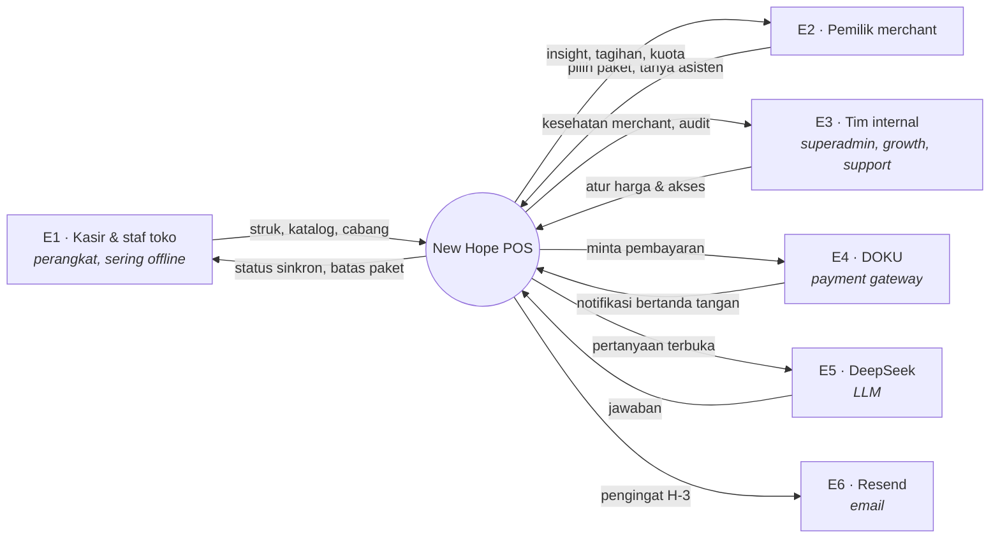
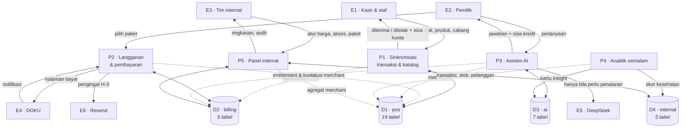
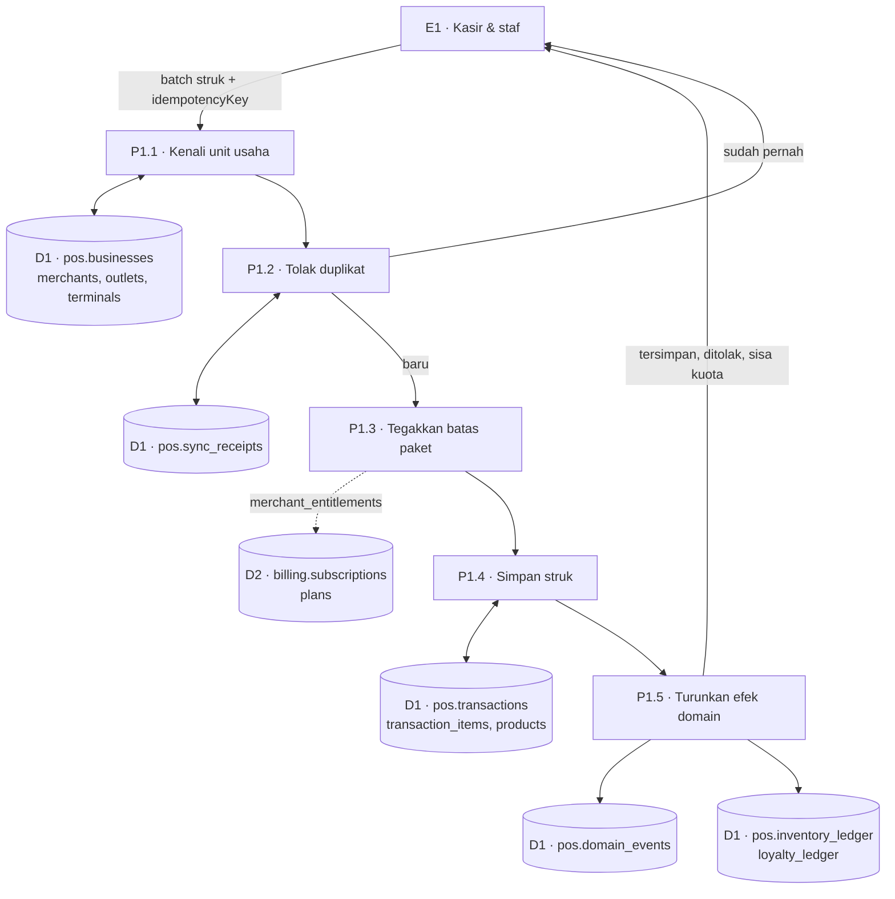
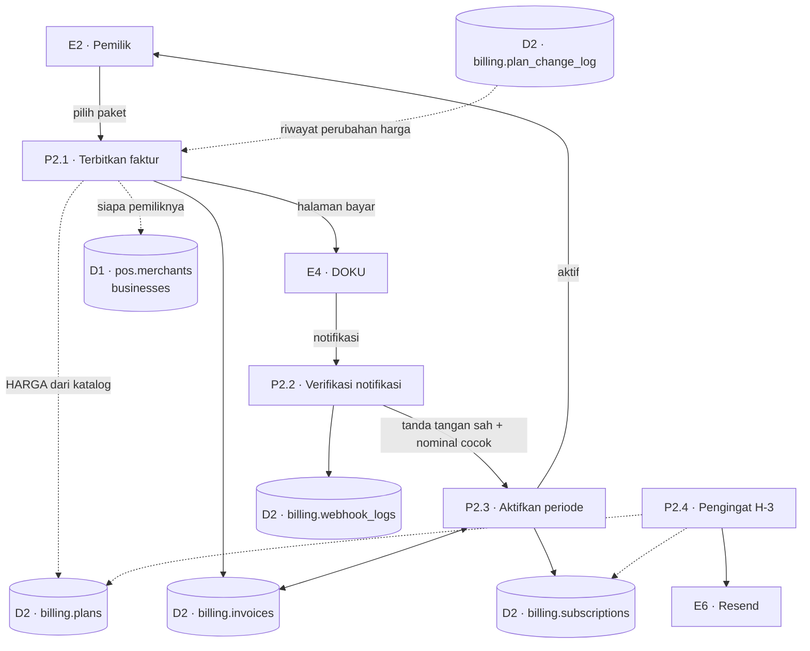
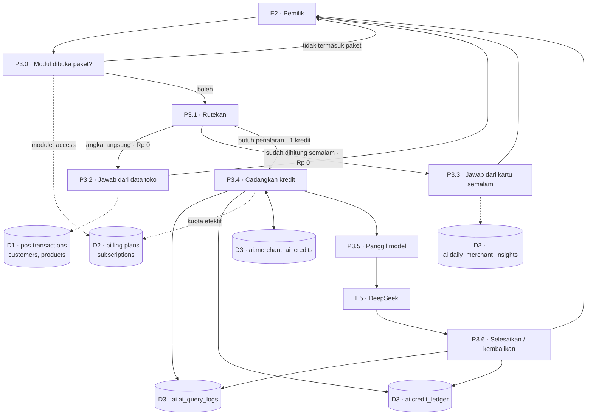
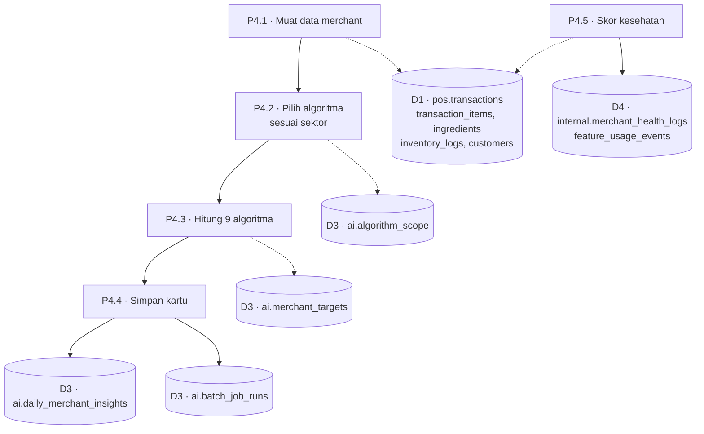
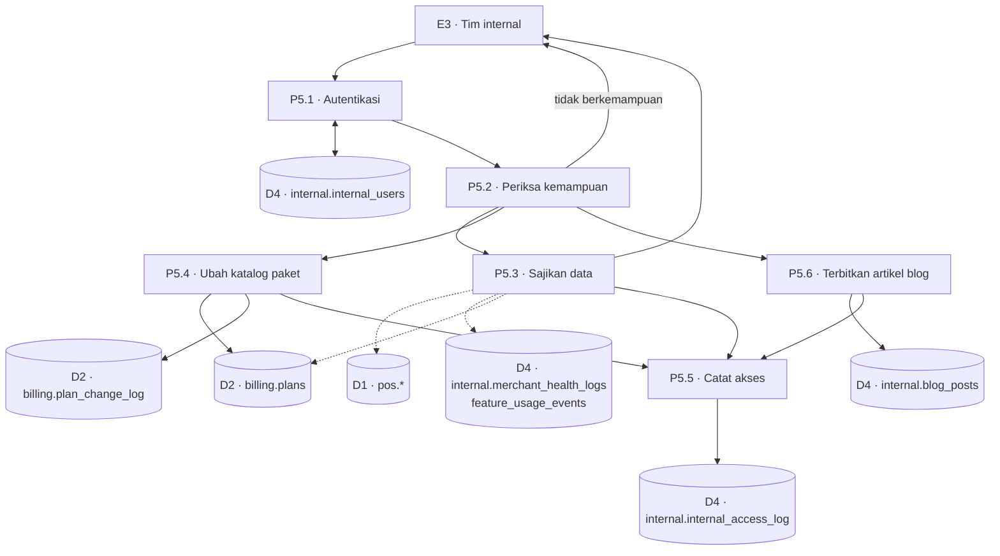

# Aliran Data — New Hope POS

Dokumen ini menggambarkan **ke mana data bergerak** dan **siapa yang boleh
menyentuhnya**. Pelengkap [`docs/erd.md`](docs/erd.md), yang menggambarkan
bentuk datanya.

Diturunkan dari kode dan migrasi yang benar-benar berjalan, lalu diverifikasi
terhadap PostgreSQL. `test/dokumentasi.test.ts` menjaganya tetap sesuai: setiap
tabel dan view kontrak yang ada di database harus muncul di dokumen ini, dan
setiap yang disebut di sini harus ada di database.

---

## Aturan penomoran

| | |
|---|---|
| `E`*n* | Entitas eksternal — di luar batas sistem |
| `P`*n* | Proses |
| `D`*n* | Data store |

Setiap store yang muncul di Level 1 harus muncul juga di Level 2 pada proses
yang memakainya, dan sebaliknya. Ketidakseimbangan di antara keduanya berarti
salah satu diagram berbohong.

---

## `contract` BUKAN data store

Ini keputusan pemodelan yang paling sering keliru dibaca, jadi ditulis
terpisah.

Skema `contract` berisi **30 view dan nol tabel**. Ia tidak menyimpan apa pun.
Ia proyeksi baca di atas `pos`, `billing`, `ai`, dan `internal` — permukaan
yang boleh dilihat service lain, supaya pemilik tabel bebas mengubah bentuk
tabelnya selama view-nya tetap utuh.

Karena itu ia **tidak digambar sebagai `D`*n***. Menggambarnya sebagai store
akan menciptakan aliran yang tidak pernah ada: "P menulis ke contract" mustahil
(tidak ada tabel yang bisa ditulis), dan "contract menyimpan X" salah (X
disimpan di store aslinya). Store bayangan seperti itulah yang membuat Level 1
dan Level 2 tidak pernah bisa diseimbangkan — setiap angka muncul dua kali,
sekali di store aslinya dan sekali di bayangannya.

Menyebutnya *"single source of truth"* juga keliru dan sempat dipakai dalam
pembahasan. Sumber kebenaran tetap tabel di skema pemiliknya; `contract` adalah
**kontrak baca** di atasnya — bentuk yang dijanjikan tidak berubah, bukan
tempat data tinggal. Perbedaannya bukan istilah semata: kalau ia dianggap
sumber kebenaran, orang akan tergoda menulis ke sana, dan yang ditulis akan
menyimpang dari tabel aslinya tanpa ada yang menyadari.

Dalam diagram, `contract` digambar sebagai **garis putus-putus** dari store ke
proses pembacanya — arah baca, bukan tempat singgah.

---

## Level 0 — Konteks

**Batas sistem.** Yang di dalam: aplikasi kasir, API, database, batch. Yang di
luar: perangkat kasir (data lokalnya milik perangkat), dan tiga layanan pihak
ketiga.

---

## Level 1 — Proses utama

**Panah penuh** = tulis (dan baca). **Panah putus-putus** = baca saja, lewat
view `contract`.

Yang terbaca dari diagram ini: **hanya P2 yang boleh menulis ke `billing`**.
P1 dan P3 membacanya untuk tahu batasnya, tapi tidak satu pun jalur dari
perangkat kasir yang bisa mengubah langganan. Itu bukan kebetulan — mengaktifkan
paket hanya boleh terjadi dari notifikasi pembayaran yang tanda tangannya sah.

---

## Level 2 — P1 · Sinkronisasi

**P1.2 — kenapa tolak duplikat lebih dulu.** Perangkat yang jaringannya putus
akan mengirim ulang batch yang sama. `sync_receipts.idempotency_key` dan
`UNIQUE (business_id, client_txn_id)` yang menahannya. Tanpa itu, satu gangguan
jaringan menggandakan omzet hari itu.

**P1.3 — batas ditegakkan di sini, bukan di layar.** Batas produk dan outlet
dibaca dari `contract.merchant_entitlements`, yang sudah menurunkan semuanya ke
tingkat Free begitu langganan mati. Penegakan yang hanya menyembunyikan tombol
bisa dilewati siapa pun yang menyunting bundel JavaScript.

**P1.5 — efek jadi catatan, bukan angka ditimpa.** Stok dan poin tidak
di-`UPDATE` langsung. Yang ditulis baris ledger; saldonya view. Void menulis
baris berlawanan, bukan menghapus. Itu sebabnya `contract.stock_drift` bisa
menjawab "apakah saldo tersimpan cocok dengan catatannya" — pertanyaan yang
tidak bisa dijawab kalau angkanya ditimpa.

---

## Level 2 — P2 · Langganan & pembayaran

**Tiga penjagaan di P2.2, dan urutannya menentukan.** Tanda tangan diperiksa
lebih dulu; lalu merchant dan paket dibaca dari **faktur kami sendiri**, bukan
dari isi notifikasi; lalu nominalnya harus cocok. Membaca paket dari badan
notifikasi berarti siapa pun yang bisa menirukan tanda tangan bisa memilih
paket termahal seharga apa pun.

**Harga tidak pernah datang dari permintaan** (P2.1). Klien mengirim `planId`,
bukan nominal. Menerima nominal dari klien berarti paket termahal bisa dibeli
seharga Rp 1.

**Periode DITAMBAHKAN, bukan diganti** (P2.3). Merchant yang memperpanjang
lebih awal tidak kehilangan hari yang sudah dibayar.

**Langganan menempel di `merchants`, bukan `businesses`.** Pemilik dengan kafe
dan laundry membeli satu paket untuk keduanya — itu sebabnya P2.1 membaca
`D1 · pos.merchants`.

---

## Level 2 — P3 · Asisten AI

**Empat lapisan, empat pertimbangan yang berdiri sendiri** (P3.1): izin,
kemampuan dijawab dengan angka, ketersediaan kartu semalam, dan kebutuhan
penalaran. Sebelumnya keputusannya satu angka — skor keyakinan pencocok pola.
Skor itu hanya tahu apakah kosakatanya dikenali, dan tidak tahu apa-apa tentang
apakah jawabannya berupa angka. *"Berapa omzet bulan ini"* dan *"kenapa omzet
saya turun"* sama-sama mengandung kata `omzet`; yang kedua dijawab tabel omzet
— benar secara harfiah, dan bukan jawaban atas pertanyaannya.

**Kredit adalah mesin keadaan**, bukan potong-lalu-kembalikan.
`RESERVED → SUCCEEDED | REFUNDED`, dan barisnya dibuat **sebelum** model
dipanggil. Proses yang mati setelah model menjawab tapi sebelum jawabannya
tercatat meninggalkan satu baris `RESERVED` yang bisa ditemukan dan
dikembalikan `ai.bersihkan_cadangan_menggantung()` — bukan kredit hilang tanpa
jejak.

---

## Level 2 — P4 · Analitik semalam

**Cakupan sektor disimpan sebagai tabel** (`ai.algorithm_scope`), bukan
ditulis di kode batch. Memindahkan sebuah algoritma antar sektor adalah
keputusan produk dan tidak boleh menuntut deploy ulang.

Tiga dari sembilan berlaku terbatas: `LAYOUT_UTILISATION` (FNB, laundry,
barbershop), `SHIFT_PERFORMANCE` (FNB, ritel, cuci mobil), `STAFF_BEHAVIOUR`
(FNB, ritel, barbershop). Perputaran tempat tidak berarti apa-apa untuk toko
tanpa tempat duduk, dan kartu kosong mengajari orang mengabaikan seluruh kolom
insight.

**`P4.4` menulis, `P3.3` membaca.** Sampai endpoint
`/api/v1/assistant/insights` ada, tidak ada satu pun kode yang membaca
`daily_merchant_insights` — batch berjalan setiap malam ke tabel yang tidak
punya pembaca.

---

## Level 2 — P5 · Panel internal

**Kemampuan diperiksa sebelum data disentuh** (P5.2), dan yang sensitif
dicatat (P5.5) — membaca pembukuan satu merchant yang teridentifikasi,
menyamar sebagai merchant, mengubah langganan, memberi kredit, dan menerbitkan
ke situs publik. Support harus menyebutkan alasannya lebih dulu.

**Perubahan harga punya riwayat** (`plan_change_log`). Harga yang berubah tanpa
jejak adalah harga yang tidak bisa dipertanggungjawabkan ketika merchant
bertanya kenapa tagihannya berbeda.

---

## Neraca store: Level 1 ↔ Level 2

Setiap store di Level 1 harus muncul di Level 2, dan sebaliknya. Tabel ini yang
membuktikannya.

| Store | Level 1 | Level 2 | Tabel |
|---|---|---|---|
| `D1` pos | P1, P2, P3, P4, P5 | P1.1–P1.5, P2.1, P3.2, P4.1, P4.5, P5.3 | 19 |
| `D2` billing | P1, P2, P3, P5 | P1.3, P2.1–P2.4, P3.0, P3.4, P5.3, P5.4 | 5 |
| `D3` ai | P3, P4 | P3.3–P3.6, P4.2–P4.4 | 7 |
| `D4` internal | P4, P5 | P4.5, P5.1–P5.6 | 5 |

**Total 36 tabel.** `contract` (30 view) sengaja tidak ada di tabel ini —
alasannya di bagian [`contract` BUKAN data store](#contract-bukan-data-store).

Tidak ada store yang muncul di Level 2 tapi hilang di Level 1, dan tidak ada
yang sebaliknya. Kalau tabel ini tidak lagi seimbang setelah sebuah perubahan,
diagramnya yang harus diperbaiki — bukan tabelnya yang disesuaikan.

---

## Matriks kepemilikan data

Siapa boleh **menulis** ke mana. Ini yang paling sering diasumsikan dan paling
jarang ditulis, sehingga pelanggarannya baru ketahuan setelah dua tempat
menulis kolom yang sama dengan aturan berbeda.

| Skema | Pemilik | Yang boleh menulis | Yang lain |
|---|---|---|---|
| `pos.*` | POS | jalur sinkron (`P1`) | baca lewat `contract` |
| `billing.plans` `billing.plan_change_log` | Billing | **panel internal** (`P5.4`) | baca lewat `contract` |
| `billing.subscriptions` `billing.invoices` | Billing | **hanya `P2`** — penerbitan faktur & webhook pembayaran | baca lewat `contract` |
| `billing.webhook_logs` | Billing | `P2.2` | — |
| `ai.*` | AI | `P3` (kredit & log), `P4` (kartu insight) | baca lewat `contract` |
| `internal.blog_posts` | Backoffice | `P5.6` — CMS blog | publik baca `contract.blog_published` |
| `internal.*` lainnya | Backoffice | `P5` | — |
| `contract.*` | — | **tidak ada.** Hanya view. | semua service, baca |

**Pembagian di dalam `billing` itu disengaja, dan inilah bagian yang paling
mudah dilanggar.** Panel internal boleh mengubah **katalog** — nama paket,
harga, batas, modul. Itu keputusan produk, dan tempatnya memang di panel.

Panel internal **tidak boleh** menyentuh `subscriptions` dan `invoices`. Yang
mengubah keadaan uang hanya `P2`, dan hanya dari notifikasi pembayaran yang
tanda tangannya sah. Kalau panel bisa menyalakan langganan, satu akun internal
yang jebol menjadi cara memberi paket termahal kepada siapa pun tanpa uang
berpindah — dan tidak akan muncul di rekonsiliasi mana pun, karena tidak ada
faktur yang dilanggarnya.

**Yang menegakkannya DATABASE, bukan peninjauan kode** (0032). `svc_backoffice`
memegang `SELECT` untuk seluruh `billing`, tapi `INSERT`/`UPDATE` hanya pada
`plans` dan `plan_change_log`. Dibuktikan: panel yang mencoba menyalakan
langganan mendapat `permission denied for table subscriptions`.

Default privileges skema ikut dicabut, jadi tabel `billing` yang ditambahkan
migrasi BERIKUTNYA tidak diam-diam bisa ditulis panel. Aturan yang hanya
ditulis di dokumen adalah aturan yang akan dilanggar oleh orang yang tidak
membaca dokumen itu.

`src/server/plansRepo.ts` adalah satu-satunya berkas panel yang menulis
`billing`, dan hanya ke dua tabel katalog itu. `billing.subscriptions` di
berkas yang sama hanya dibaca — untuk menghitung berapa merchant yang memakai
sebuah paket sebelum harganya diubah.

---

## Matriks kemampuan

Capability mana membuka apa, dan mana yang tercatat.

| Capability | Kepekaan | Membuka | Diaudit | Alasan wajib |
|---|---|---|---|---|
| `VIEW_MERCHANT_HEALTH` | AGGREGATE | Skor churn, agregat | — | — |
| `VIEW_CHURN_COHORT` | AGGREGATE | Kohor retensi | — | — |
| `VIEW_PLATFORM_REVENUE` | AGGREGATE | MRR seluruh platform | — | — |
| `VIEW_FEATURE_ADOPTION` | AGGREGATE | Adopsi fitur | — | — |
| `VIEW_SECTOR_ANALYTICS` | AGGREGATE | Ringkasan lima sektor | — | — |
| `VIEW_ACCESS_AUDIT` | AGGREGATE | Log akses internal | — | — |
| `VIEW_MERCHANT_PROFILE` | IDENTIFIED | Profil, cabang, staf toko | ya | SUPPORT |
| `VIEW_ACTIVITY_LOG` | IDENTIFIED | Kejadian di aplikasi kasir | ya | SUPPORT |
| `VIEW_MERCHANT_FINANCIAL` | FINANCIAL | Omzet & margin satu merchant | ya | SUPPORT |
| `VIEW_MERCHANT_BILLING` | FINANCIAL | Langganan & tagihannya | ya | SUPPORT |
| `VIEW_MERCHANT_AI_USAGE` | FINANCIAL | Kredit & pemakaian AI | ya | SUPPORT |
| `VIEW_TRANSACTION_LOG` | FINANCIAL | Struk satu merchant | ya | SUPPORT |
| `VIEW_PRODUCT_SALES` | FINANCIAL | Penjualan per produk | ya | SUPPORT |
| `VIEW_CUSTOMER_DATA` | PERSONAL | Data pribadi pelanggan merchant | ya | **semua** |
| `MANAGE_SUBSCRIPTION` | DANGEROUS | Ubah katalog paket & harga | ya | **semua** |
| `GRANT_AI_CREDITS` | DANGEROUS | Menambah kredit AI | ya | **semua** |
| `IMPERSONATE_MERCHANT` | DANGEROUS | Menyamar sebagai merchant | ya | **semua** |
| `MANAGE_INTERNAL_USERS` | DANGEROUS | Buat & ubah peran akun internal | ya | **semua** |
| `MANAGE_PUBLIC_CONTENT` | DANGEROUS | Terbitkan artikel blog | ya | **semua** |

**Kepekaan melekat pada DATANYA, bukan pada jabatan pembukanya.** Kewajiban
alasan dulu ditentukan semata oleh peran — `role === SUPPORT && requiresAudit`.
Artinya superadmin membuka data pribadi pelanggan tanpa menyebut alasan apa
pun, sementara support harus beralasan untuk melihat daftar cabang. Peran
menjawab "boleh atau tidak"; ia tidak menjawab "seberapa berbahaya kalau ini
dibuka tanpa sebab".

Sekarang: PERSONAL dan DANGEROUS menuntut alasan dari **siapa pun, termasuk
superadmin**. FINANCIAL dan IDENTIFIED hanya dari SUPPORT — superadmin memang
mengurus pembukuan platform, dan menuntutnya beralasan setiap kali hanya
melatih mengetik "cek". AGGREGATE tidak pernah.

**Empat capability agregat sengaja tidak diaudit.** Semuanya angka yang tidak
bisa dikenali merchantnya. Menuntut jejak untuk membuka dasbor ringkasan
melatih staf mengabaikan seluruh mekanismenya, dan kebiasaan itu merusak nilai
jejak yang benar-benar penting.

**Daftar yang diaudit DIHASILKAN, bukan ditulis tangan.** Dulu array manual —
dan array manual menua ke arah yang salah: capability baru tidak masuk kecuali
ada yang ingat, makin banyak yang tidak tercatat, dan tidak ada yang memberi
tahu. Sekarang `requiresAudit(cap) === (sensitivity(cap) !== 'AGGREGATE')`, dan
TypeScript menolak `SENSITIVITY` yang tidak memuat seluruh capability.

**Mutasi lewat `layaniTulis`**, yang menuntut alasan, menjalankan handlernya,
lalu mencatat hasil sesungguhnya — termasuk `FAILED_*` saat gagal. Sebelumnya
tiap endpoint memanggil `catatAkses` sendiri: benar hari itu, tapi endpoint
berikutnya yang lupa **tidak akan mengeluh**. `npm run hygiene` sekarang
menolak berkas di `api/admin/` yang melayani metode tulis tanpa memakai
pembungkusnya.

---

## Dua bentuk deployment, satu aliran

Diagram di atas berlaku untuk keduanya. Yang berbeda hanya di mana prosesnya
berjalan.

| | Serverless (Vercel) | Microservice |
|---|---|---|
| P1, P2, P3 | `api/v1/**` | `services/pos`, `services/billing`, `services/ai` |
| P5 | `api/admin/**` | `services/backoffice` |
| P4 | `scripts/batch/*.mjs` (cron) | sama |
| Gerbang | routing Vercel | `services/gateway` |
| Migrasi | `scripts/db/bundle.mjs` → `supabase-setup.sql` | `services/db-server/migrate.ts` |

Keduanya memakai file migrasi yang sama, jadi tidak ada bentuk skema yang hanya
ada di satu sisi.

---

## Yang belum

Ditulis di sini supaya tidak terlihat seperti sudah selesai.

- **Jabat tangan DOKU belum diuji ke server sungguhan.** Tanda tangannya sudah
  diuji terhadap vektor uji, tapi `api-sandbox.doku.com` diblokir dari
  lingkungan pengembangan ini. Harus dijalankan dari mesin sendiri.
- **`LAYOUT_UTILISATION` memakai pendekatan.** Meja, bay, dan kursi belum
  menjadi entitas, jadi yang dihitung adalah pesanan yang dilayani di tempat
  (`order_type = DINE_IN`) — bukan perputaran meja yang sesungguhnya. Payload
  kartunya menuliskan basis itu apa adanya.
