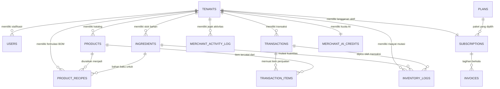
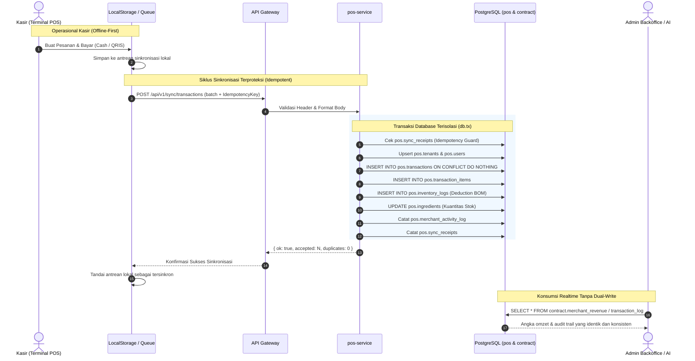
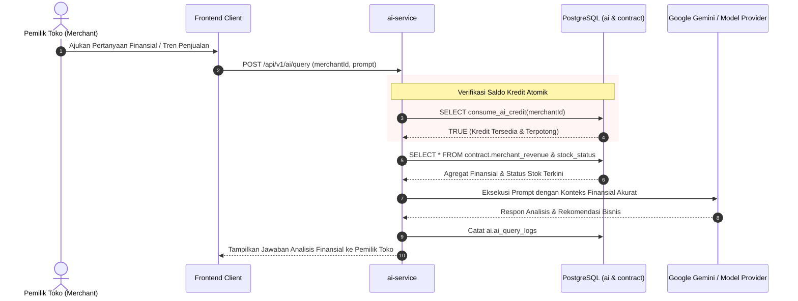

# 📖 Dokumentasi Arsitektur Resmi — New Hope POS

Dokumentasi komprehensif arsitektur sistem, domain data model, aliran data (end-to-end data flow), dan tata kelola keamanan New Hope POS.

---

## 1. Prinsip Arsitektur Utama

Sistem New Hope POS menerapkan **Clean Multi-Schema Architecture** di atas PostgreSQL (Supabase) dengan batas domain yang ditegakkan secara struktural oleh hak akses database.

```
┌────────────────────────────────────────────────────────────────────────┐
│                              CLIENT TIER                               │
│        Web POS Terminal (React)  │  Admin Backoffice (React)           │
│        Offline-first Cache       │  Realtime Analytics Dashboard       │
└───────────────────────────────────┬────────────────────────────────────┘
                                    │ HTTPS / WSS
                                    ▼
┌────────────────────────────────────────────────────────────────────────┐
│                          API GATEWAY TIER                              │
│   Reverse Proxy │ SSL Termination │ Rate Limiting │ Request Routing    │
└───────────────────────────────────┬────────────────────────────────────┘
                                    │
                                    ▼
┌────────────────────────────────────────────────────────────────────────┐
│                        AUTHENTICATION & CONTEXT                        │
│   • Supabase Auth / Session Token Resolution                           │
│   • Cashier PIN Hash Verification                                      │
│   • Resolve Actor & Merchant Identity (merchant_id = tenant_id)        │
└───────────────────────────────────┬────────────────────────────────────┘
                                    │
                                    ▼
┌────────────────────────────────────────────────────────────────────────┐
│                         BUSINESS SERVICE LAYER                         │
│   ┌──────────────┐  ┌──────────────┐  ┌─────────────┐  ┌─────────────┐ │
│   │ pos-service  │  │billing-serv. │  │ ai-service  │  │ backoffice  │ │
│   │ (Sync/Catalog│  │(Subscription │  │ (Credits &  │  │(Audit & Org │ │
│   │  & Inventory)│  │ & Invoices)  │  │  Insights)  │  │  Monitoring)│ │
│   └──────┬───────┘  └──────┬───────┘  └──────┬──────┘  └──────┬──────┘ │
└──────────┼─────────────────┼─────────────────┼────────────────┼────────┘
           │                 │                 │                │
           ▼                 ▼                 ▼                ▼
┌────────────────────────────────────────────────────────────────────────┐
│                        POSTGRESQL DATABASE TIER                        │
│                                                                        │
│  [pos]            [billing]          [ai]              [internal]      │
│  • tenants        • plans            • credits         • users         │
│  • users          • subscriptions    • insights        • access_log    │
│  • products       • invoices         • targets         • health_logs   │
│  • ingredients    • webhooks         • query_logs      • feature_usage │
│  • recipes                                                             │
│  • transactions                                                        │
│  • trans_items                                                         │
│  • inventory_logs                                                      │
│                                                                        │
│  ────────────────────────────────────────────────────────────────────  │
│  [contract] (Single Source of Truth Cross-Domain Read Surface)         │
│  • merchant_directory   • merchant_revenue     • catalog               │
│  • stock_status         • inventory_movements  • transaction_log       │
│  • subscription_status  • sector_summary       • merchant_health       │
│                                                                        │
│  ────────────────────────────────────────────────────────────────────  │
│  [PostgreSQL RLS Enforcement] (Database-Level Authorization Filter)    │
└────────────────────────────────────────────────────────────────────────┘
```

---

## 2. Canonical Domain Model: Merchant ≡ Tenant

### Identitas Tunggal (Single Source of Truth)
- **`Merchant` adalah `Tenant`**: Tidak ada pemisahan entitas antara organisasi toko dan tenant sistem.
- **Canonical ID**: `pos.tenants.id` (UUID v7) bertindak sebagai `tenant_id` internal dan diekspos sebagai `merchant_id` pada seluruh kontrak bisnis lintas-layanan.

### Hierarki Relasi Domain (1 : N)



---

## 3. Batas Domain Skema (Multi-Schema Isolation)

| Skema | Service Pemilik | Hak Akses Tulis (Write) | Hak Akses Baca (Read) | Deskripsi |
|---|---|---|---|---|
| `pos` | `pos-service` | `svc_pos` | `svc_pos` | Inti transaksi POS, katalog, staf, resep BOM, dan mutasi stok. |
| `billing` | `billing-service` | `svc_billing` | `svc_billing` | Paket langganan SaaS, status tagihan, faktur, dan log webhook. |
| `ai` | `ai-service` | `svc_ai` | `svc_ai` | Dompet kuota kredit AI, agregasi insight bisnis harian, log kueri LLM. |
| `internal` | `backoffice-service` | `svc_internal` | `svc_internal` | Identitas admin platform, audit trail operator, pemantauan churn & kesehatan merchant. |
| `contract` | *Shared Contract* | Tidak ada (Hanya View) | Semua Service (`svc_*`, `bi_readonly`) | **Satu-satunya antarmuka baca lintas-layanan**. Menghilangkan inkonsistensi pelaporan angka omzet dan stok. |
| `public` | *Platform Public* | `schema_migrations` | `anon`, `authenticated` | Hanya memuat view tersanitasi yang merujuk ke `contract.*` (tanpa kolom sensitif seperti hash PIN). |

---

## 4. Aliran Data Transaksi & Mutasi Stok (End-to-End Flow)



---

## 5. Aliran Otorisasi & Eksekusi AI Financial Copilot



---

## 6. Perlindungan Keamanan & Sanitasi Skema

1. **Anti-Leakage PIN**:
   - Kolom `pin` di `pos.users` tidak pernah diekspos ke skema `contract` atau skema `public`.
   - Tidak ada view `SELECT * FROM pos.users` di skema `public`.
2. **PostgreSQL RLS (Row Level Security)**:
   - RLS diterapkan pada semua tabel domain (`pos.*`, `billing.*`, `ai.*`) sebagai lapisan pertahanan database (*defense-in-depth*).
   - Layanan aplikasi beroperasi dengan peran tersendiri (`svc_pos`, `svc_billing`, `svc_ai`, `svc_internal`).
3. **No Dual-Write Guarantee**:
   - Seluruh transaksi hanya ditulis satu kali ke `pos.transactions`.
   - Modul pelaporan, analitik backoffice, dan AI Copilot membaca data yang sama melalui view di skema `contract`.
