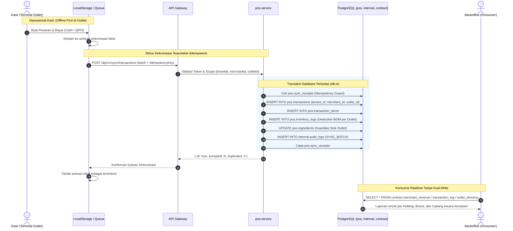

# 📖 Dokumentasi Arsitektur Resmi — New Hope POS

Dokumentasi arsitektur sistem, hirarki multi-tenant (Model B), otentikasi & step-up otorisasi, tata kelola keamanan berlapis (*Defense-in-Depth*), dan aturan emas integritas data (*Golden Rule*).

---

## 🌟 Aturan Emas Arsitektur New Hope POS (*The Golden Rule*)

> ### *"A service may consume another domain's data, but it never becomes the owner of that domain's entity."*
>
> 1. **AI membaca data Transaksi** ➔ AI **TIDAK** memiliki entitas Transaksi.
> 2. **Backoffice membaca data Langganan** ➔ Backoffice **TIDAK** memiliki entitas Langganan.
> 3. **Billing mengetahui entitas Tenant** ➔ Billing **TIDAK** memiliki entitas Tenant.
> 4. **POS menggunakan akun Kasir/Staf** ➔ POS **TIDAK** memiliki entitas Pengguna/User.
> 5. **Backoffice adalah Konsumer/Orkestrator UI** ➔ Backoffice **TIDAK** memiliki skema database tersendiri.

---

## 1. Prinsip Arsitektur: Clean Multi-Schema & Multi-Tier Isolation

```
┌────────────────────────────────────────────────────────────────────────┐
│                              CLIENT TIER                               │
│        Web POS Terminal (React)  │  Admin Backoffice (React)           │
│        Offline-first Cache       │  Realtime Analytics Dashboard       │
└───────────────────────────────────┬────────────────────────────────────┘
                                    │ HTTPS / WSS
                                    ▼
┌────────────────────────────────────────────────────────────────────────┐
│                          API GATEWAY TIER                              │
│   Reverse Proxy │ SSL Termination │ Rate Limiting │ Request Routing    │
└───────────────────────────────────┬────────────────────────────────────┘
                                    │
                                    ▼
┌────────────────────────────────────────────────────────────────────────┐
│           AUTHENTICATION, CONTEXT & STEP-UP AUTHORIZATION              │
│   1. AUTHENTICATION     : Supabase Session Token & Actor Identity      │
│   2. CONTEXT RESOLUTION : User ➔ Tenant ➔ Merchant ➔ Outlet ➔ Role     │
│   3. STEP-UP AUTH (PIN) : Manager PIN for High-Risk (VOID/Refund)      │
└───────────────────────────────────┬────────────────────────────────────┘
                                    │
                                    ▼
┌────────────────────────────────────────────────────────────────────────┐
│                         BUSINESS SERVICE LAYER                         │
│   ┌──────────────┐  ┌──────────────┐  ┌─────────────┐  ┌─────────────┐ │
│   │ pos-service  │  │billing-serv. │  │ ai-service  │  │ Backoffice  │ │
│   │(Catalog,Order│  │(Subscription │  │ (Credits &  │  │(Consumer &  │ │
│   │Txn & Invent.)│  │ & Invoices)  │  │  Insights)  │  │Orchestrator)│ │
│   └──────┬───────┘  └──────┬───────┘  └──────┬──────┘  └──────┬──────┘ │
└──────────┼─────────────────┼─────────────────┼────────────────┼────────┘
           │                 │                 │                │
           ▼                 ▼                 ▼                ▼
┌────────────────────────────────────────────────────────────────────────┐
│                        POSTGRESQL DATABASE TIER                        │
│                                                                        │
│  ┌─────────────────────────┐  ┌─────────────────────────┐              │
│  │ [internal]              │  │ [pos]                   │              │
│  │ (Platform Plane)        │  │ (Store Operations)      │              │
│  ├─────────────────────────┤  ├─────────────────────────┤              │
│  │ • tenants (Holding/Corp)│  │ • products (Master Data)│              │
│  │ • merchants (Brand/Unit)│  │ • ingredients (Master)  │              │
│  │ • outlets (Store Branch)│  │ • product_recipes (BOM) │              │
│  │ • users (Global ID 1:1) │  │ • inventory_locations   │              │
│  │ • memberships (RBAC/PIN)│  │ • inventory_balances    │              │
│  │ • audit_logs (Platform) │  │ • inventory_logs (Audit)│              │
│  │ • business_targets      │  │ • transactions          │              │
│  │ • feature_usage (Telem.)│  │ • transaction_items     │              │
│  │ • access_log (Operator) │  │ • sync_receipts         │              │
│  │ • health_logs           │  └────────────┬────────────┘              │
│  └────────────┬────────────┘               │                           │
│               │                            │                           │
│               ├────────────────────────────┤                           │
│               ▼                            ▼                           │
│  ┌─────────────────────────┐  ┌─────────────────────────┐              │
│  │ [billing]               │  │ [ai]                    │              │
│  │ (SaaS Monetization)     │  │ (Intelligence)          │              │
│  ├─────────────────────────┤  ├─────────────────────────┤              │
│  │ • plans                 │  │ • merchant_ai_credits   │              │
│  │ • subscriptions         │  │ • daily_merchant_insight│              │
│  │ • invoices              │  │ • query_logs            │              │
│  │ • webhook_logs          │  └─────────────────────────┘              │
│  └─────────────────────────┘                                           │
│                                                                        │
│  ────────────────────────────────────────────────────────────────────  │
│  [contract] (Single Source of Truth Cross-Domain Read Surface)         │
│  • tenant_directory     • merchant_directory   • outlet_directory      │
│  • merchant_revenue     • merchant_staff       • catalog               │
│  • stock_status         • inventory_movements  • transaction_log       │
│  • subscription_status  • sector_summary       • business_targets      │
│  • activity_log (Platform Audit Stream)                                │
│                                                                        │
│  ────────────────────────────────────────────────────────────────────  │
│  [PostgreSQL RLS Enforcement] (Database-Level Authorization Filter)    │
└────────────────────────────────────────────────────────────────────────┘
```

---

## 2. Model B: Enterprise Multi-Tier Hierarchy (Tenant ➔ Merchant ➔ Outlet)

Struktur data New Hope POS dirancang untuk mendukung ekspansi bisnis dari 1 toko hingga holding multi-brand dan multi-cabang:

```
┌────────────────────────────────────────────────────────────────────────┐
│                TINGKAT 1: TENANT (internal.tenants)                    │
│      Holding Company / Enterprise Account / Pelanggan SaaS Billing     │
│      Contoh: "PT Boga Maju Bersama"                                    │
│      • Memiliki Paket Langganan SaaS (billing.subscriptions)           │
│      • Memiliki Faktur Tagihan (billing.invoices)                      │
│      • Memiliki Kuota AI Platform (ai.merchant_ai_credits)             │
└───────────────────────────────────┬────────────────────────────────────┘
                                    │ 1 : N
                                    ▼
┌────────────────────────────────────────────────────────────────────────┐
│               TINGKAT 2: MERCHANT (internal.merchants)                 │
│         Brand / Business Unit / Lini Bisnis per Sektor Usaha           │
│         Contoh: "Kopi Senja (F&B)"  &  "Laundry Bersih (Laundry)"      │
│         • Memiliki Katalog Produk & Resep BOM                          │
│         • Memiliki Target Omzet Bulanan (internal.business_targets)    │
└───────────────────────────────────┬────────────────────────────────────┘
                                    │ 1 : N
                                    ▼
┌────────────────────────────────────────────────────────────────────────┐
│                TINGKAT 3: OUTLET (internal.outlets)                    │
│             Cabang Toko Fisik / Terminal Kasir Geofenced               │
│             Contoh: "Cabang Senayan"  &  "Cabang Sudirman"             │
│             • Memiliki Kasir & Terminal POS Aktif                      │
│             • Memiliki Gudang Stok & Mutasi Bahan Baku Fisik           │
│             • Menghasilkan Transaksi Penjualan & Struk                 │
└────────────────────────────────────────────────────────────────────────┘
```

### Relasi Multi-Tenant RBAC & Keanggotaan Staf (`internal.memberships`)

- **`internal.users`**: 1 Manusia = 1 User ID global (Email, Nama, Avatar).
- **`internal.memberships`**:
  - User A dapat menjadi **Owner** di tingkat Tenant (mengakses semua merchant dan outlet).
  - User B dapat menjadi **Manager** di Merchant "Kopi Senja" (mengakses cabang Senayan & Sudirman).
  - User C dapat menjadi **Cashier** di Outlet "Cabang Senayan" dengan PIN Kios `1234`.

---

### 📦 2.1 Domain Inventory Multi-Location (Branch-Aware Inventory)

Sistem membedakan secara tegas antara **Master Data Katalog** dengan **Fisik Saldo Stok Per Cabang**:

```
[MASTER DATA BRAND (Merchant-Scoped)]
pos.products          : Definisi produk, SKU, kategori, harga jual, harga pokok
pos.ingredients       : Definisi bahan baku mentah (biji kopi, susu, deterjen)
pos.product_recipes   : Bill of Materials (BOM) per porsi produk
        │
        ▼ (Diturunkan ke masing-masing cabang)
[PHYSICAL INVENTORY (Outlet-Scoped)]
pos.inventory_locations : Titik gudang per cabang (Gudang Utama, Dapur, Rak Display)
pos.inventory_balances  : Saldo stok riil per (outlet_id, location_id, item_id)
pos.inventory_logs      : Audit mutasi riil per (outlet_id, transaction_id, type)
```

- **Contoh Kasus**: Kopi Susu Gula Aren memiliki stok di **Cabang Senayan = 20 cup** dan **Cabang Sudirman = 50 cup**.
- Data saldo fisik tersimpan terisolasi di `pos.inventory_balances`, bukan di tabel global `pos.products.stock`.
- Konsumen lintas domain membaca kondisi stok melalui view `contract.stock_status`.

---

### 🧬 2.2 Multi-Level Recursive Bill of Materials (BOM) & Semi-Finished Items

Sistem mendukung struktur pohon resep bertingkat (*Recursive Multi-Level BOM*) untuk mengelola bahan mentah, olahan antara (*prep/semi-finished*), dan produk jadi:

```
[Level 1: FINISHED GOOD]
Es Kopi Latte (1 porsi)
 ├── 60 ml Espresso Base Shot (SEMI_FINISHED) ──────────────┐
 ├── 150 ml Susu Segar (RAW_MATERIAL)                       │
 ├── 20 ml Simple Syrup Gula Aren (SEMI_FINISHED) ──┐       │
 └── 1 pcs Paper Cup 12oz (PACKAGING)               │       │
                                                    │       ▼
                                                    │ [Level 2: SEMI_FINISHED]
                                                    │ Batch Espresso 1000 ml
                                                    │  ├── 250 gr Roasted Coffee Beans (SEMI_FINISHED) ──┐
                                                    │  └── 1200 ml Air RO Terfiltrasi (RAW_MATERIAL)     │
                                                    ▼                                                    │
                                  [Level 2: SEMI_FINISHED]                                               │
                                  Batch Simple Syrup 5000 ml                                             ▼
                                   ├── 3 kg Gula Aren Batok (RAW_MATERIAL)             [Level 3: RAW MATERIAL]
                                   └── 3000 ml Air Panas (RAW_MATERIAL)                Roasted Coffee Beans 1000 gr
                                                                                        ├── 600 gr Green Bean Arabica
                                                                                        └── 400 gr Green Bean Robusta
```

- **`pos.recipes`**: Menyimpan formula header untuk *Finished Goods* maupun *Semi-Finished Preps*.
- **`pos.recipe_items`**: Menghubungkan input item (bahan mentah maupun olahan setengah jadi) secara rekursif.
- **`contract.bom_explosion`**: PostgreSQL Recursive CTE yang otomatis mengurai kebutuhan bahan baku riil dari level teratas hingga bahan mentah dasar.

---

### ☕ 2.3 Varian Produk, Modifier BOM, & Snapshot Transaksi Historis

Sistem menjamin integritas finansial dan pemotongan stok bahan baku melalui snapshot data pesanan:

```
[TRANSAKSI PENJUALAN]
Item: Latte (Variant: Large, Rp 32.000)
 ├── Base Product Snapshot   : product_name = "Latte", unit_price = 28000, unit_cost = 6500
 ├── Variant Snapshot        : variant_name = "Large", price_adj = +4000, cost_adj = +1200
 └── Selected Modifiers BOM  :
      ├── Extra Shot (+Rp 5.000, HPP: Rp 1.500) ➔ Potong 8g Biji Kopi di pos.inventory_balances
      └── Oat Milk Swap (+Rp 6.000, HPP: Rp 2.200) ➔ Potong 150ml Susu Oat di pos.inventory_balances
```

- **Modifier BOM (`pos.modifier_recipes`)**: Menghubungkan setiap add-on/opsi ke bahan baku mentah terkait, sehingga saat *Extra Shot* terjual, stok biji kopi otomatis terpotong.
- **Immutable Price & Cost Snapshots (`pos.transaction_items`)**:
  - Menyimpan permanen `product_name_snapshot`, `variant_name_snapshot`, `unit_price`, `unit_cost`, dan `modifier_snapshot`.
  - Jika harga menu dinaikkan di masa depan, laporan keuangan transaksi lampau tetap akurat dan tidak berubah.
- **Kontrak Detail Transaksi (`contract.transaction_items_detailed`)**:
  - Menyediakan single source of truth untuk analisis laba kotor riil per varian dan modifier.

---

### 💳 2.4 Pemisahan Daur Hidup Pesanan (Order) vs Pembayaran (Payment)

Untuk mendukung *Split Payment*, *Multi-Tender*, *Partial Payment*, dan pencegahan *Fraud* pada pembayaran digital (QRIS/EDC):

```
┌────────────────────────────────────────────────────────┐
│             ORDER LIFECYCLE (pos.transactions)         │
│   OPEN ➔ PENDING_PAYMENT ➔ COMPLETED                   │
│   (Batal: CANCELLED / VOIDED / REFUNDED)               │
└───────────────────────────┬────────────────────────────┘
                            │ 1 : N
                            ▼
┌────────────────────────────────────────────────────────┐
│             PAYMENT LIFECYCLE (pos.payments)           │
│   PENDING ➔ PAID (Verifikasi Webhook / EDC Trace)      │
│   (Gagal: FAILED / EXPIRED / REFUNDED)                 │
└────────────────────────────────────────────────────────┘
```

#### Alur Pembayaran Digital Aman (Anti-Fraud QRIS Flow):
```
1. Kasir memilih pembayaran QRIS
    ↓
2. Backend POS memanggil Payment Gateway (Midtrans / Xendit) ➔ Generate Dynamic QRIS
    ↓
3. Pelanggan melakukan scan & bayar via m-Banking / E-Wallet
    ↓
4. Payment Gateway mengirimkan Webhook terverifikasi (HMAC Signature & Idempotency Key)
    ↓
5. Backend POS memvalidasi Webhook ➔ Membuat record pos.payments (status = PAID)
    ↓
6. Order berubah menjadi COMPLETED ➔ Bahan baku BOM otomatis dipotong di gudang cabang
    ↓
7. Layar Kasir menerima notifikasi Realtime bahwa transaksi lunas (Struk tercetak)
```

- **Prinsip Keamanan Finansial**: Kasir **TIDAK** menjadi penentu status `PAID` untuk transaksi digital (mencegah manipulasi struk/fraud kasir).
- **VOID vs Status Pembayaran**: `VOID` adalah pembatalan pesanan yang telah lunas (*Order Lifecycle Event*) yang membutuhkan Step-Up Authorization Manager, bukan sekadar status pembayaran.

---

## 3. Otentikasi vs Step-Up Otorisasi (Manager PIN)

```
Skenario Kasir Melakukan Tindakan Berisiko Tinggi (mis. VOID Transaksi / Diskon Khusus):

Kasir Login (Supabase Session)
        │
        ▼
Kasir Memilih "Batalkan Transaksi (VOID)"
        │
        ▼
Service Permission Check (Peran: CASHIER tidak memiliki hak VOID langsung)
        │
        ▼
Require Manager Step-Up Authorization
        │
        ▼
Manager Memasukkan PIN Toko (Short-Lived Authorization Grant: 60 Detik)
        │
        ▼
Eksekusi VOID ➔ Catat ke internal.audit_logs dengan Actor Kasir + ApprovedBy Manager
```

---

## 4. Keamanan Berlapis (*Defense-in-Depth Chain*)

Batas domain tidak hanya bergantung pada izin database, melainkan ditegakkan pada setiap lapisan:

```
1. USER                    : Permintaan masuk dari browser kasir / admin
    ↓
2. AUTHENTICATION          : Verifikasi JWT / Sesi Supabase Auth yang valid
    ↓
3. CONTEXT RESOLUTION      : Penentuan Tenant ID, Merchant ID, dan Outlet ID aktif
    ↓
4. SERVICE AUTHORIZATION   : Pengecekan RBAC aplikasi (Apakah peran diizinkan?)
    ↓
5. STEP-UP AUTHORIZATION   : PIN Manager untuk aksi berisiko tinggi (VOID, Refund)
    ↓
6. DB ROLE ISOLATION       : svc_pos, svc_billing, svc_ai, svc_internal
    ↓
7. SCHEMA PERMISSION       : Hanya skema milik domain yang dapat ditulis
    ↓
8. TENANT ISOLATION (RLS)  : Enforce WHERE tenant_id = current_tenant di PostgreSQL
```

---

## 5. Perbedaan Eksplisit: `internal.access_log` vs `ai.query_logs`

| Kategori | Tabel | Isi Data | Tujuan |
|---|---|---|---|
| **Operator Access Log** | `internal.access_log` | **WHO accessed WHAT**<br>(`internal_user_id`, `merchant_id`, `resource`, `action`, `timestamp`) | Audit kepatuhan operator backoffice/support saat mengakses data privat merchant. |
| **AI LLM Query Log** | `ai.query_logs` | **WHAT AI request happened**<br>(`merchant_id`, `intent`, `model`, `prompt_tokens`, `completion_tokens`, `latency_ms`, `credit_consumed`) | Audit teknis performa model AI, konsumsi kuota kredit, dan diagnostik latensi. |
| **Platform Audit Log** | `internal.audit_logs` | **BUSINESS EVENT AUDIT**<br>(`domain`, `event_type`, `severity`, `amount_idr`, `summary`, `detail`) | Jejak audit bisnis (VOID transaksi, ganti harga, ubah paket langganan). |
| **Product Telemetry** | `internal.feature_usage_events` | **FEATURE ADOPTION METRICS**<br>(`feature_name`, `ui_component`, `event_count`) | Analisis produk dan adopsi fitur (tidak dipakai untuk penagihan invoice). |

---

## 6. Aliran Data Transaksi Kasir (End-to-End Flow)


