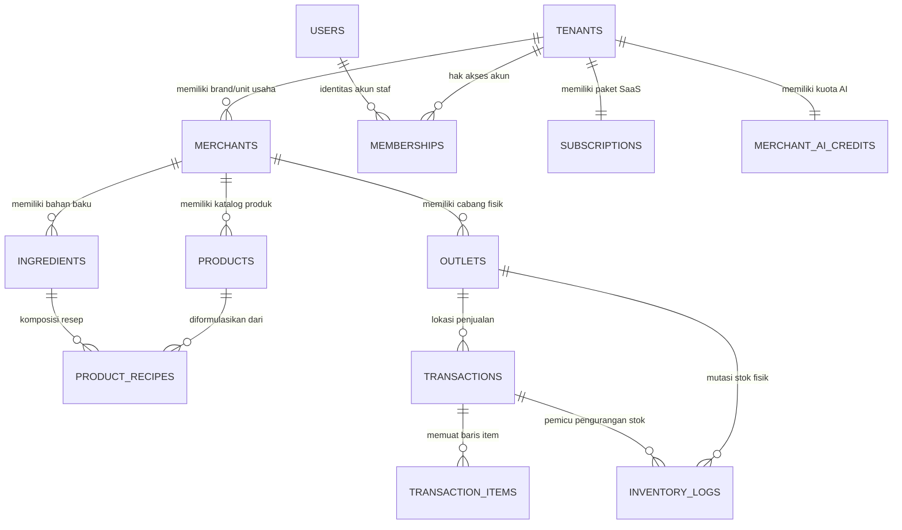
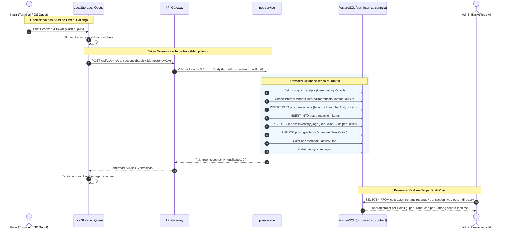
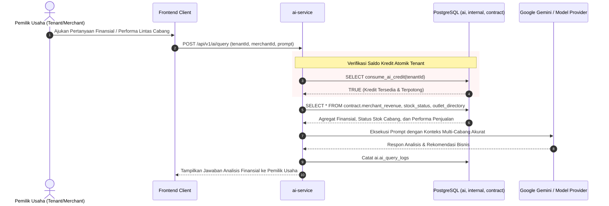

# 📖 Dokumentasi Arsitektur Resmi — New Hope POS

Dokumentasi komprehensif arsitektur sistem, model data domain hirarkis (Model B), aliran data (end-to-end data flow), dan tata kelola keamanan New Hope POS.

---

## 1. Prinsip Arsitektur Utama: Clean Multi-Schema Isolation

Sistem New Hope POS menerapkan **Clean Multi-Schema Architecture** di atas PostgreSQL (Supabase) dengan batas domain yang ditegakkan secara struktural oleh hak akses database.

```
┌────────────────────────────────────────────────────────────────────────┐
│                              CLIENT TIER                               │
│        Web POS Terminal (React)  │  Admin Backoffice (React)           │
│        Offline-first Cache       │  Realtime Analytics Dashboard       │
└───────────────────────────────────┬────────────────────────────────────┘
                                    │ HTTPS / WSS
                                    ▼
┌────────────────────────────────────────────────────────────────────────┐
│                          API GATEWAY TIER                              │
│   Reverse Proxy │ SSL Termination │ Rate Limiting │ Request Routing    │
└───────────────────────────────────┬────────────────────────────────────┘
                                    │
                                    ▼
┌────────────────────────────────────────────────────────────────────────┐
│                  GLOBAL IDENTITY & AUTHENTICATION                      │
│   • Supabase Auth / Session Token Resolution                           │
│   • Global User Plane: internal.users (1 Manusia = 1 User)             │
│   • Multi-Tenant RBAC: internal.memberships (Peran & PIN Kios Toko)    │
│   • Resolve Scope: Tenant ID ➔ Merchant ID ➔ Outlet ID                 │
└───────────────────────────────────┬────────────────────────────────────┘
                                    │
                                    ▼
┌────────────────────────────────────────────────────────────────────────┐
│                         BUSINESS SERVICE LAYER                         │
│   ┌──────────────┐  ┌──────────────┐  ┌─────────────┐  ┌─────────────┐ │
│   │ pos-service  │  │billing-serv. │  │ ai-service  │  │ backoffice  │ │
│   │ (Sync/Catalog│  │(Subscription │  │ (Credits &  │  │(Audit & Org │ │
│   │  & Inventory)│  │ & Invoices)  │  │  Insights)  │  │  Monitoring)│ │
│   └──────┬───────┘  └──────┬───────┘  └──────┬──────┘  └──────┬──────┘ │
└──────────┼─────────────────┼─────────────────┼────────────────┼────────┘
           │                 │                 │                │
           ▼                 ▼                 ▼                ▼
┌────────────────────────────────────────────────────────────────────────┐
│                        POSTGRESQL DATABASE TIER                        │
│                                                                        │
│  [internal] (Platform Plane)  [pos] (Operations)  [billing]  [ai]      │
│  • tenants (Holding / Corp)   • products          • plans    • credits │
│  • merchants (Brand / Unit)   • ingredients       • subs     • insight │
│  • outlets (Physical Branch)  • recipes           • invoices • query   │
│  • users (Global Identity)    • transactions      • webhooks           │
│  • memberships (Tenant RBAC)  • trans_items                            │
│  • audit_logs (Cross-Cutting) • inventory_logs                         │
│  • business_targets                                                    │
│  • feature_usage (Telemetry)                                           │
│  • health_logs                                                         │
│                                                                        │
│  ────────────────────────────────────────────────────────────────────  │
│  [contract] (Single Source of Truth Cross-Domain Read Surface)         │
│  • tenant_directory     • merchant_directory   • outlet_directory      │
│  • merchant_revenue     • merchant_staff       • catalog               │
│  • stock_status         • inventory_movements  • transaction_log       │
│  • subscription_status  • sector_summary       • business_targets      │
│  • activity_log (Platform Audit Stream)                                │
│                                                                        │
│  ────────────────────────────────────────────────────────────────────  │
│  [PostgreSQL RLS Enforcement] (Database-Level Authorization Filter)    │
└────────────────────────────────────────────────────────────────────────┘
```

---

## 2. Canonical Domain Model: Model B (Multi-Tier Enterprise Hierarchy)

Platform New Hope POS mengadopsi **Model B (Tenant ≠ Merchant ≠ Outlet)** untuk mendukung pertumbuhan bisnis merchant dari single-store hingga enterprise holding company dengan banyak brand dan cabang.

```
┌────────────────────────────────────────────────────────────────────────┐
│                TINGKAT 1: TENANT (internal.tenants)                    │
│      Holding Company / Enterprise Account / Pelanggan SaaS Billing     │
│      Contoh: "PT Boga Maju Bersama"                                    │
│      • Memiliki Paket Langganan SaaS (billing.subscriptions)           │
│      • Memiliki Faktur Tagihan (billing.invoices)                      │
│      • Memiliki Kuota AI Platform (ai.merchant_ai_credits)             │
└───────────────────────────────────┬────────────────────────────────────┘
                                    │ 1 : N
                                    ▼
┌────────────────────────────────────────────────────────────────────────┐
│               TINGKAT 2: MERCHANT (internal.merchants)                 │
│         Brand / Business Unit / Lini Bisnis per Sektor Usaha           │
│         Contoh: "Kopi Senja (F&B)"  &  "Laundry Bersih (Laundry)"      │
│         • Memiliki Katalog Produk & Resep BOM                          │
│         • Memiliki Target Omzet Bulanan                                │
└───────────────────────────────────┬────────────────────────────────────┘
                                    │ 1 : N
                                    ▼
┌────────────────────────────────────────────────────────────────────────┐
│                TINGKAT 3: OUTLET (internal.outlets)                    │
│             Cabang Toko Fisik / Terminal Kasir Geofenced               │
│             Contoh: "Cabang Senayan"  &  "Cabang Sudirman"             │
│             • Memiliki Kasir & Terminal POS Aktif                      │
│             • Memiliki Gudang Stok & Mutasi Bahan Baku Fisik           │
│             • Menghasilkan Transaksi Penjualan & Struk                 │
└────────────────────────────────────────────────────────────────────────┘
```

### Relasi Multi-Tenant RBAC & Keanggotaan Staf (`internal.memberships`)

- **`internal.users`**: 1 Manusia = 1 User ID global (Email, Nama, Avatar).
- **`internal.memberships`**:
  - User A dapat menjadi **Owner** di tingkat Tenant (mengakses semua merchant dan outlet).
  - User B dapat menjadi **Manager** di Merchant "Kopi Senja" (mengakses cabang Senayan & Sudirman).
  - User C dapat menjadi **Cashier** di Outlet "Cabang Senayan" dengan PIN Kios `1234`.

### Diagram Relasi Entitas (ERD Model B)



---

## 3. Batas Domain Skema (Multi-Schema Isolation)

| Skema | Service Pemilik | Hak Akses Tulis (Write) | Hak Akses Baca (Read) | Deskripsi |
|---|---|---|---|---|
| `internal` | `backoffice-service` | `svc_internal`, `svc_pos` (sync) | `svc_internal`, Semua Service | **Platform Organization & Identity**: Organisasi Holding (`tenants`), Brand (`merchants`), Cabang (`outlets`), Pengguna (`users`), Hak Akses (`memberships`), dan audit log operator. |
| `pos` | `pos-service` | `svc_pos` | `svc_pos` | **Store Operations**: Inti operasional kasir (katalog produk, resep BOM, transaksi penjualan, dan mutasi stok fisik). Mereferensikan `tenant_id`, `merchant_id`, dan `outlet_id`. |
| `billing` | `billing-service` | `svc_billing` | `svc_billing` | **SaaS Monetization**: Paket langganan SaaS, status tagihan, faktur, dan log webhook. Mereferensikan `tenant_id`. |
| `ai` | `ai-service` | `svc_ai` | `svc_ai` | **AI Intelligence**: Dompet kuota kredit AI, agregasi insight bisnis harian, log kueri LLM. Mereferensikan `tenant_id` dan `merchant_id`. |
| `contract` | *Shared Contract* | Tidak ada (Hanya View) | Semua Service (`svc_*`, `bi_readonly`) | **Satu-satunya antarmuka baca lintas-layanan**. Menjamin angka omzet, staf, dan stok selalu konsisten. |
| `public` | *Platform Public* | `schema_migrations` | `anon`, `authenticated` | Hanya memuat view tersanitasi yang merujuk ke `contract.*` (tanpa kolom sensitif seperti hash PIN). |

---

## 4. Aliran Data Transaksi & Mutasi Stok (End-to-End Flow)



---

## 5. Aliran Otorisasi & Eksekusi AI Financial Copilot



---

## 6. Perlindungan Keamanan & Sanitasi Skema

1. **Anti-Leakage Kredensial**:
   - Kolom `pin` di `internal.memberships` tidak pernah diekspos ke skema `contract` atau skema `public`.
   - View `contract.merchant_staff` hanya mengekspos profil publik staf beserta relasi Tenant, Merchant, dan Outlet.
2. **PostgreSQL RLS (Row Level Security)**:
   - RLS diterapkan pada semua tabel domain (`pos.*`, `billing.*`, `ai.*`, `internal.*`) sebagai lapisan pertahanan database (*defense-in-depth*).
   - Layanan aplikasi beroperasi dengan peran tersendiri (`svc_pos`, `svc_billing`, `svc_ai`, `svc_internal`).
3. **No Dual-Write Guarantee**:
   - Seluruh transaksi hanya ditulis satu kali ke `pos.transactions`.
   - Laporan konsolidasi holding, analitik brand, dan audit cabang membaca data yang sama melalui view di skema `contract`.
