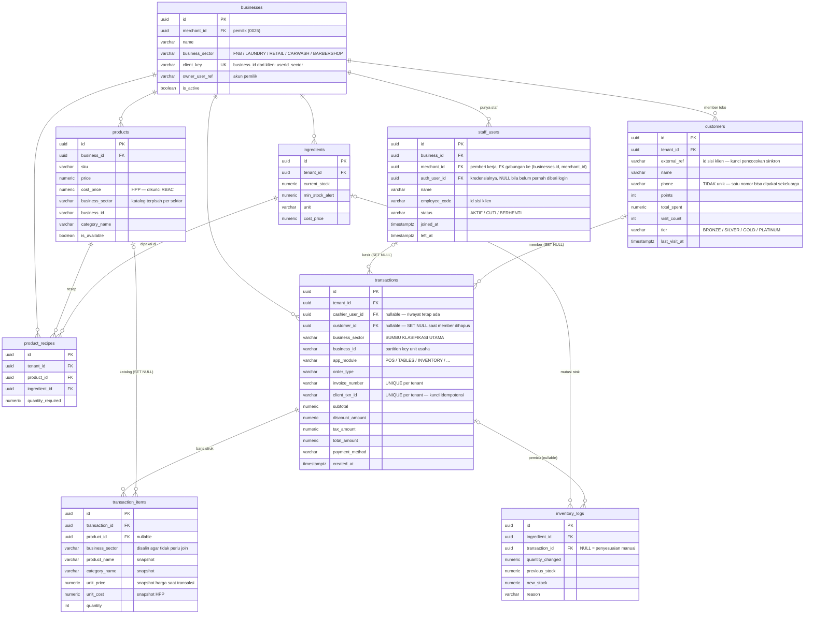
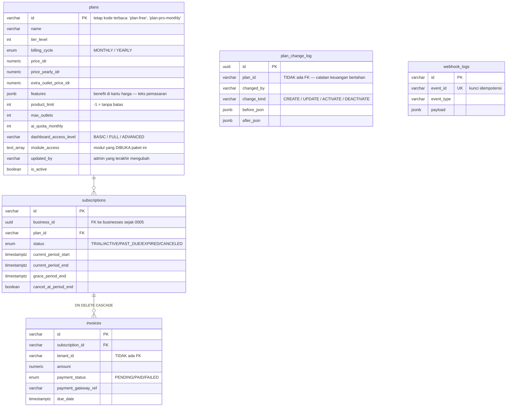
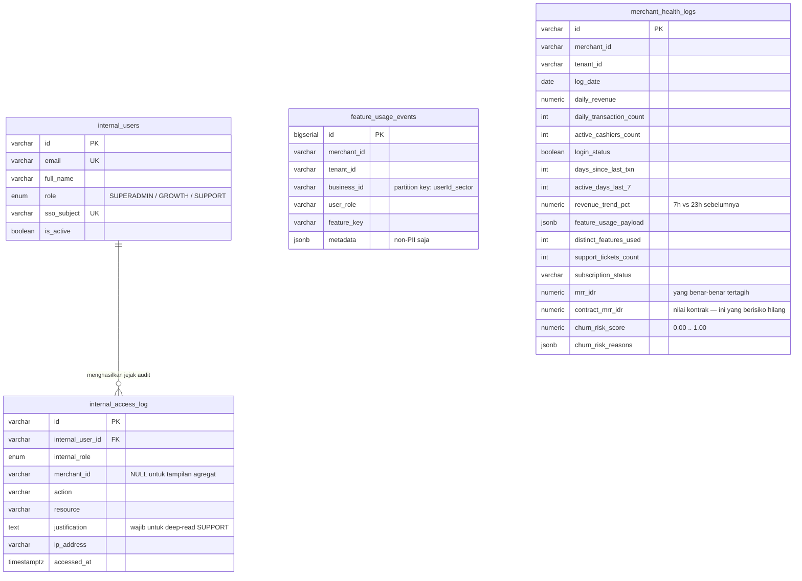
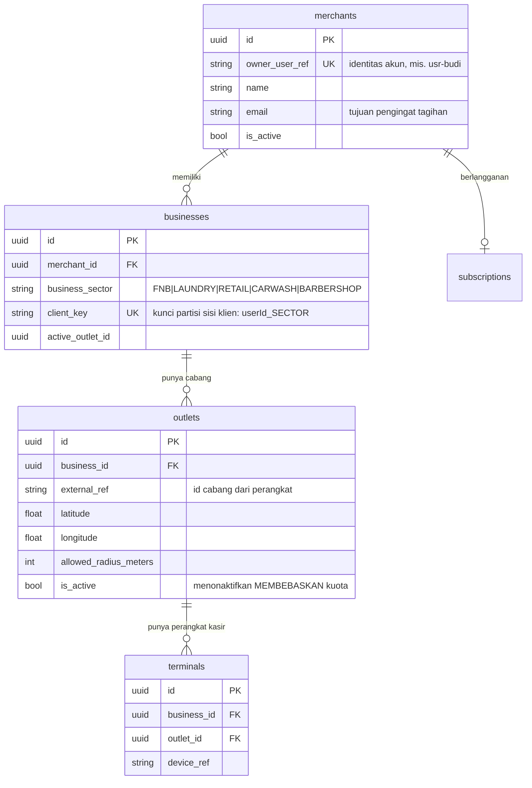
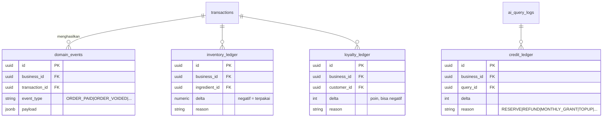
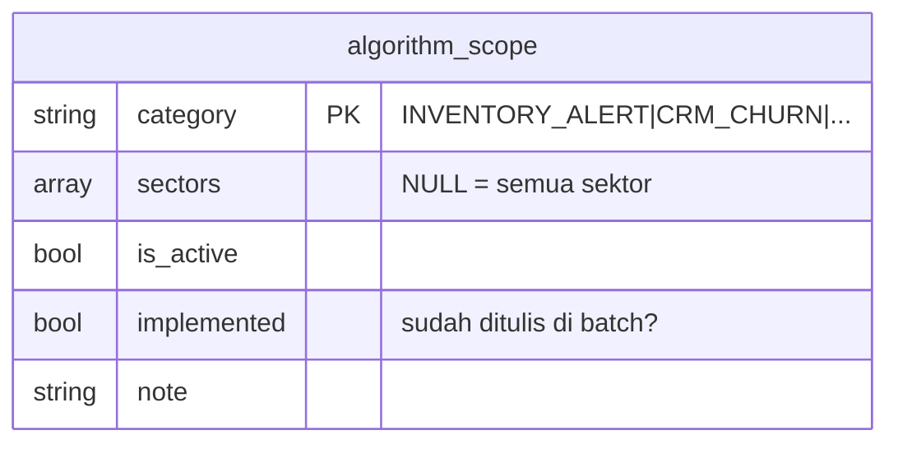
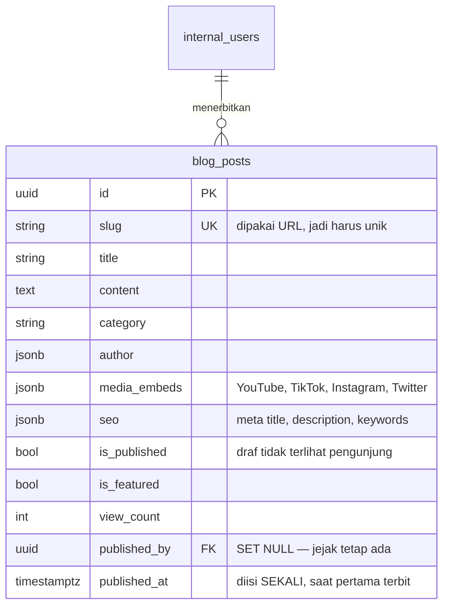
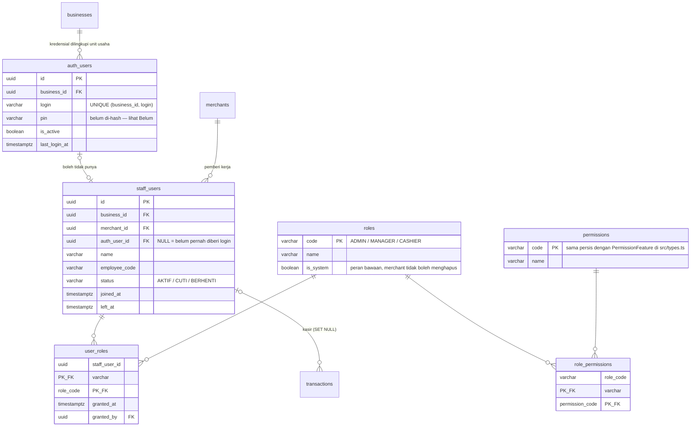

# ERD — New Hope POS

**46 tabel dan 41 view kontrak, dalam 11 domain.** Diturunkan langsung dari file
migrasi, lalu diverifikasi dengan menjalankannya di PostgreSQL — jadi diagram ini
menunjukkan apa yang benar-benar dibuat Postgres, bukan yang diniatkan.

Aliran datanya — ke mana data bergerak dan siapa yang boleh menyentuhnya — ada
di [`Dokumentasi.md`](../Dokumentasi.md).

`test/dokumentasi.test.ts` menjaga dokumen ini tetap sesuai: setiap tabel dan
view kontrak yang ada di database harus disebut di sini. Berkas ini sempat
tertinggal delapan tabel dan masih menyebut entitas `tenants` yang sudah
diganti nama pada 0025 — dokumentasi yang salah lebih berbahaya daripada
dokumentasi yang tidak ada, karena ia dipercaya.

Semua primary key `UUID` (v7) setelah `0005_uuid_keys.sql`, kecuali `plans.id`
yang tetap kode terbaca dan `feature_usage_events.id` yang `BIGSERIAL`.

Menjalankan ulang dari nol:

```bash
npm run db:reset
```

---

## 1. Domain OPERASIONAL (inti POS)



**Snapshot, bukan join.** `product_name`, `unit_price`, `unit_cost`, dan
`category_name` disalin ke baris struk. Kalau di-join ke `products`, menaikkan
harga akan menulis ulang seluruh riwayat penjualan — dan laba kotor tahun lalu
ikut berubah setiap kali katalog disunting.

**`SET NULL`, bukan `CASCADE`, pada `product_id` dan `cashier_user_id`.** Ini
bukan detail: dengan `NO ACTION` (bentuk aslinya) satu merchant **tidak bisa
dihapus sama sekali** — `DELETE businesses` merambat ke `products` lalu ditolak
oleh `transaction_items`. Permintaan penghapusan data tidak akan bisa dipenuhi.
`SET NULL` aman justru karena snapshot di atas: riwayat tetap terbaca utuh
setelah katalognya hilang.

**`business_sector` ada di tiga tabel sekaligus** — `transactions`,
`transaction_items`, `products` — dan itu disengaja. Merchant yang pindah dari
laundry ke kafe tidak mengubah kenyataan bahwa transaksi tahun lalu adalah
transaksi laundry.

---

## 2. Domain BILLING (langganan SaaS)



**Entitlement ada di `plans`, bukan tersebar di kode.** `product_limit`,
`max_outlets`, `ai_quota_monthly`, `dashboard_access_level`, dan `module_access`
adalah yang benar-benar menegakkan batas di aplikasi kasir. `features` di
sebelahnya hanya kalimat pemasaran untuk kartu harga — keduanya sengaja
dipisah, karena mengubah teks promosi tidak boleh diam-diam mengubah apa yang
merchant benar-benar dapat.

`plan_change_log` menyimpan nilai sebelum dan sesudah. `internal_access_log`
menjawab "siapa membuka halaman paket"; enam bulan lagi pertanyaan yang benar
adalah "kenapa merchant ini ditagih 99rb padahal daftarnya 149rb", dan hanya
tabel ini yang bisa menjawabnya.

`webhook_logs` sengaja berdiri sendiri. `event_id UNIQUE` adalah yang mencegah
payment gateway men-*deliver* event yang sama dua kali dan meng-upgrade paket
merchant dua kali.

---

## 3. Domain SMART ASSISTANT (0003)


Tidak ada relasi antar tabel di domain ini — memang begitu desainnya. Keempatnya
dikunci oleh `merchant_id`, dan `UNIQUE (merchant_id, insight_date, category)`
di `daily_merchant_insights` yang menjamin batch job idempoten: dijalankan dua
kali dalam semalam tidak menggandakan insight.

`ai_query_logs.source` adalah metrik biaya. Target arsitekturnya ≥90% baris
bernilai `RULE` atau `BATCH` (Rp 0). Kalau `LLM` naik melewati itu, ada intent
yang bocor ke jalur berbayar.

---

## 4. Domain BACK-OFFICE INTERNAL (0004)



`internal_users` **sengaja terpisah** dari `staff_users`. Kalau SUPERADMIN cuma
satu peran lagi di `pos.user_roles`, maka satu bug mass-assignment di form
pengaturan merchant menjadi jalan ke seluruh data semua tenant. Tidak ada satu
pun jalur kode sisi merchant yang bisa menulis ke tabel ini.

`mrr_idr` vs `contract_mrr_idr` bukan duplikasi: merchant yang berhenti bayar
punya `mrr_idr = 0` justru ketika dia paling berisiko. Kolom kontrak yang
menjawab "berapa rupiah yang akan hilang kalau dia churn".

---

## 5. Domain ADMIN PANEL & SINKRONISASI (0006)


`merchant_activity_log` menjawab "log transaksi seluruhnya" secara harfiah —
termasuk yang bukan penjualan. Penyesuaian stok, perubahan harga, PIN salah tiga
kali, diskon manual di atas 25%, shift dibuka, laporan diekspor. Kalau isinya
hanya penjualan, tabel ini cuma salinan `transactions` yang lebih lambat.

`sync_receipts` adalah lapisan pertahanan terluar terhadap penggandaan omzet.
Lapisan keduanya `UNIQUE (tenant_id, client_txn_id)` di `transactions`.
Berlebihan memang, dan disengaja: omzet yang terhitung dua kali tidak bisa
diperbaiki dari layar mana pun.

### View yang dibaca panel

| View | Isi |
|---|---|
| `v_sector_summary` | Ringkasan lima sektor — sumber angka tunggal kartu ringkasan |
| `v_merchant_directory` | Satu baris per merchant; LEFT JOIN agar yang belum pernah bertransaksi tetap muncul |
| `v_product_sales_by_sector` | Produk apa saja yang terjual, per sektor per merchant |
| `v_activity_by_sector` | Rekap kejadian per sektor × modul × tingkat |
| `v_daily_sector_revenue` | Omzet harian per sektor, dikonversi ke WIB |
| `v_merchant_health_latest` | Skor churn terbaru per merchant |
| `v_platform_mrr` | MRR tertagih vs nilai kontrak |
| `v_feature_adoption_30d` | Adopsi fitur 30 hari |

Panel tidak pernah menulis SQL agregat sendiri. Kalau definisi "omzet" di panel
berbeda dari yang dipakai batch job, akan ada dua angka resmi yang saling
bertentangan dan tidak ada cara memutuskan mana yang benar.

`v_daily_sector_revenue` mengonversi ke `Asia/Jakarta` sebelum memotong tanggal.
Tanpa itu, penjualan setelah pukul 17.00 WIB jatuh ke tanggal berikutnya menurut
UTC — dan laporan harian merchant tidak akan pernah cocok dengan kasnya.

---

## 6. Domain IDENTITAS (0025)

Empat tingkat, dan masing-masing menjawab pertanyaan berbeda.



**Sektor adalah klasifikasi, bukan identitas.** `client_key` berbentuk
`userId_SECTOR` dan dipakai perangkat untuk mengenali dirinya sendiri — tapi
tidak pernah dipakai sebagai kunci apa pun di sisi server. Yang menjadi kunci
`businesses.id`. Kalau sektor ikut menjadi identitas, merchant yang mengubah
jenis usahanya akan kehilangan seluruh riwayatnya.

**Langganan menempel di `merchants`, bukan `businesses`** (0028). Pemilik yang
punya kafe dan laundry membeli satu paket untuk keduanya, dan jatah outletnya
dihitung untuk seluruh unit usahanya. Sebelum itu `UNIQUE(business_id)` membuat
orang yang sama menanggung dua langganan, dengan 5 outlet di masing-masing —
10 outlet dari satu paket yang menjanjikan 5.

---

## 7. Domain PERISTIWA & LEDGER (0026, 0027)

Efek transaksi disimpan sebagai **catatan**, bukan angka yang ditimpa.



**Saldo adalah view, bukan kolom.** `contract.stock_balance`,
`contract.loyalty_balance`, dan `contract.ai_credit_ledger` menjumlahkan
ledgernya. Karena itu `contract.stock_drift` dan `contract.ai_credit_drift`
bisa menjawab *"apakah saldo yang tersimpan cocok dengan catatannya"* —
pertanyaan yang tidak bisa dijawab sama sekali kalau angkanya ditimpa.

**Void menulis baris berlawanan**, bukan menghapus baris lama. Struk yang
dibatalkan tetap ada di riwayat, dan stok yang kembali punya sebab yang bisa
dibaca.

**`inventory_mode` menentukan apa yang dikurangi.** `NONE` tidak mengurangi apa
pun (jasa), `STOCK` mengurangi produknya sendiri, `RECIPE` mengurangi bahan
bakunya lewat `product_recipes`. Sebelumnya semuanya diperlakukan sebagai
`STOCK`, jadi kafe yang menjual kopi mengurangi "1 kopi" alih-alih biji kopi
dan susu.

**`ai.credit_ledger` CASCADE, `ai.ai_query_logs` SET NULL** — perbedaan yang
disengaja. Yang pertama catatan saldo dan tanpa dompetnya tidak punya arti;
yang kedua catatan biaya, dan justru berguna setelah merchantnya pergi.

---

## 8. Domain CAKUPAN ALGORITMA (0028)



Sembilan kategori. Enam global, tiga terbatas sektor: `LAYOUT_UTILISATION`
(FNB, laundry, barbershop), `SHIFT_PERFORMANCE` (FNB, ritel, cuci mobil),
`STAFF_BEHAVIOUR` (FNB, ritel, barbershop).

Disimpan sebagai tabel, bukan ditulis di kode batch: memindahkan sebuah
algoritma antar sektor adalah keputusan produk, dan tidak boleh menuntut deploy
ulang. `contract.algorithm_coverage` menjawab, untuk satu merchant, insight apa
yang **seharusnya** muncul — dan mana yang belum ditulis.

---

## 9. Domain KONTEN PUBLIK (0031)



Di skema `internal` karena pemiliknya backoffice dan isinya bukan milik
merchant mana pun — tidak ada `business_id`.

**Sebelum 0031, artikel disimpan di `localStorage` peramban.** Tiga akibatnya,
dan yang ketiga paling mengejutkan: `MANAGE_PUBLIC_CONTENT` tidak punya tempat
untuk ditegakkan, tidak ada yang bisa diaudit, dan **artikel yang ditulis admin
tidak pernah sampai ke pengunjung mana pun** — halaman publik memuat konstanta
bawaan, dan membersihkan data peramban menghilangkan seluruh tulisan.

`published_at` diisi sekali. Menimpanya di tiap penyuntingan membuat artikel
lama melompat ke puncak daftar hanya karena ada yang memperbaiki satu huruf.

`contract.blog_published` menyaring `is_published`, jadi draf tidak bisa bocor
lewat endpoint yang lupa menuliskan syaratnya — penyaringan di view berlaku
untuk semua pembacanya sekaligus.

---

## 10. Domain IDENTITAS STAF & IZIN (0033)

Sebelum 0033, satu baris `pos.users` merangkap **tiga hal yang berubah pada
waktu berbeda dan karena sebab berbeda**:

| Yang dicampur | Berubah karena | Konsekuensi dicampur |
|---|---|---|
| Kredensial (`username`, `pin`) | PIN bocor, diganti berkala | Menonaktifkan login = menghapus staf |
| Kepegawaian (`name`, `external_ref`) | Orang pindah cabang atau berhenti | Menghapus staf = struk lama kehilangan kasirnya |
| Izin (`role`) | Perannya naik | Tidak bisa diubah tanpa menyentuh keduanya |



**Kenapa RENAME, bukan tabel baru.** `transactions.cashier_user_id` dan
`merchant_activity_log.actor_user_id` menunjuk ke tabel ini. `ALTER TABLE …
RENAME` mempertahankan OID-nya, jadi kedua foreign key ikut berpindah sendiri
tanpa satu baris pun bergerak. Menyalin ke tabel baru lalu memindahkan isinya
akan memutus keduanya — dan struk lama kehilangan kasirnya, permanen.

**Kenapa login dilingkupi `business_id`, bukan global.** Login global menuntut
email, dan kasir warung tidak punya email perusahaan. Yang sungguh terjadi di
lapangan: nama pendek dan PIN empat angka, diketik di terminal di toko itu.
"Budi" di dua toko berbeda memang dua orang berbeda.

**Kenapa `auth_user_id` boleh NULL.** Staf yang masuk lewat sinkronisasi dari
perangkat kasir adalah catatan kepegawaian, bukan seseorang yang login ke
server. Sebelum 0033 kedua jalur sinkron menyisipkan `pin = '----'` untuk setiap
nama kasir yang lewat — kredensial yang tidak pernah bisa dipakai, dibuat hanya
karena kolomnya NOT NULL. Panel admin bahkan sudah memperlakukan `'----'`
sebagai "PIN belum dipasang". Sekarang ketiadaan kredensial punya cara
mengatakannya sendiri.

**`merchant_id` di sini adalah salinan, dan dijaga sebagai salinan.**
`fk_staff_merchant_sama_dengan_usaha` adalah foreign key gabungan ke
`businesses (id, merchant_id)`: baris staf tidak bisa menyebut pemilik yang
bukan pemilik unit usahanya. Yang menjaganya database, bukan kesepakatan antar
penulis kode.

**Satu perubahan perilaku yang disengaja.** Di `src/data/rolePermissions.ts`,
ADMIN dan MANAGER dulu punya daftar izin yang **persis sama** — artinya
menurunkan seseorang dari Admin ke Manajer tidak mencabut apa pun, dan salah
satu dari dua peran itu hanya hiasan. Memindahkan tabel itu ke database membuat
kesamaannya terlihat, jadi diperbaiki: `billing_subscription` dicabut dari
MANAGER. Mengganti paket langganan adalah keputusan pemilik.

**Dua salinan tabel izin, dan yang menjaganya.** Aplikasi kasir offline-first,
jadi pemeriksaan izin harus bisa terjadi tanpa internet — tabelnya wajib ada di
perangkat (`src/data/rolePermissions.ts`) *dan* di server
(`pos.role_permissions`). Dua salinan berarti dua kesempatan menyimpang, dan
menyimpangnya tidak berisik. `test/izin-peran.test.ts` membandingkan keduanya
dan gagal kalau berbeda.

| View kontrak | Menjawab |
|---|---|
| `staff_directory` | Staf + status kepegawaian + kredensial + peran. PIN sengaja tidak ikut. |
| `staff_permissions` | Izin **efektif** per staf, gabungan semua perannya. Staf non-AKTIF tidak menghasilkan baris. |

---

## 11. Domain OPERASIONAL HARIAN (0036)

Enam entitas yang sampai 0036 **tidak pernah meninggalkan perangkat**. Semuanya
hanya hidup di `localStorage` peramban yang kebetulan dipakai: bersihkan
riwayat, dan seluruhnya hilang tanpa satu pun salinan.

| Entitas | Yang hilang saat cache dibersihkan |
|---|---|
| `dining_tables` | Seluruh denah meja |
| `ingredients` | Seluruh daftar bahan baku dan stoknya |
| `promo_codes` | Seluruh kode promo yang sedang berjalan |
| `cashier_shifts` | Seluruh rekap buka/tutup kas, termasuk selisihnya |
| `attendance_records` | Seluruh catatan absensi berikut koordinatnya |
| `store_settings` | Tarif pajak, service charge, dan tarif loyalitas |

Dua di antaranya dipakai untuk **menilai orang**: selisih kas dan absensi.
Angka yang hanya ada di satu perangkat, bisa disunting siapa pun yang membuka
devtools, dan lenyap saat cache dibersihkan bukan dasar yang layak untuk itu.

`pos.ingredients` adalah kasus tersendiri: tabelnya sudah ada sejak migrasi
pertama dan **tidak pernah menerima satu baris pun**. Yang hilang bukan
tabelnya melainkan `external_ref` — tanpa itu tidak ada cara mencocokkan
`stk-…` di perangkat dengan baris di sini, sehingga setiap kiriman akan
menggandakan seluruh daftar bahan.

```mermaid
erDiagram
    businesses  ||--o{ dining_tables      : ""
    businesses  ||--o{ ingredients        : ""
    businesses  ||--o{ promo_codes        : ""
    businesses  ||--o{ cashier_shifts     : ""
    businesses  ||--o{ attendance_records : ""
    businesses  ||--|| store_settings     : "satu baris"
    staff_users |o--o{ cashier_shifts     : "kasir (SET NULL)"
    staff_users |o--o{ attendance_records : "staf (SET NULL)"
    outlets     |o--o{ attendance_records : "cabang (SET NULL)"

    dining_tables {
        uuid id PK
        uuid business_id FK
        varchar external_ref "UNIQUE per unit usaha"
        varchar name
        smallint capacity
        varchar zone
        boolean is_active
    }
    ingredients {
        uuid id PK
        uuid business_id FK
        varchar external_ref "ditambahkan 0036"
        varchar name
        numeric current_stock
        numeric min_stock_alert
        varchar unit
        numeric cost_price
        varchar stock_type
    }
    promo_codes {
        uuid id PK
        uuid business_id FK
        varchar code "UNIQUE (business_id, upper(code))"
        numeric discount_percent
        numeric max_discount_amount
        numeric min_purchase_amount
        boolean is_active
    }
    cashier_shifts {
        uuid id PK
        uuid business_id FK
        varchar external_ref
        varchar cashier_name
        timestamptz opened_at
        timestamptz closed_at
        numeric expected_cash "disimpan, bukan dihitung ulang"
        numeric actual_cash "NULL = kas belum dihitung"
        numeric difference "NULL = belum ada kesimpulan"
    }
    attendance_records {
        uuid id PK
        uuid business_id FK
        varchar external_ref
        varchar staff_name
        timestamptz clock_in_at
        timestamptz clock_out_at
        numeric clock_in_lat "koordinat mentah"
        numeric clock_in_lon
        integer clock_in_distance_m
    }
    store_settings {
        uuid business_id PK_FK
        numeric tax_rate
        numeric service_rate
        boolean enable_loyalty
        numeric loyalty_earn_rate
        jsonb extra "sakelar yang belum punya kolom"
    }
```

**Status meja tidak disimpan.** Tabel dan pesanan yang sedang berjalan berubah
setiap beberapa detik dan hanya berarti di perangkat yang melayani meja itu.
Mengirimnya berarti dua kasir saling menimpa status meja sepanjang jam sibuk.
Yang disinkronkan adalah **denahnya** — nama, kapasitas, zona — yang berubah
beberapa kali setahun.

**Selisih kas disimpan, tidak dihitung ulang saat dibaca.** Alasannya sama
dengan snapshot harga di `transaction_items`: `expected_cash` adalah kesimpulan
yang diambil pada saat shift ditutup, dari angka yang berlaku saat itu.
Menghitungnya ulang dari transaksi bulan lalu akan mengubah selisih kas yang
sudah ditandatangani orang.

**`actual_cash` NULL bukan nol.** "Kas belum dihitung" dan "kas dihitung dan
hasilnya nol" adalah dua keadaan yang sangat berbeda bagi orang yang tanda
tangan di lembar serah terima.

**Koordinat absensi disimpan mentah, kesimpulannya tidak.** Yang tersimpan
adalah jarak dalam meter, bukan "di dalam radius" — radius cabang bisa diubah
pemilik kapan saja, dan kesimpulan yang sudah tersimpan akan menjadi salah
tanpa ada yang menyadarinya. Kesimpulannya dihitung saat dibaca, terhadap
radius yang berlaku saat itu.

**Pengaturan: kolom untuk yang dibaca server, `extra` untuk sisanya.**
`tax_rate`, `service_rate`, dan tarif loyalitas dipakai laporan dan Smart
Assistant di sisi server; menyembunyikannya di dalam jsonb berarti setiap kueri
laporan harus tahu bentuk objek pengaturan versi klien. Sisanya masuk `extra`
apa adanya, karena memaksa migrasi baru untuk setiap sakelar berarti sakelar
itu akan disimpan di localStorage saja — persis keadaan yang diperbaiki 0036.
`subscription` dan `branches` **ditolak** masuk `extra`: status langganan
ditentukan billing, dan cabang punya tabelnya sendiri.

| View kontrak | Menjawab |
|---|---|
| `dining_tables` | Denah meja per unit usaha |
| `ingredients` | Bahan baku + penanda stok menipis, dihitung satu tempat |
| `promo_codes` | Kode promo yang terdaftar |
| `cashier_shifts` | Rekap kas per shift; selisihnya apa adanya |
| `attendance` | Absensi + menit kerja; NULL untuk yang belum pulang |
| `store_settings` | Pengaturan toko yang tersimpan di pusat |

---

## Seluruh view kontrak

Empat puluh satu view, dikelompokkan menurut yang dijawabnya. Semuanya
hanya-baca.

| View | Menjawab |
|---|---|
| `merchant_directory` | Daftar unit usaha + ringkasan omzetnya |
| `business_hierarchy` | Terminal → outlet → unit usaha → pemilik, satu baris |
| `merchant_revenue` | Omzet per unit usaha |
| `merchant_entitlements` | Batas yang **berlaku sekarang**, sudah turun bila langganan mati |
| `merchant_outlet_usage` | Outlet terpakai vs jatah, dihitung semerchant |
| `subscription_status` | Langganan per unit usaha; MRR dihitung sekali per pemilik |
| `merchant_invoices` | Riwayat tagihan |
| `plan_catalog` | Paket yang sedang dijual |
| `catalog` | Produk per sektor |
| `product_sales` | Penjualan per produk |
| `product_recipes` | Resep bahan baku |
| `raw_materials` | Bahan baku |
| `stock_status` | Status stok terhadap batas aman |
| `stock_balance` | Saldo stok menurut ledger |
| `stock_drift` | Selisih saldo tersimpan vs ledger |
| `loyalty_balance` | Saldo poin menurut ledger |
| `customer_rfm` | Recency, frequency, monetary per pelanggan |
| `branches` | Cabang per unit usaha |
| `bundles` | Paket bundling |
| `transaction_log` | Struk yang benar-benar terjadi — CANCELLED sudah dibuang di `merchant_revenue` |
| `transaction_status` | SELURUH struk termasuk yang dibatalkan; satu-satunya tempat CANCELLED terlihat |
| `transaction_items` | Baris struk |
| `activity_log` | Kejadian di aplikasi kasir |
| `activity_by_sector` | Kejadian, diagregat per sektor |
| `sector_summary` | Ringkasan lima sektor |
| `daily_sector_revenue` | Omzet harian per sektor, dipotong pada `Asia/Jakarta` |
| `merchant_health_latest` | Skor churn terbaru |
| `ai_credit_ledger` | Saldo kredit AI menurut ledger |
| `ai_credit_drift` | Selisih saldo kredit + cadangan menggantung |
| `insight_freshness` | Umur kartu insight per kategori |
| `algorithm_coverage` | Insight apa yang seharusnya ada untuk sektor ini |
| `blog_published` | Artikel blog yang BENAR-BENAR terbit — draf disaring di sini |
| `staff_directory` | Staf + status kepegawaian + kredensial + peran. PIN tidak ikut |
| `staff_permissions` | Izin efektif per staf; staf non-AKTIF tidak menghasilkan baris |
| `staf_pin_belum_aman` | Kredensial kasir yang PIN-nya masih tersimpan apa adanya; harus kosong sebelum kolom lamanya dibuang |
| `dining_tables` | Denah meja per unit usaha; status meja sengaja tidak ikut |
| `ingredients` | Bahan baku + `stok_menipis`, dihitung di satu tempat saja |
| `promo_codes` | Kode promo yang terdaftar per unit usaha |
| `cashier_shifts` | Rekap buka/tutup kas; `difference` apa adanya, tidak dihitung ulang |
| `attendance` | Absensi + `menit_kerja`; NULL untuk yang belum pulang |
| `store_settings` | Pengaturan toko yang tersimpan di pusat |

---

## Yang sudah diperbaiki, dan yang belum

### Sudah (0006)

**FK yang hilang sudah dipasang.** 12 kolom `merchant_id`/`tenant_id` di
`daily_merchant_insights`, `merchant_targets`, `merchant_ai_credits`,
`merchant_health_logs`, `feature_usage_events`, `subscriptions`, `invoices`
sekarang benar-benar menunjuk `businesses(id)`. Total foreign key naik dari 11
menjadi **34**.

Log audit dan log biaya (`ai_query_logs`, `internal_access_log`) sengaja
`SET NULL`, bukan `CASCADE` — jejak akses harus tetap ada setelah merchantnya
pergi, justru saat itulah biasanya dibutuhkan.

**Merchant sekarang bisa dihapus.** Diuji: menghapus satu tenant membuang 169
transaksi, 310 baris item, 43 kejadian, dan menyisakan **nol baris yatim**.

**`merchant_targets` dan `batch_job_runs` ikut jadi UUID.** Keduanya terlewat
dari daftar 0005; ketahuan hanya karena 0006 mencoba memasang FK-nya dan
Postgres menolak `uuid = character varying`.

### Sudah (0012)

**Pelanggan pindah ke database.** `pos.customers` menyimpan poin, tier, total
belanja, dan jumlah kunjungan; `transactions.customer_id` menautkannya ke struk.
Keduanya ikut terkirim lewat jalur sinkronisasi yang sama dengan transaksi, jadi
member tidak lagi hilang saat browser dibersihkan.

`ON DELETE SET NULL`, dan di sini alasannya lebih kuat daripada di `product_id`:
pelanggan berhak meminta datanya dihapus. Dengan `CASCADE`, memenuhi permintaan
itu ikut menghapus struk penjualannya — omzet berkurang surut dan laporan pajak
yang sudah dikirim menjadi salah. Karena itu pula nama pembeli **tidak** ikut
di-snapshot ke baris transaksi: itu satu-satunya hal yang memang harus hilang.

**Analisis RFM sekarang bisa dijalankan.** `contract.customer_rfm` menyajikan
recency, frequency, dan monetary per member — lewat view kontrak, bukan dengan
memberi ai-service dan backoffice-service akses ke skema `pos`.

### Sudah (0014 & 0015)

**Paket punya entitlement, bukan cuma harga.** `billing.plans` kini menyimpan
`product_limit`, `max_outlets`, `ai_quota_monthly`, `dashboard_access_level`,
dan `module_access` — dengan CHECK constraint untuk masing-masing, termasuk
`module_access <@ ARRAY[...]` yang menolak nama modul salah ketik. Sebelumnya
angka-angka itu tidak punya kolom sama sekali, jadi tidak ada yang bisa ditanya
"paket ini sebenarnya dapat apa" — dan karena itu tidak ada yang menegakkannya.

`contract.plan_catalog` menyajikannya lintas service; `billing.plan_change_log`
menyimpan nilai sebelum dan sesudah setiap perubahan harga, karena
`internal_access_log` hanya mencatat siapa membuka apa, bukan berapa jadi berapa.

**Konsol internal punya autentikasi.** `internal_users` mendapat
`password_hash` (scrypt, tanpa dependensi baru), penguncian sementara setelah
lima percobaan gagal, dan `last_login_at`. Password `NULL` berarti akun belum
bisa dipakai login sama sekali — keadaan awal yang benar, karena tidak ada
password bawaan di mana pun.

### Sudah (0013)

**`merchant_id` = `tenant_id` sekarang dijaga database.** Tujuh tabel mendapat
`CHECK (merchant_id IS NOT DISTINCT FROM tenant_id) NOT VALID`. Ditinjau lebih
dulu: setiap penulisan di repo mengisi keduanya dari satu parameter yang sama
(`VALUES ($1, $1, ...)`), jadi batasan ini hanya menuliskan apa yang sudah benar.

### Sudah (0016–0018)

**Kuota AI mengikuti paket.** `contract.merchant_entitlements` menyajikan hak
yang sedang berlaku per merchant dengan kedaluwarsa dihitung dari
`current_period_end`; ai-service membacanya dari sana, bukan dari konstanta 30
yang dulu sama untuk semua orang.

**Bahan baku, resep, dan bundle punya punggung data.** `contract.raw_materials`,
`contract.product_recipes`, dan `pos.bundles` + `pos.bundle_items` beserta
`contract.bundles`. Ketiganya menghitung hal yang tidak boleh ditentukan
masing-masing layar: status menipis, biaya per porsi, dan besar diskon paket.

**Member yang belum pernah belanja ikut tersinkron.** Pelanggan dan bundle
sekarang dibawa kiriman katalog, bukan menunggu transaksi pertama.

### Belum

**Salah satu dari `merchant_id`/`tenant_id` tetap harus dibuang.** 0013 baru
mencegah keduanya menyimpang, bukan menghapus duplikasinya — dan itu menunggu
satu keputusan produk: apakah satu akun boleh punya beberapa merchant? Kalau
tidak, buang `merchant_id`. Kalau ya, `merchants` harus jadi tabel tersendiri
**sekarang**, sebelum ada data produksi; `business_id` (`userId_sector`) sudah
menyiratkan arah itu.

**Tier loyalitas belum memberi manfaat.** Poin sudah bisa ditukar jadi potongan
sejak penukaran dipasang di layar bayar, tapi naik ke GOLD atau PLATINUM masih
hanya mengubah warna badge — belum ada diskon atau akses yang mengikutinya.

**Penjualan per bundle tidak bisa dihitung.** Baris struk tidak mencatat paket
asalnya, jadi "berapa paket terjual" belum punya jawaban. Menambah
`bundle_id` di `transaction_items` akan menjawabnya.

**Replikasi belum pernah diuji.** Konfigurasi di `docker-compose.analytics.yml`
sudah ada, tapi belum pernah dinyalakan.
