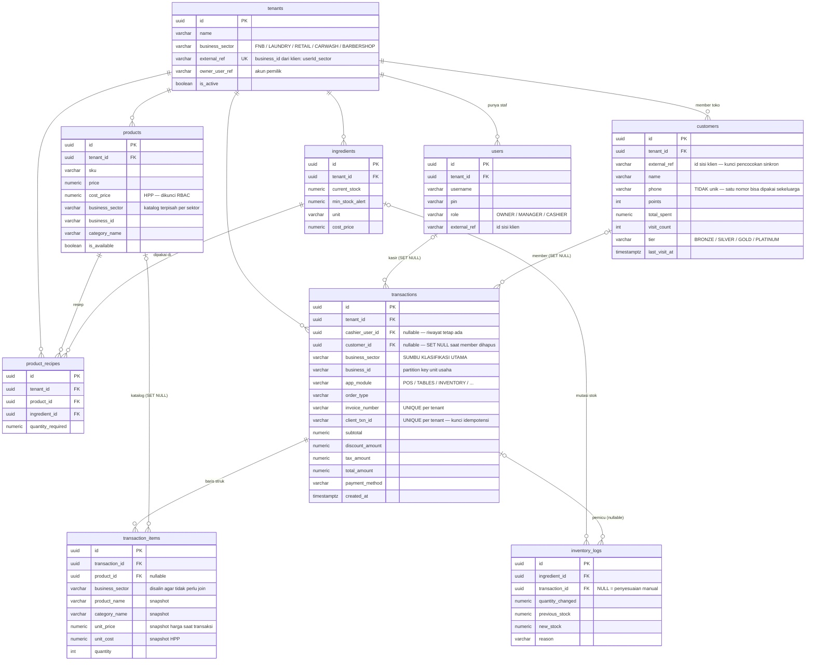
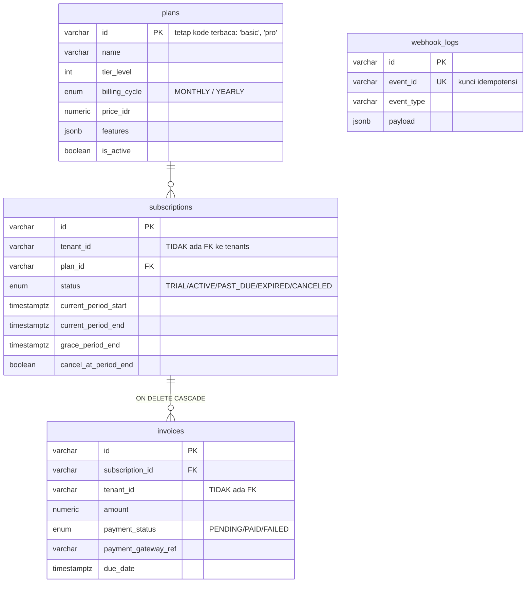
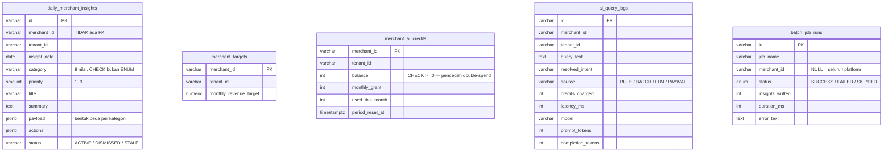
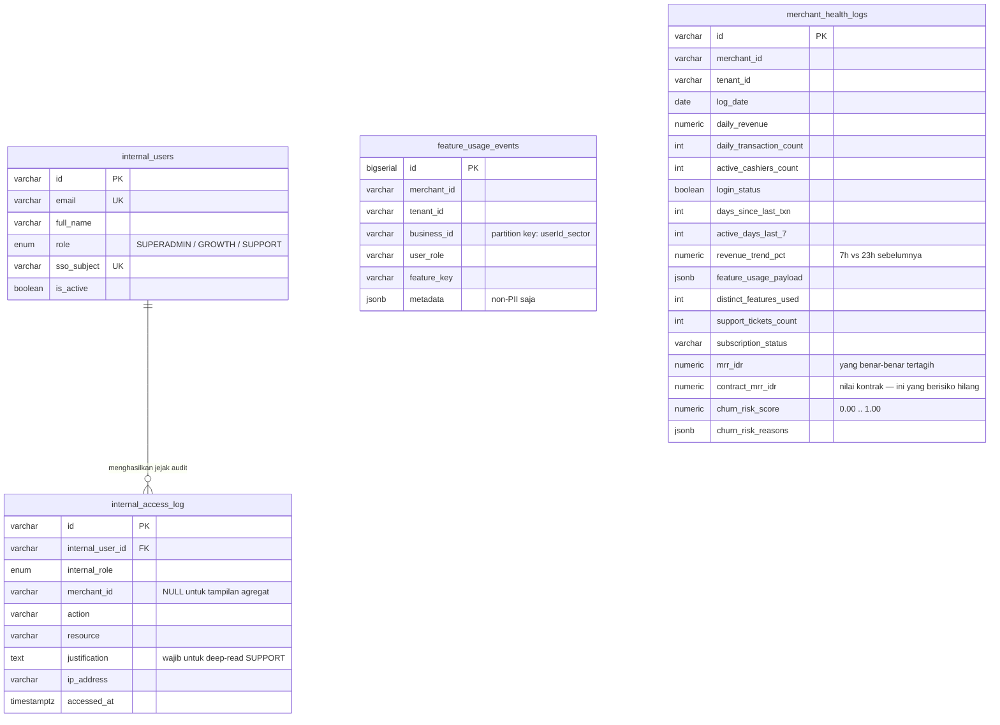
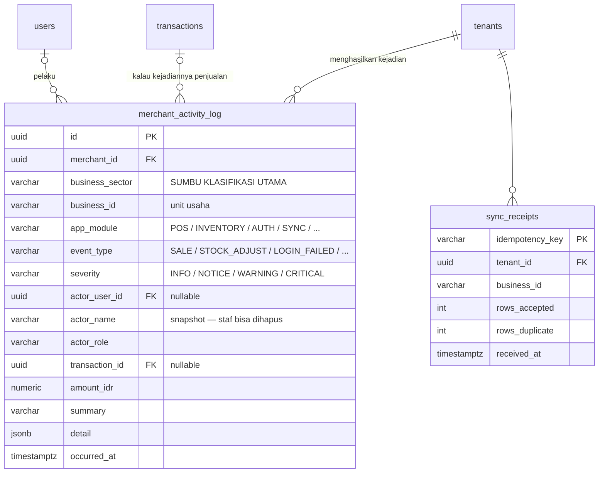

# ERD — New Hope POS

**25 tabel dan 14 view kontrak, dalam 5 domain.** Diturunkan langsung dari file
migrasi, lalu diverifikasi dengan menjalankannya di PostgreSQL — jadi diagram ini
menunjukkan apa yang benar-benar dibuat Postgres, bukan yang diniatkan.

Semua primary key `UUID` (v7) setelah `0005_uuid_keys.sql`, kecuali `plans.id`
yang tetap kode terbaca dan `feature_usage_events.id` yang `BIGSERIAL`.

Menjalankan ulang dari nol:

```bash
npm run db:reset
```

---

## 1. Domain OPERASIONAL (inti POS)



**Snapshot, bukan join.** `product_name`, `unit_price`, `unit_cost`, dan
`category_name` disalin ke baris struk. Kalau di-join ke `products`, menaikkan
harga akan menulis ulang seluruh riwayat penjualan — dan laba kotor tahun lalu
ikut berubah setiap kali katalog disunting.

**`SET NULL`, bukan `CASCADE`, pada `product_id` dan `cashier_user_id`.** Ini
bukan detail: dengan `NO ACTION` (bentuk aslinya) satu merchant **tidak bisa
dihapus sama sekali** — `DELETE tenants` merambat ke `products` lalu ditolak
oleh `transaction_items`. Permintaan penghapusan data tidak akan bisa dipenuhi.
`SET NULL` aman justru karena snapshot di atas: riwayat tetap terbaca utuh
setelah katalognya hilang.

**`business_sector` ada di tiga tabel sekaligus** — `transactions`,
`transaction_items`, `products` — dan itu disengaja. Merchant yang pindah dari
laundry ke kafe tidak mengubah kenyataan bahwa transaksi tahun lalu adalah
transaksi laundry.

---

## 2. Domain BILLING (langganan SaaS)



`webhook_logs` sengaja berdiri sendiri. `event_id UNIQUE` adalah yang mencegah
payment gateway men-*deliver* event yang sama dua kali dan meng-upgrade paket
merchant dua kali.

---

## 3. Domain SMART ASSISTANT (0003)



Tidak ada relasi antar tabel di domain ini — memang begitu desainnya. Keempatnya
dikunci oleh `merchant_id`, dan `UNIQUE (merchant_id, insight_date, category)`
di `daily_merchant_insights` yang menjamin batch job idempoten: dijalankan dua
kali dalam semalam tidak menggandakan insight.

`ai_query_logs.source` adalah metrik biaya. Target arsitekturnya ≥90% baris
bernilai `RULE` atau `BATCH` (Rp 0). Kalau `LLM` naik melewati itu, ada intent
yang bocor ke jalur berbayar.

---

## 4. Domain BACK-OFFICE INTERNAL (0004)



`internal_users` **sengaja terpisah** dari `users`. Kalau SUPERADMIN cuma satu
nilai lagi di kolom `users.role`, maka satu bug mass-assignment di form
pengaturan merchant menjadi jalan ke seluruh data semua tenant. Tidak ada satu
pun jalur kode sisi merchant yang bisa menulis ke tabel ini.

`mrr_idr` vs `contract_mrr_idr` bukan duplikasi: merchant yang berhenti bayar
punya `mrr_idr = 0` justru ketika dia paling berisiko. Kolom kontrak yang
menjawab "berapa rupiah yang akan hilang kalau dia churn".

---

## 5. Domain ADMIN PANEL & SINKRONISASI (0006)



`merchant_activity_log` menjawab "log transaksi seluruhnya" secara harfiah —
termasuk yang bukan penjualan. Penyesuaian stok, perubahan harga, PIN salah tiga
kali, diskon manual di atas 25%, shift dibuka, laporan diekspor. Kalau isinya
hanya penjualan, tabel ini cuma salinan `transactions` yang lebih lambat.

`sync_receipts` adalah lapisan pertahanan terluar terhadap penggandaan omzet.
Lapisan keduanya `UNIQUE (tenant_id, client_txn_id)` di `transactions`.
Berlebihan memang, dan disengaja: omzet yang terhitung dua kali tidak bisa
diperbaiki dari layar mana pun.

### View yang dibaca panel

| View | Isi |
|---|---|
| `v_sector_summary` | Ringkasan lima sektor — sumber angka tunggal kartu ringkasan |
| `v_merchant_directory` | Satu baris per merchant; LEFT JOIN agar yang belum pernah bertransaksi tetap muncul |
| `v_product_sales_by_sector` | Produk apa saja yang terjual, per sektor per merchant |
| `v_activity_by_sector` | Rekap kejadian per sektor × modul × tingkat |
| `v_daily_sector_revenue` | Omzet harian per sektor, dikonversi ke WIB |
| `v_merchant_health_latest` | Skor churn terbaru per merchant |
| `v_platform_mrr` | MRR tertagih vs nilai kontrak |
| `v_feature_adoption_30d` | Adopsi fitur 30 hari |

Panel tidak pernah menulis SQL agregat sendiri. Kalau definisi "omzet" di panel
berbeda dari yang dipakai batch job, akan ada dua angka resmi yang saling
bertentangan dan tidak ada cara memutuskan mana yang benar.

`v_daily_sector_revenue` mengonversi ke `Asia/Jakarta` sebelum memotong tanggal.
Tanpa itu, penjualan setelah pukul 17.00 WIB jatuh ke tanggal berikutnya menurut
UTC — dan laporan harian merchant tidak akan pernah cocok dengan kasnya.

---

## Yang sudah diperbaiki, dan yang belum

### Sudah (0006)

**FK yang hilang sudah dipasang.** 12 kolom `merchant_id`/`tenant_id` di
`daily_merchant_insights`, `merchant_targets`, `merchant_ai_credits`,
`merchant_health_logs`, `feature_usage_events`, `subscriptions`, `invoices`
sekarang benar-benar menunjuk `tenants(id)`. Total foreign key naik dari 11
menjadi **34**.

Log audit dan log biaya (`ai_query_logs`, `internal_access_log`) sengaja
`SET NULL`, bukan `CASCADE` — jejak akses harus tetap ada setelah merchantnya
pergi, justru saat itulah biasanya dibutuhkan.

**Merchant sekarang bisa dihapus.** Diuji: menghapus satu tenant membuang 169
transaksi, 310 baris item, 43 kejadian, dan menyisakan **nol baris yatim**.

**`merchant_targets` dan `batch_job_runs` ikut jadi UUID.** Keduanya terlewat
dari daftar 0005; ketahuan hanya karena 0006 mencoba memasang FK-nya dan
Postgres menolak `uuid = character varying`.

### Sudah (0012)

**Pelanggan pindah ke database.** `pos.customers` menyimpan poin, tier, total
belanja, dan jumlah kunjungan; `transactions.customer_id` menautkannya ke struk.
Keduanya ikut terkirim lewat jalur sinkronisasi yang sama dengan transaksi, jadi
member tidak lagi hilang saat browser dibersihkan.

`ON DELETE SET NULL`, dan di sini alasannya lebih kuat daripada di `product_id`:
pelanggan berhak meminta datanya dihapus. Dengan `CASCADE`, memenuhi permintaan
itu ikut menghapus struk penjualannya — omzet berkurang surut dan laporan pajak
yang sudah dikirim menjadi salah. Karena itu pula nama pembeli **tidak** ikut
di-snapshot ke baris transaksi: itu satu-satunya hal yang memang harus hilang.

**Analisis RFM sekarang bisa dijalankan.** `contract.customer_rfm` menyajikan
recency, frequency, dan monetary per member — lewat view kontrak, bukan dengan
memberi ai-service dan backoffice-service akses ke skema `pos`.

### Sudah (0013)

**`merchant_id` = `tenant_id` sekarang dijaga database.** Tujuh tabel mendapat
`CHECK (merchant_id IS NOT DISTINCT FROM tenant_id) NOT VALID`. Ditinjau lebih
dulu: setiap penulisan di repo mengisi keduanya dari satu parameter yang sama
(`VALUES ($1, $1, ...)`), jadi batasan ini hanya menuliskan apa yang sudah benar.

### Belum

**Salah satu dari `merchant_id`/`tenant_id` tetap harus dibuang.** 0013 baru
mencegah keduanya menyimpang, bukan menghapus duplikasinya — dan itu menunggu
satu keputusan produk: apakah satu akun boleh punya beberapa merchant? Kalau
tidak, buang `merchant_id`. Kalau ya, `merchants` harus jadi tabel tersendiri
**sekarang**, sebelum ada data produksi; `business_id` (`userId_sector`) sudah
menyiratkan arah itu.

**Poin belum bisa ditukar.** `settings.loyaltyRedeemRate` dirender di layar
member tapi tidak pernah dipakai menghitung apa pun — poin hanya bertambah.
Tier pun belum memberi diskon atau akses apa pun, hanya warna badge.

**Member yang belum pernah belanja belum tersinkron.** Baris `pos.customers`
lahir dari transaksi pertama. Pendaftaran member yang belum pernah bertransaksi
masih berhenti di localStorage sampai ada endpoint sinkronisasi tersendiri.

**Replikasi belum pernah diuji.** Konfigurasi di `docker-compose.analytics.yml`
sudah ada, tapi belum pernah dinyalakan.
