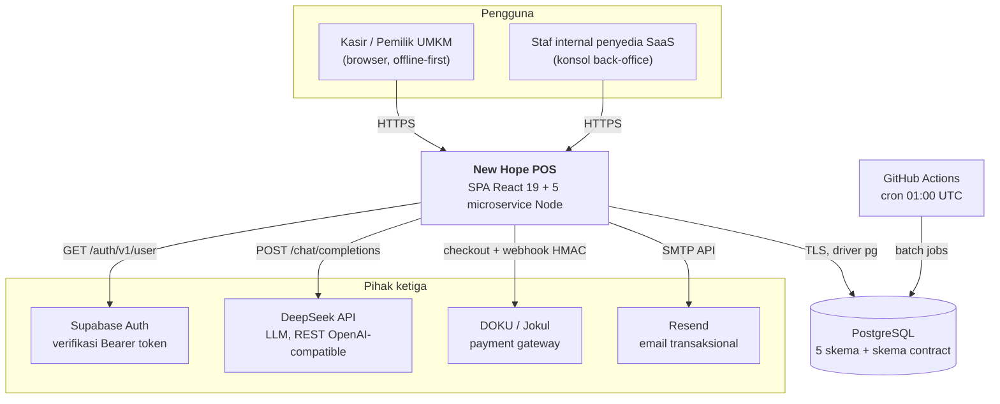
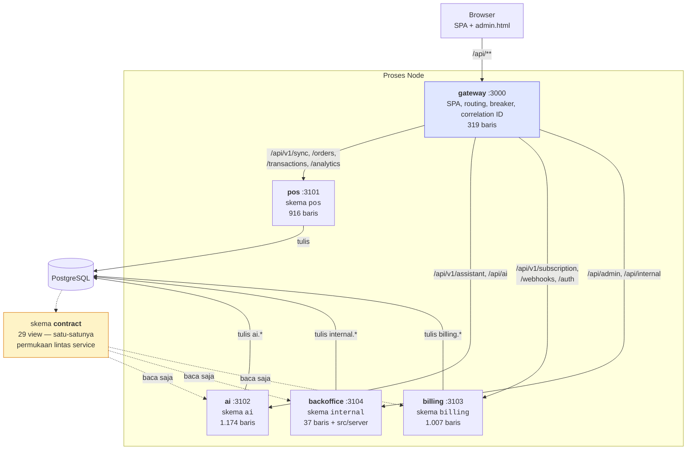
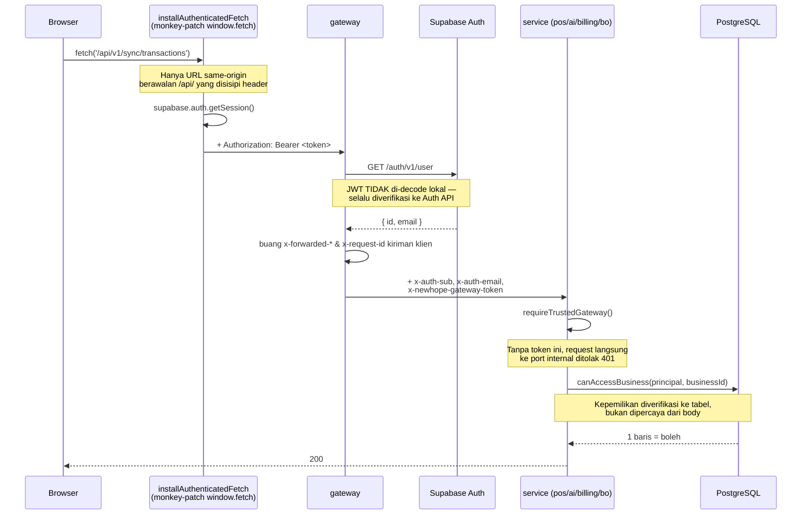
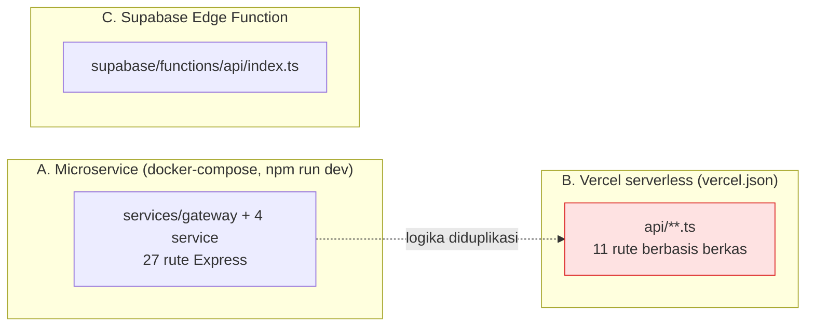
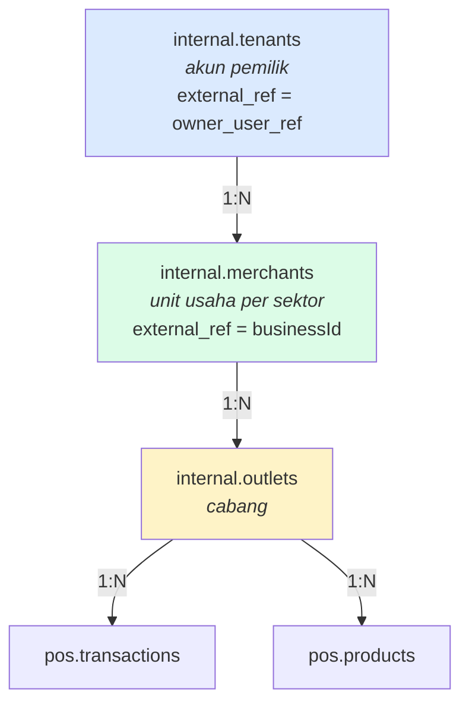

# 01 — Arsitektur Sistem (hasil rekonstruksi)

Direkonstruksi dari kode, bukan dari dokumen desain. Sumber utama:
`services/gateway/index.ts`, `services/shared/service.ts`, `docker-compose.yml`,
`vercel.json`, dan tabel rute di gateway.

---

## 1. Konteks sistem

Siapa berbicara dengan apa, dan lewat protokol apa.

**Catatan integrasi.** Keempat integrasi eksternal punya jalur *degradasi* yang
eksplisit: tanpa `DEEPSEEK_API_KEY` Layer 3 mati tapi Layer 1–2 tetap penuh
(`services/ai/index.ts:238`); tanpa Supabase, SPA jatuh ke sesi lokal
(`src/context/AuthContext.tsx:118`). Tidak ada integrasi yang mematikan sistem
saat tidak tersedia — kecuali PostgreSQL.

---

## 2. Peta container (runtime)

### Tabel rute gateway

Diambil verbatim dari `services/gateway/index.ts:47-59`. Pemilihan memakai
**prefiks terpanjang menang** (`pickRoute`, baris 89), sehingga
`/api/v1/assistant` diperiksa sebelum `/api/v1`.

| Prefiks | Tujuan | Autentikasi |
|---|---|---|
| `/api/v1/assistant` | ai | Bearer (kecuali `/quick-chips`) |
| `/api/ai` | ai | Bearer |
| `/api/v1/subscription` | billing | Bearer (kecuali `/plans`) |
| `/api/v1/webhooks` | billing | **Publik** — secret terpisah di service |
| `/api/v1/sync` | pos | Bearer |
| `/api/v1/orders` · `/transactions` · `/analytics` | pos | Bearer |
| `/api/admin` · `/api/internal` | backoffice | Bearer |
| `/api/v1/auth` | billing | Bearer |

---

## 3. Rantai kepercayaan autentikasi

Ini bagian paling penting untuk dipahami secara utuh, karena tersebar di tiga
berkas.

**Tiga sifat yang membuat rantai ini kuat**

1. `ownerRef` dari body **diabaikan**; principal gateway yang dipakai
   (`services/pos/sync.ts:110-113`). Klien tidak bisa mengklaim tenant lain.
2. Header `x-forwarded-host` selalu dibuang lalu diisi ulang gateway
   (`services/gateway/index.ts:158-163`) — tanpa ini siapa pun bisa mengaku
   berada di domain internal dan melewati `resolveEnvironment()`.
3. `requireTrustedGateway` **fail-closed**: token tidak dikonfigurasi → 401,
   bukan lolos (`services/shared/auth.ts:71-77`).

> **Celah yang tersisa:** `AUTH_ALLOW_LOCAL_DEVELOPMENT=1` melewati ketiganya
> sekaligus dan memberi `subject: 'local-development'`, yang oleh
> `canAccessBusiness()` diberi akses ke **semua** unit usaha
> (`services/shared/auth.ts:88`). Lihat T-07.

---

## 4. Tiga permukaan deployment yang hidup berdampingan

Temuan arsitektural yang tidak terlihat dari README: repositori ini
mendefinisikan **tiga** cara menjalankan API yang sama.

Konsekuensinya nyata dan terukur:

- `SAAS_PLANS` didefinisikan **4 kali** — `services/billing/index.ts:33`,
  `api/_gateway.ts:4`, `api/v1/subscription/plans.ts:3`,
  `api/v1/subscription/checkout.ts:3`. Saat ini nilainya identik; tidak ada
  mekanisme apa pun yang menjaganya tetap begitu.
- Literal harga (`99000`, `299000`, `49000`) tersebar di **12 berkas**.
- `api/v1/webhooks/doku.ts` menghitung `isValid` lalu **mengabaikannya** dan
  selalu menjawab `200 { ok: true }`. Handler itu juga membangun ulang
  `rawBody` lewat `JSON.stringify(req.body)` — yang mengubah byte dan membuat
  verifikasi HMAC tidak akan pernah cocok. Lihat T-04.

---

## 5. Pola desain yang terpakai

Teridentifikasi dari struktur, bukan dari penamaan.

| Pola | Lokasi | Catatan penerapan |
|---|---|---|
| **API Gateway** | `services/gateway/index.ts` | Murni — tidak ada logika bisnis, sesuai komentar perancangnya |
| **Circuit Breaker** | `services/shared/breaker.ts` | Tiga keadaan; hanya **satu** permintaan percobaan dilepas saat SETENGAH (baris 71-78) |
| **Database-per-Service** | `migrations/0009` | Skema-per-service, satu instance fisik |
| **Published Language / Contract** | skema `contract` (29 view) | View berjalan dengan hak pembuatnya, jadi konsumen tak butuh hak ke tabel dasar |
| **Template Method** | `services/shared/service.ts:startService` | Semua service mewarisi health, shutdown, error handling identik |
| **Outbox/Idempotency Receipt** | `pos.sync_receipts` | Kunci idempotensi tingkat batch |
| **Repository** | `src/server/repo.ts` | 12 fungsi query murni; hanya membaca `contract.*` |
| **Ambassador / Anti-Corruption Layer** | `services/shared/identity.ts` | Menerjemahkan id klien bebas-bentuk ke UUID, 4 tingkat pencarian |
| **Strategy berjenjang** | Layer 1/2/3 AI Copilot | Determinisik dulu, model belakangan |
| **God Object** (anti-pola) | `src/context/POSContext.tsx` | 2.109 baris, ±70 metode, fan-in 26. Lihat T-06 |

---

## 6. Model multi-tenant

Hierarki disempurnakan bertahap sampai migrasi 0015 ("Model B").

**Kunci partisi klien** adalah `businessId = ${userId}_${sector}` — dibentuk di
`makeBusinessId()` dan dipakai sebagai prefiks kunci `localStorage`
(`src/context/POSContext.tsx:251`) *dan* sebagai `external_ref` merchant di
server. Satu string yang sama menjadi batas isolasi di kedua sisi; itulah yang
membuat kafe dan laundry milik pemilik yang sama tidak pernah tertukar,
termasuk pada antrian sinkronisasi (`src/lib/sync/queue.ts:22-24`).

`resolveTenant()` sengaja **menolak menebak** ketika satu pemilik punya lebih
dari satu unit usaha dan `businessId` tidak disebut — ia hanya cocok bila
`LIMIT 2` mengembalikan tepat satu baris (`services/shared/identity.ts:88-96`).
Ini keputusan yang benar: menebak berarti kredit AI kafe terpotong untuk
pertanyaan tentang laundry, tanpa error apa pun.
