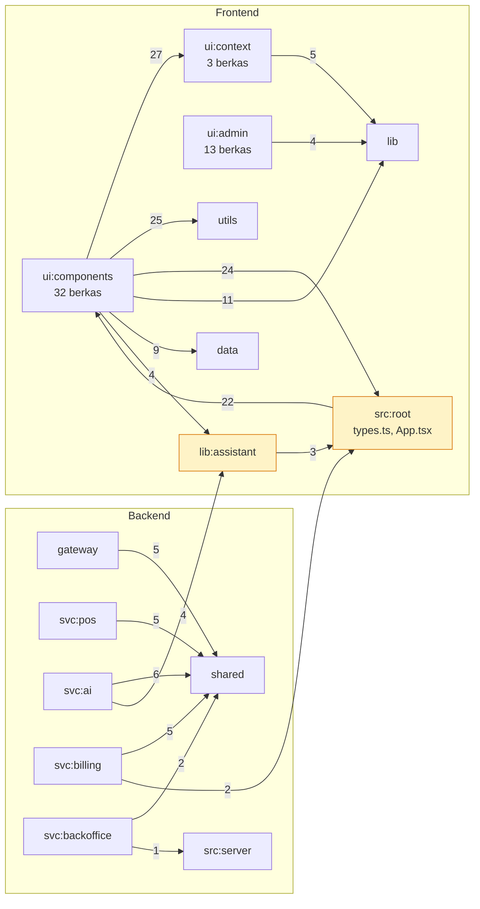

# 02 — Analisis Kode Statis

Seluruh angka di halaman ini dihasilkan oleh
[`tools/depgraph.mjs`](tools/depgraph.mjs) dan
[`tools/endpoint-map.mjs`](tools/endpoint-map.mjs), keduanya bisa dijalankan
ulang tanpa basis data:

```bash
node docs/reverse-engineering/tools/depgraph.mjs
node docs/reverse-engineering/tools/endpoint-map.mjs
```

---

## 1. Metrik ukuran

**162 berkas** TypeScript/JavaScript dianalisis, **275 tepi impor internal**.

| Lapisan | Berkas | Baris | Porsi |
|---|---:|---:|---:|
| `src/components` | 32 | 17.210 | 30,0 % |
| `src/lib` | 13 | 8.553 | 14,9 % |
| `migrations` | 35 | 7.321 | 12,8 % |
| `src/admin` | 13 | 5.537 | 9,7 % |
| `scripts` | 52 | 5.055 | 8,8 % |
| `src/context` | 3 | 2.633 | 4,6 % |
| `api` (Vercel) | 13 | 1.392 | 2,4 % |
| `src/data` | 3 | 1.364 | 2,4 % |
| `src/server` | 3 | 1.161 | 2,0 % |
| `services/ai` | 4 | 1.174 | 2,0 % |
| `services/billing` | 3 | 1.007 | 1,8 % |
| `services/pos` | 3 | 916 | 1,6 % |
| `services/shared` | 7 | 770 | 1,3 % |
| `src/utils` | 4 | 1.070 | 1,9 % |
| `services/gateway` | 1 | 319 | 0,6 % |
| `services/db-server` | 2 | 219 | 0,4 % |
| `services/backoffice` | 1 | 37 | 0,1 % |
| **Total** | **162 + 35 SQL** | **57.332** | |

**Rasio yang menonjol.** Backend microservice seluruhnya hanya **4.423 baris**
(7,7 %), sementara frontend menyerap **31.000+ baris** (54 %). Sistem ini
adalah aplikasi klien tebal dengan lapisan layanan tipis — bukan sebaliknya.
Itu konsisten dengan desain *offline-first*, tapi berarti bobot logika bisnis
ada di tempat yang paling sulit diuji.

### Sepuluh berkas terbesar

| Baris | Berkas | Peran |
|---:|---|---|
| 3.842 | `src/lib/assistant/intents.ts` | Rule engine 22 intent + parser NL |
| 2.310 | `src/lib/assistant/insights.ts` | Batch analytics Layer 1 |
| 2.109 | `src/context/POSContext.tsx` | State global POS (lihat T-06) |
| 1.998 | `src/components/home/HomePage.tsx` | Landing + onboarding |
| 1.793 | `src/components/reports/ReportsDashboard.tsx` | Laporan merchant |
| 1.664 | `src/admin/api.ts` | Klien konsol admin (lihat T-01) |
| 1.609 | `src/components/inventory/InventoryManager.tsx` | Inventori |
| 1.358 | `src/components/ai/AIAssistant.tsx` | UI copilot |
| 843 | `src/components/overview/OverviewPage.tsx` | Ringkasan |
| 786 | `src/components/settings/SettingsManager.tsx` | Pengaturan |

---

## 2. Graf dependensi antar-lapisan

Panah menunjukkan arah impor; angka adalah jumlah tepi.



### Ketergantungan yang melintasi batas frontend↔backend

Empat tepi berikut membuat kode server bergantung pada kode yang secara
konvensional milik browser:

| Tepi | Berkas | Sifat |
|---|---|---|
| `svc:ai → lib:assistant` (4) | `services/ai/index.ts:34` | **Disengaja & benar** — parser intent harus identik di klien dan server |
| `svc:ai → src:root` | `src/lib/ids.ts`, `src/types.ts` | Tipe bersama; aman |
| `svc:billing → src:root` (2) | tipe langganan | Aman |
| `svc:backoffice → src:server` | `src/server/adminRoutes.ts` | **Penamaan menyesatkan** — `src/` menyiratkan kode browser, padahal ini murni Express |
| `lib:assistant → ui:context` | `src/lib/assistant/*` | **Bau kode** — modul yang dipakai server mengimpor React context |

Tepi terakhir layak diperiksa: `src/lib/assistant` di-`import` oleh
`services/ai/index.ts`, sehingga setiap impor React yang bocor ke sana ikut
masuk ke bundel service.

### Tidak ditemukan dependensi melingkar

Pemeriksaan pada 275 tepi tidak menemukan siklus impor statis. Pasangan
`src:root ↔ ui:components` (24 ↔ 22) tampak melingkar pada tingkat *lapisan*,
tapi pada tingkat berkas arahnya satu arah: `App.tsx` mengimpor komponen,
komponen mengimpor `types.ts` — dua berkas berbeda yang kebetulan dikelompokkan
sama.

---

## 3. Simpul kritis (fan-in tertinggi)

Berkas dengan fan-in tinggi adalah titik di mana satu perubahan menyentuh
banyak tempat — kandidat pertama untuk uji regresi.

| Fan-in | Berkas | Risiko perubahan |
|---:|---|---|
| 36 | `src/types.ts` | Definisi domain tunggal; perubahan tipe menyentuh 36 berkas |
| 27 | `src/utils/formatters.ts` | Format rupiah/tanggal — salah di sini salah di mana-mana |
| 26 | `src/context/POSContext.tsx` | **Titik kegagalan tunggal frontend** |
| 14 | `src/lib/ids.ts` | Pembangkit ID; dipakai klien *dan* service |
| 11 | `src/data/businessPresets.ts` | Definisi 5 sektor |
| 10 | `src/admin/api.ts` | Seluruh konsol admin |
| 9 | `services/shared/db.ts` | Semua akses database service |
| 9 | `src/lib/assistant/types.ts` | Kontrak AI klien↔server |

**Fan-out tertinggi**: `src/App.tsx` (26), `src/admin/AdminApp.tsx` (11),
`src/context/POSContext.tsx` (11). Ketiganya *composition root* — fan-out
tinggi di sana normal dan tidak perlu diperbaiki.

---

## 4. Rekonsiliasi endpoint

Membandingkan `fetch()` di frontend dengan handler yang benar-benar terdaftar.

### Panggilan frontend

| Status | Endpoint | Service | Pemanggil |
|---|---|---|---|
| ✅ | `POST /api/v1/assistant/query` | ai | `AIAssistant.tsx:887` |
| ✅ | `POST /api/v1/assistant/credits/topup` | ai | `AIAssistant.tsx:948` |
| ❌ | **`POST /api/ai/generate-promo`** | ai | `AIAssistant.tsx:1007` |
| ✅ | `POST /api/v1/subscription/checkout` | billing | `SubscriptionLockScreen.tsx:31`, `SubscriptionBillingTab.tsx:200` |
| ✅ | `POST /api/v1/subscription/simulate-payment` | billing | `SubscriptionLockScreen.tsx:67`, `SubscriptionBillingTab.tsx:246` |
| ✅ | `GET /api/v1/subscription/plans` | billing | `SubscriptionBillingTab.tsx:114` |
| ✅ | `POST /api/v1/subscription/prorated-upgrade` | billing | `SubscriptionBillingTab.tsx:158,187` |
| ✅ | `POST /api/v1/sync/catalog` | pos | `queue.ts:228` |
| ✅ | `POST /api/v1/sync/transactions` | pos | `queue.ts:295` |
| ✅ | `POST /api/v1/auth/send-welcome` | billing | `AuthContext.tsx:343` |

`/api/ai/generate-promo` cocok dengan prefiks gateway `/api/ai` → diteruskan ke
ai-service, yang **tidak punya handler tersebut**. Hasilnya `404 NOT_FOUND` dari
penangkap terakhir di `services/shared/service.ts:187`. Lihat T-08.

### Handler backend yang tidak pernah dipanggil frontend

```
GET  /api/admin/me                 GET  /api/admin/identities
GET  /api/admin/overview           GET  /api/admin/merchants
GET  /api/admin/merchants/:id      GET  /api/admin/transactions
GET  /api/admin/transactions/:id   GET  /api/admin/products
GET  /api/admin/catalog            GET  /api/admin/activity
GET  /api/admin/activity/breakdown GET  /api/admin/access-audit
GET  /api/v1/assistant/audit       GET  /api/v1/assistant/credits
GET  /api/v1/subscription/status   GET  /api/v1/sync/status
POST /api/v1/sync/activity
```

**Ke-12 rute `/api/admin/*` tidak punya satu pun pemanggil.** Itu bukan
kebetulan — lihat T-01, temuan paling berdampak dalam audit ini.

---

## 5. Kode tak terjangkau

Dideteksi dari fan-in nol setelah impor dinamis (`React.lazy`) diperhitungkan.

| Berkas | Baris | Status |
|---|---:|---|
| `src/lib/internal/churn.ts` | 141 | **Mati** — nol pengimpor statis maupun dinamis |
| `src/components/pos/CategoryFilter.tsx` | 47 | **Mati** — `ReportsDashboard` memakai variabel bernama mirip, bukan komponen ini |
| `src/server/repo.ts` (12 fungsi) | 438 | **Terjangkau tapi tak terpakai** — dipanggil `adminRoutes.ts`, yang tak pernah dipanggil UI |
| `src/server/adminRoutes.ts` | 397 | Sama |

Empat berkas yang tampak yatim pada pindaian pertama — `AIAssistant.tsx`,
`InventoryManager.tsx`, `ReportsDashboard.tsx`, `SettingsManager.tsx` —
sebenarnya dimuat lewat `React.lazy()` di `src/App.tsx:45-54` dan **aktif**.

---

## 6. Hasil gerbang verifikasi repo

Dijalankan pada commit yang dianalisis:

```
$ npm run lint
Category parity:     OK (9 kategori cocok antara types.ts dan migrasi)
Tenant scoping:      OK (entitas per-akun terbatas pada: settings, staff_members)
Churn model parity:  OK (6 bobot identik di SQL, API, dan cron; jumlah = 1.0)
Source hygiene:      OK
$ npx tsc --noEmit
(0 error)
```

**Bersih.** `check-source-hygiene.mjs` bahkan memeriksa hal yang biasanya
terlewat: paritas enum antara TypeScript dan SQL, konsistensi bobot model churn
lintas tiga bahasa, dan byte NUL yang pernah membuat Git menganggap berkas
analitik 1.866 baris sebagai biner.

```
$ npm run smoke
TypeError: Cannot read properties of undefined (reading 'items')
    at mk (scripts/dev/smoke-assistant.ts:257:27)
```

**Gagal.** Lihat T-05.

---

## 7. Pemindaian keamanan statis

| Vektor | Pola dicari | Hasil |
|---|---|---|
| SQL injection | interpolasi `${}` di dalam `query(\`…\`)` | **0** di `services/` dan `src/`. 3 di skrip inspeksi dev, seluruh nilainya berasal dari `information_schema` — bukan input pengguna |
| XSS | `dangerouslySetInnerHTML`, `.innerHTML` | **0** |
| Eksekusi dinamis | `eval(`, `new Function(` | **0** |
| Rahasia ter-hardcode | kunci ≥16 karakter di sumber | **0** — semua dari `process.env` / `import.meta.env` |
| Embed tak tepercaya | `<iframe src>` | Aman: `MediaEmbedRenderer.tsx` menyusun URL dari ID yang di-parse (allowlist YouTube/TikTok), bukan meneruskan input mentah |

Temuan keamanan yang ada bersifat **logika otorisasi**, bukan injeksi. Rinciannya
di [05-audit-temuan.md](05-audit-temuan.md).
