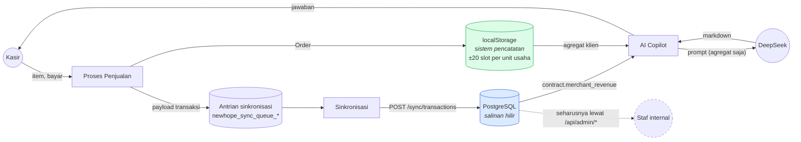
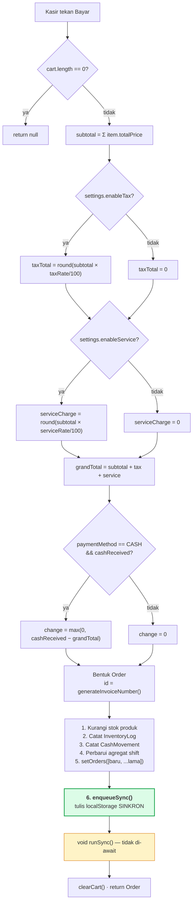
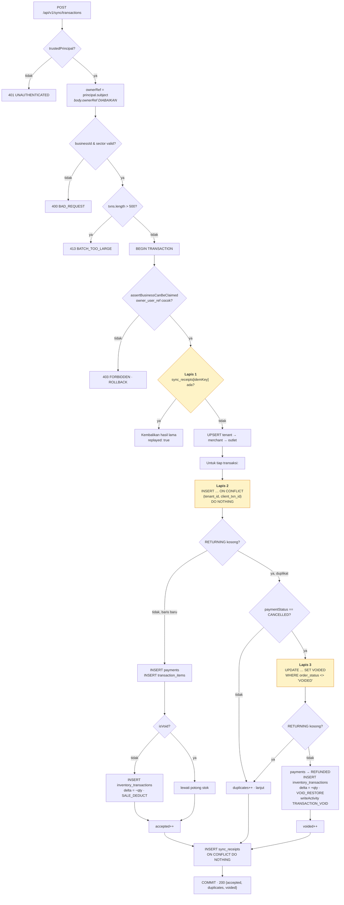
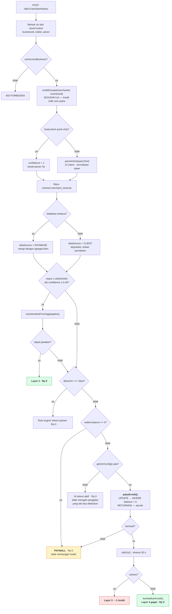
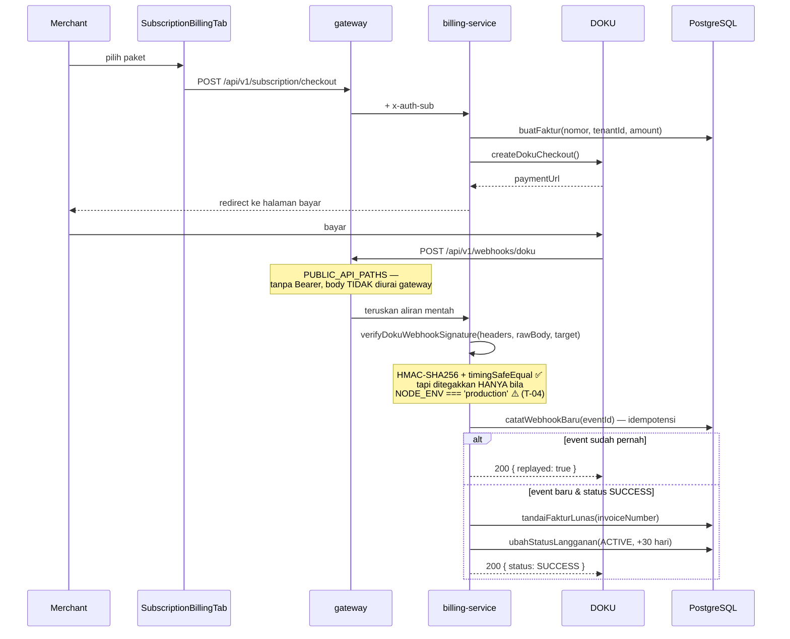
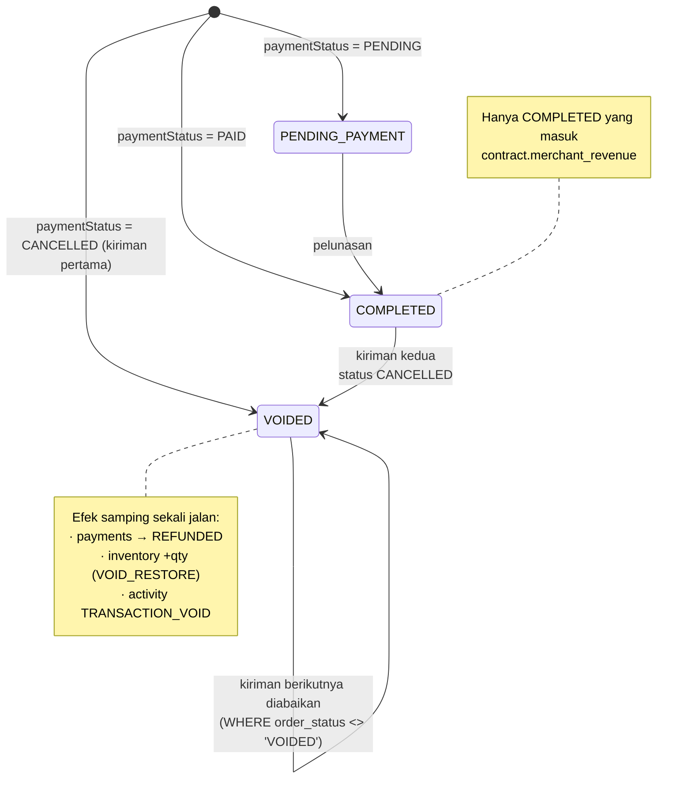
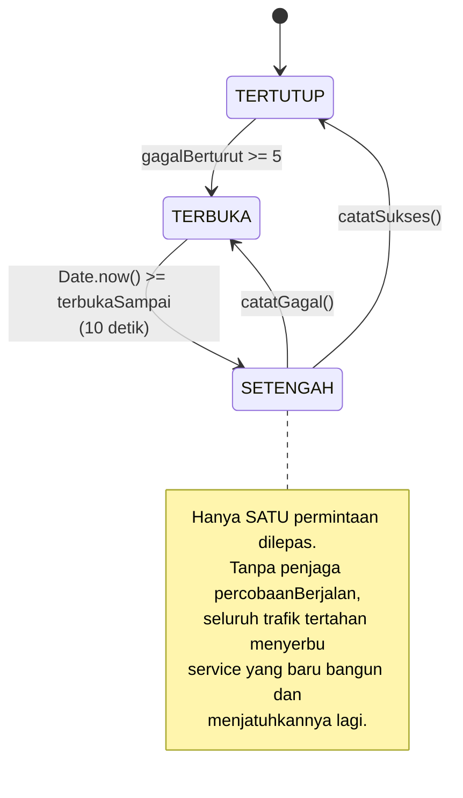
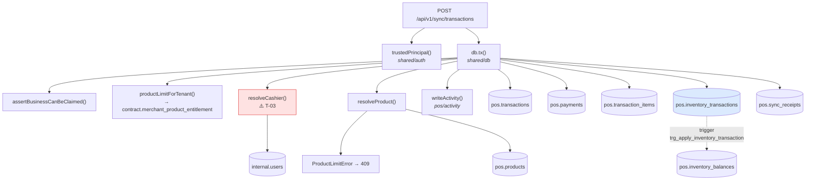

# 03 — Visualisasi Alur & Logika

Diagram di halaman ini diturunkan dari pembacaan jalur eksekusi sebenarnya, dan
setiap simpul keputusan menunjuk baris kode yang menentukannya.

---

## 1. Data Flow Diagram — tingkat konteks

Yang penting dipahami lebih dulu: **`localStorage` adalah sistem pencatatan
utama aplikasi kasir**, dan PostgreSQL adalah salinan hilir untuk pelaporan.
Arah alirannya satu arah — tidak ada jalur yang menarik transaksi dari server
kembali ke browser.

Garis putus-putus ke staf internal **tidak terhubung dalam kode**: konsol admin
membaca fiktur, bukan PostgreSQL (T-01).

**Data yang menyeberang ke LLM** dibatasi secara eksplisit di
`services/ai/index.ts:265-271`: hanya agregat dan ringkasan insight (maksimal 6).
Baris transaksi mentah, nomor telepon pelanggan, dan data staf tidak pernah
keluar.

---

## 2. Flowchart — proses penjualan (`processPayment`)

Sumber: `src/context/POSContext.tsx:1284-1516`.

**Keputusan desain yang menentukan.** Langkah 6 menulis ke disk **sebelum**
apa pun dikirim, lalu pengirimannya sengaja tidak di-`await`
(`POSContext.tsx:1503-1510`). Kasir tidak pernah menunggu jaringan; kalau tab
ditutup tepat setelah baris itu, transaksinya tetap terkirim saat aplikasi
dibuka lagi.

> **Catatan ketepatan:** `grandTotal` **tidak** mengurangi `discountTotal`.
> Diskon sudah terpotong di `item.totalPrice` saat masuk keranjang, jadi
> `subtotal` sudah bersih. `discountTotal` yang disimpan di `Order` bersifat
> informasional. Server memakai rumus berbeda sebagai *fallback* —
> `subtotal - discount + tax + serviceCharge` (`sync.ts:307`) — tapi hanya jika
> `totalAmount` tidak dikirim, dan klien selalu mengirimnya.

---

## 3. Flowchart — jalur idempotensi sinkronisasi

Ini jalur tulis paling kritis di seluruh sistem. Sumber:
`services/pos/sync.ts:108-548`.

### Tiga lapis pertahanan penggandaan

| Lapis | Mekanisme | Menangkap |
|---|---|---|
| 1 | `pos.sync_receipts.idempotency_key` | Batch identik terkirim ulang seluruhnya |
| 2 | `UNIQUE (tenant_id, client_txn_id)` | Transaksi tunggal terkirim ulang di batch berbeda |
| 3 | `UPDATE … WHERE order_status <> 'VOIDED'` | Pembatalan ganda |

Lapis 3 adalah yang paling halus dan paling mudah salah dirancang. Void selalu
tiba sebagai kiriman **kedua** untuk `clientTxnId` yang sama — kalau
diperlakukan sebagai duplikat biasa, pembatalannya hilang dan panel terus
menghitung uang yang sudah dikembalikan ke pelanggan. Arah sebaliknya
(menghidupkan lagi transaksi batal) sengaja tidak dilayani.

Pengembalian stok saat void idempoten karena bergantung pada `RETURNING` dari
`UPDATE` bersyarat itu: kiriman ketiga tidak menghasilkan baris, jadi blok
pengembalian stok tidak dimasuki sama sekali (`sync.ts:389-423`).

---

## 4. Flowchart — perutean AI Copilot tiga lapis

Urutan operasinya **adalah** strategi kendali biayanya. Sumber:
`services/ai/index.ts:86-370`.

**Enam gerbang berbeda mengembalikan Rp 0 sebelum satu kredit pun terpotong.**
Kredit hanya dipotong setelah dipastikan: intent tidak terpecahkan secara
deterministik, saldo ada, dan penyedia LLM benar-benar terkonfigurasi. Kalau
panggilan gagal setelah itu, kreditnya dikembalikan
(`services/ai/index.ts:356`).

Pengurangan saldo memakai `UPDATE … WHERE balance > 0 RETURNING` dalam satu
pernyataan (`services/ai/wallet.ts`), sehingga dua request bersamaan pada saldo
terakhir menghasilkan satu TRUE dan satu FALSE. Membaca-lalu-menulis dari
aplikasi akan meloloskan keduanya.

---

## 5. Sequence — aktivasi langganan lewat webhook DOKU

Sumber: `services/billing/index.ts:428-483`.

Gateway sengaja **tidak mengurai body** pada jalur ini
(`services/gateway/index.ts:82-84`): mengurai lalu menyusun ulang JSON mengubah
byte-nya dan merusak verifikasi tanda tangan. Keputusan itu benar — dan justru
karena itu handler Vercel di `api/v1/webhooks/doku.ts:12` yang melakukan
`JSON.stringify(req.body)` tidak akan pernah menghasilkan tanda tangan yang
cocok.

---

## 6. State machine — status transaksi

Direkonstruksi dari `sync.ts:311-313` dan `POSContext.tsx:1517-1560`.

Transisi `VOIDED → COMPLETED` **tidak ada dan disengaja**: menghidupkan kembali
transaksi yang sudah dibatalkan harus menjadi transaksi baru dengan struk baru.

---

## 7. State machine — circuit breaker

Sumber: `services/shared/breaker.ts`.

---

## 8. Call graph — jalur tulis pos-service

Perhatikan `pos.inventory_transactions → pos.inventory_balances`: pengurangan
stok dilakukan **trigger database**, bukan aplikasi. Tidak ada *read-then-write*
di sisi aplikasi, sehingga dua penjualan bersamaan atas produk yang sama tidak
bisa saling menimpa.
