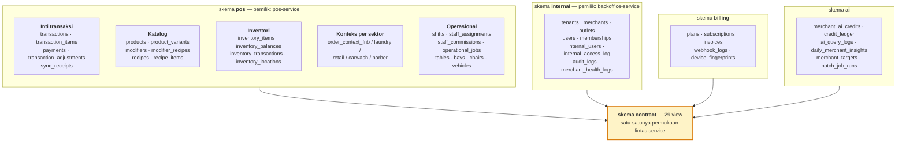
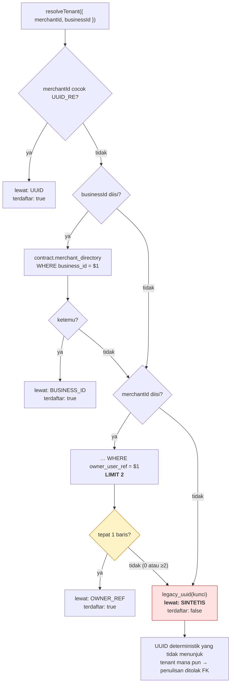
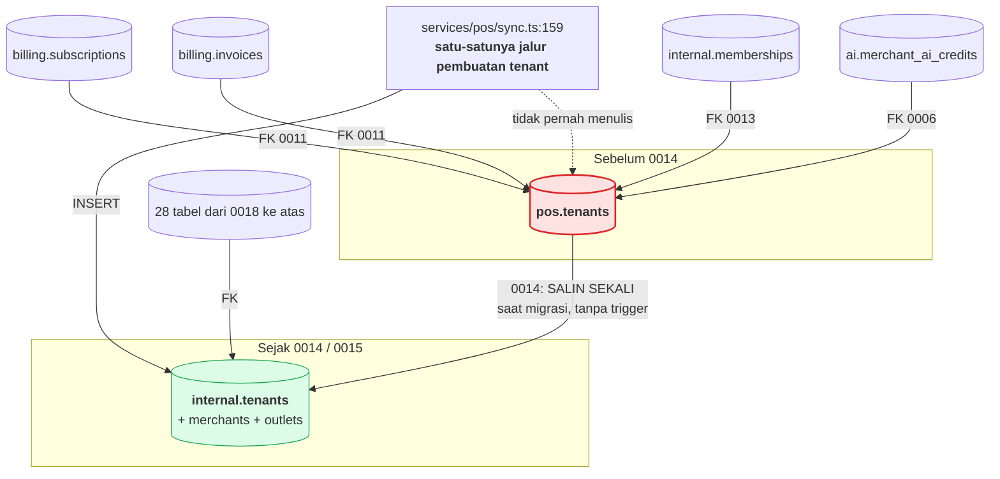

# 04 — Model Data (hasil rekonstruksi dari DDL)

Direkonstruksi dari **35 berkas migrasi (7.321 baris DDL)** di `migrations/`.
Migrasi tidak dijalankan; bentuk skema di sini adalah hasil pembacaan DDL secara
berurutan, termasuk `ALTER TABLE … SET SCHEMA` yang memindahkan tabel antar
skema.

> Dokumen `docs/erd.md` yang ada menyebut *"24 tabel dan 8 view"*. Angka itu
> benar untuk migrasi 0001–0006; sejak 0009 dan seterusnya jumlahnya menjadi
> **±58 tabel dan 29 view kontrak**. Lihat T-12.

---

## 1. Peta skema



---

## 2. Skema `contract` — bahasa terpublikasi

29 view. Inilah satu-satunya hal yang boleh dibaca lintas service, dan view di
PostgreSQL berjalan dengan hak **pembuatnya** — sehingga konsumen tidak perlu
(dan tidak diberi) hak akses ke tabel dasarnya.

| Kelompok | View |
|---|---|
| **Uang** | `merchant_revenue` · `transaction_log` · `transaction_items` · `transaction_items_detailed` · `payments_log` · `daily_sector_revenue` |
| **Direktori** | `merchant_directory` · `tenant_directory` · `outlet_directory` · `merchant_staff` |
| **Katalog & stok** | `catalog` · `modifier_directory` · `product_sales` · `stock_status` · `inventory_movements` · `bom_explosion` |
| **Antrean langsung** | `live_fnb_orders` · `live_laundry_orders` · `live_barber_queue` · `live_carwash_queue` · `workshop_jobs_board` |
| **Aktivitas** | `activity_log` · `activity_by_sector` |
| **Komersial** | `subscription_status` · `merchant_product_entitlement` · `merchant_health_latest` · `business_targets` · `staff_commission_ledger` · `sector_summary` |

### Definisi omzet tunggal

`contract.merchant_revenue` (`migrations/0020_separate_orders_and_payments.sql:112`)
adalah satu-satunya definisi omzet di platform:

```sql
WHERE x.order_status = 'COMPLETED'
  AND (x.payment_status <> 'CANCELLED' OR x.payment_status IS NULL)
```

Karena AI Copilot (`services/ai/merchantData.ts`) dan konsol admin
(`src/server/repo.ts`) sama-sama **wajib** membacanya, angka yang mereka
laporkan identik secara struktural — bukan hasil disiplin menjaga dua potongan
SQL tetap sama.

Metode pembayaran diambil lewat `LEFT JOIN LATERAL … ORDER BY created_at DESC
LIMIT 1` ke `pos.payments`, dengan `COALESCE` ke kolom lama pada
`pos.transactions` — pola kompatibilitas maju yang membuat migrasi 0020 bisa
berjalan tanpa menulis ulang jalur sinkronisasi.

---

## 3. Resolusi identitas merchant

Klien mengenal merchant lewat string bebas (`usr-budi`, `usr-budi_FNB`);
database memakai UUIDv7 sejak 0005. Penerjemahannya **terpusat** di
`services/shared/identity.ts`.



**`LIMIT 2` adalah inti keputusannya.** Pemilik dengan kafe *dan* laundry
sengaja **tidak** diselesaikan tanpa `businessId`. Menebak salah satunya berarti
kredit AI kafe terpotong untuk pertanyaan tentang laundry — dan tidak akan ada
error apa pun yang menunjukkannya (`identity.ts:88-96`).

Langkah SINTETIS juga disengaja gagal: UUID-nya deterministik tapi tidak
menunjuk baris mana pun, jadi setiap penulisan ditolak foreign key. Lebih baik
ditolak daripada menempel pada merchant yang salah.

---

## 4. ⚠️ Split-brain tabel tenant

Temuan struktural yang muncul dari membaca migrasi secara berurutan.



| Aspek | Rincian |
|---|---|
| **`pos.tenants`** | Dibuat 0009 (dari `public.tenants`). **Tidak pernah di-DROP.** Tidak pernah ditulis lagi setelah 0014. |
| **`internal.tenants`** | Dibuat 0014, disempurnakan 0015. Satu-satunya tabel yang ditulis `sync.ts`. |
| **Menunjuk `pos.tenants`** | `billing.subscriptions` · `billing.invoices` (0011:45,53) · `internal.memberships` (0013:38) · `ai.merchant_ai_credits`, `daily_merchant_insights`, `merchant_targets`, `merchant_health_logs`, `feature_usage_events` (0006:34-46, lewat `REFERENCES tenants(id)` tanpa prefiks) |
| **Menunjuk `internal.tenants`** | ±28 tabel dari 0018 sampai 0034 |
| **Yang menjembatani** | Hanya penyalinan satu kali di `0014:41-56`. Tidak ada trigger, tidak ada view, tidak ada penulisan ganda. |

Konsekuensinya bisa dilacak sampai ke kode yang menanganinya:

- `services/ai/wallet.ts:86-92` menangkap kode error `23503` (pelanggaran FK)
  dan mengembalikan **dompet kosong** alih-alih melempar.
- `services/billing/store.ts:113` mengembalikan `null` bila tenant tidak
  `terdaftar`, yang di handler webhook menjadi peringatan
  `MERCHANT_BELUM_SINKRON` (`billing/index.ts:520`).

Kedua penanganan itu benar sebagai perlindungan, tapi keduanya menangani
**gejala**. Akar masalahnya adalah FK yang masih menunjuk tabel yang sudah
ditinggalkan. Lihat **T-09**.

---

## 5. Peran database & hak akses

Dibuat di `migrations/0009_service_schemas.sql:339-378`.

| Peran | Skema sendiri | `contract` | Tambahan |
|---|---|---|---|
| `svc_pos` | `pos` — ALL | SELECT | `EXECUTE legacy_uuid()` |
| `svc_billing` | `billing` — ALL | SELECT | `USAGE ON pos` + `SELECT, REFERENCES ON pos.tenants` (0011) |
| `svc_ai` | `ai` — ALL | SELECT | idem (0011) |
| `svc_internal` | `internal` — ALL | SELECT | — |
| `bi_readonly` | — | SELECT | Untuk Metabase/BI; tidak pernah tabel mentah |

Semua dibuat `NOLOGIN` (`0009:347`). **Tidak ada satu pun `SET ROLE` di seluruh
basis kode**, dan `services/shared/db.ts:67` memakai satu `DATABASE_URL` untuk
kelima service. Isolasi ini ada di DDL tapi tidak aktif saat dijalankan — lihat
**T-02**.

> Catatan ketepatan untuk README: sejak 0011, `svc_ai` **memang** punya
> `USAGE ON SCHEMA pos`. Pesan penolakan yang dicontohkan README
> (`permission denied for schema pos`) kini akan berbunyi
> `permission denied for table transactions`. Isolasi atas `pos.transactions`
> tetap berlaku; hanya pesannya yang berubah.

---

## 6. Integritas yang ditegakkan database

Hal-hal yang **tidak** dititipkan ke aplikasi:

| Mekanisme | Lokasi | Yang dicegah |
|---|---|---|
| `UNIQUE (tenant_id, client_txn_id)` | `pos.transactions` | Omzet berlipat dari kiriman ulang |
| `UNIQUE (idempotency_key)` | `pos.sync_receipts` | Batch identik diproses dua kali |
| `trg_apply_inventory_transaction` | 0024 | Race pada stok — tidak ada read-then-write di aplikasi |
| `consume_ai_credit()` | 0003/0010 | Dua request bersamaan menghabiskan kredit terakhir yang sama |
| Immutabilitas catatan finansial | 0035 | Perubahan retroaktif pada pembukuan |
| Ledger kompensasi | 0033 | Pembalikan pembayaran yang menghapus jejak |
| `ON DELETE SET NULL` pada log | 0006:49-50 | Jejak audit ikut hilang saat merchant pergi |

Pilihan `SET NULL` untuk `ai_query_logs` dan `internal_access_log` — bukan
`CASCADE` — adalah keputusan yang tepat: riwayat biaya dan jejak akses justru
paling dibutuhkan **setelah** merchant pergi.
