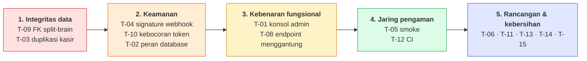

# 05 — Register Temuan Audit

Setiap temuan menyebut **bukti** (berkas:baris yang bisa diperiksa), **dampak**
yang bisa diamati, dan **perbaikan** yang konkret. Tidak ada temuan yang
didasarkan pada kesan; yang tidak bisa dibuktikan dari kode tidak dimasukkan.

| # | Temuan | Tingkat | Wilayah |
|---|---|---|---|
| [T-01](#t-01) | Konsol back-office berjalan di atas data fiktif | 🔴 Kritis | Arsitektur |
| [T-09](#t-09) | Split-brain FK: `pos.tenants` vs `internal.tenants` | 🔴 Kritis | Data |
| [T-02](#t-02) | Isolasi peran database tidak aktif saat runtime | 🟠 Tinggi | Keamanan |
| [T-03](#t-03) | `resolveCashier()` membuat user baru tiap batch | 🟠 Tinggi | Korektness |
| [T-04](#t-04) | Verifikasi tanda tangan webhook bersyarat `NODE_ENV` | 🟠 Tinggi | Keamanan |
| [T-05](#t-05) | `npm run smoke` crash sebelum menjalankan satu intent | 🟡 Sedang | Kualitas |
| [T-06](#t-06) | `POSContext` God Object (2.109 baris) | 🟡 Sedang | Rancangan |
| [T-07](#t-07) | `AUTH_ALLOW_LOCAL_DEVELOPMENT` melewati semua otorisasi | 🟡 Sedang | Keamanan |
| [T-10](#t-10) | Header webhook dicatat utuh ke log | 🟡 Sedang | Keamanan |
| [T-11](#t-11) | Katalog harga terduplikasi di 12 berkas | 🟡 Sedang | Rancangan |
| [T-12](#t-12) | Tidak ada uji otomatis; CI hanya untuk batch | 🟡 Sedang | Kualitas |
| [T-08](#t-08) | Endpoint menggantung `/api/ai/generate-promo` | 🟢 Rendah | Korektness |
| [T-13](#t-13) | Kode mati: `churn.ts`, `CategoryFilter.tsx` | 🟢 Rendah | Kebersihan |
| [T-14](#t-14) | Komentar kerja tertinggal di jalur tulis produksi | 🟢 Rendah | Kebersihan |
| [T-15](#t-15) | Drift dokumentasi terhadap kode | 🟢 Rendah | Dokumentasi |

---

## 🔴 T-01 {#t-01}
### Konsol back-office berjalan 100% di atas data fiktif

**Bukti.**

```bash
$ grep -cE "fetch\(|supabase\.(from|rpc)" src/admin/api.ts
0
```

`src/admin/api.ts` — 1.664 baris, fan-in 10, penyuplai seluruh konsol admin —
**tidak berisi satu pun panggilan jaringan**. Semua data dikembalikan dari
literal:

- `api.overview()` (`:1230`) mengembalikan 5 sektor ter-hardcode
  (`gross_revenue: 184500000`, dst.)
- `api.merchants()` (`:1258`) memfilter array `SAMPLE_MERCHANTS`
- `api.me()` (`:1199`) membaca email dari `localStorage`, lalu mengembalikan
  **ketujuh capability tanpa syarat** — apa pun role-nya

Sementara itu backend-nya lengkap dan berjalan:

| Komponen | Baris | Status |
|---|---|---|
| `src/server/adminRoutes.ts` | 397 | 12 rute + `guard()` RBAC + audit akses |
| `src/server/repo.ts` | 438 | 12 fungsi query, seluruhnya membaca `contract.*` |
| `services/backoffice/index.ts` | 37 | Mendaftarkan rute; berjalan di `:3104` |
| `services/gateway/index.ts:56` | — | `/api/admin` → backoffice |

**Dampak.**

1. Konsol menampilkan angka yang **tidak ada hubungannya** dengan merchant
   sungguhan. Keputusan operasional yang diambil darinya salah sejak awal.
2. RBAC menjadi kosmetik. `ROLE_INTERNAL_SUPPORT` dan `ROLE_INTERNAL_GROWTH`
   berbeda label saja — `api.me()` memberi capability identik ke keduanya.
3. Email yang **tidak ada** dalam `IDENTITIES_LIST` di-default ke
   `ROLE_SUPERADMIN` (`:1204-1208`).
4. Seluruh mesin audit di `adminRoutes.ts` — pencatatan `DENIED_*`,
   `BLOCKED_*`, kewajiban justifikasi untuk role support — tidak pernah
   dijalankan sekali pun.

Komentar di `src/admin/AdminApp.tsx:21` menulis *"Yang sesungguhnya menjaga
adalah guard di server"*. Guard itu ada dan benar; ia hanya tidak berada di
jalur yang dipakai UI.

**Perbaikan.** Ganti isi `src/admin/api.ts` dengan pemanggil HTTP ke
`/api/admin/*` yang sudah ada, mengirim identitas lewat header
`x-internal-user` sebagaimana diharapkan `guard()`. Backend-nya tidak perlu
diubah. Setelah itu hapus seluruh fikstur, dan `api.me()` cukup meneruskan
respons `/api/admin/me` — termasuk capability yang benar per role.

---

## 🔴 T-09 {#t-09}
### Split-brain foreign key: `pos.tenants` vs `internal.tenants`

**Bukti.**

| Migrasi | Perubahan |
|---|---|
| `0009:69-71` | `public.tenants` → `pos.tenants` |
| `0006:34-46` + `:96-99` | FK dari `merchant_ai_credits`, `subscriptions`, `invoices`, `merchant_targets`, `merchant_health_logs`, `feature_usage_events` → `REFERENCES tenants(id)` (ikut berpindah ke `pos.tenants`) |
| `0011:45,53` | `fk_subscriptions_tenant`, `fk_invoices_tenant` → `REFERENCES pos.tenants(id)` |
| `0013:38` | `internal.memberships.tenant_id` → `REFERENCES pos.tenants(id)` |
| `0014:41-56` | Salin **sekali** `pos.tenants` → `internal.tenants`. `pos.tenants` **tidak** di-DROP; FK **tidak** dipindahkan |
| `0018`–`0034` | ±28 tabel baru → `REFERENCES internal.tenants(id)` |

Jalur pembuatan tenant satu-satunya (`services/pos/sync.ts:159`) menulis
**hanya** ke `internal.tenants`.

**Dampak.** Merchant yang mendaftar setelah 0014 punya baris di
`internal.tenants` tapi tidak di `pos.tenants`. `resolveTenant()` membacanya
lewat `contract.merchant_directory` (dibangun di atas `internal.tenants`) dan
melaporkan `terdaftar: true` — lalu setiap penulisan ke tabel yang FK-nya masih
menunjuk `pos.tenants` ditolak dengan SQLSTATE `23503`.

Kode sudah menanggung akibatnya, dan itu justru buktinya:

- `services/ai/wallet.ts:86-92` menangkap `23503` dan mengembalikan **dompet
  kosong** — artinya merchant pasca-0014 tidak pernah bisa memakai Layer 3 AI.
- `services/billing/store.ts:113` mengembalikan `null`, yang di webhook menjadi
  peringatan `MERCHANT_BELUM_SINKRON` (`billing/index.ts:520`) — artinya
  pembayaran diterima tapi langganan tidak aktif.

Keduanya menangani gejala dengan benar. Tidak satu pun menyentuh sebabnya.

**Perbaikan.** Satu migrasi yang memindahkan seluruh FK ke `internal.tenants`:

```sql
ALTER TABLE billing.subscriptions      DROP CONSTRAINT fk_subscriptions_tenant;
ALTER TABLE billing.subscriptions      ADD  CONSTRAINT fk_subscriptions_tenant
      FOREIGN KEY (tenant_id) REFERENCES internal.tenants(id) ON DELETE CASCADE;
-- ulangi untuk billing.invoices, internal.memberships,
-- ai.merchant_ai_credits, ai.merchant_targets,
-- internal.merchant_health_logs, internal.feature_usage_events
```

Jalankan setelah menyamakan baris yatim, lalu `DROP TABLE pos.tenants` agar
tidak ada kemungkinan salah tunjuk di kemudian hari. Verifikasi:

```sql
SELECT conname, confrelid::regclass FROM pg_constraint
 WHERE confrelid = 'pos.tenants'::regclass;   -- harus kosong
```

---

## 🟠 T-02 {#t-02}
### Isolasi peran database dibuat, tapi tidak pernah dipakai

**Bukti.**

```bash
$ grep -rn "SET ROLE" --include=*.ts --include=*.mjs --include=*.sql .
(tidak ada hasil)
```

- `migrations/0009:347` membuat `svc_pos`, `svc_billing`, `svc_ai`,
  `svc_internal` sebagai **`NOLOGIN`**.
- `services/shared/db.ts:67-68` memakai satu `process.env.DATABASE_URL` untuk
  kelima service.
- `.env.example:23` mencontohkan `postgres.PROJECT_REF` — akun pemilik proyek,
  bukan peran per-service.
- `.env.example:17` bahkan menyebut `SET ROLE` sebagai alasan memakai session
  pooler, tapi tidak ada kode yang memanggilnya.

**Dampak.** Klaim inti README — *"Batas antar service ditegakkan database, bukan
kesepakatan"* — tidak berlaku saat sistem berjalan. Kelima proses berbagi satu
identitas dengan hak penuh atas kelima skema. Satu bug di ai-service bisa
menulis ke `pos.transactions`; Postgres tidak akan menolaknya.

Ini menghapus justifikasi keamanan yang dinyatakan
`services/backoffice/index.ts:7-14` untuk memisahkan backoffice sebagai proses
tersendiri.

**Perbaikan.** Dua langkah:

```sql
ALTER ROLE svc_pos LOGIN PASSWORD '…';   -- untuk keempat peran
```

Lalu berikan URL berbeda per service, dengan `DATABASE_URL` sebagai cadangan:

```ts
// services/shared/db.ts
const connectionString =
  opts.connectionString ||
  process.env[`DATABASE_URL_${opts.schema.toUpperCase()}`] ||
  process.env.DATABASE_URL;
```

Migrasi tetap dijalankan oleh peran pemilik. Verifikasi bahwa batasnya aktif:

```sql
SET ROLE svc_ai;
SELECT 1 FROM pos.transactions LIMIT 1;   -- harus: permission denied
```

Sampai itu dilakukan, README sebaiknya menyatakan bahwa isolasi peran adalah
**rancangan yang belum diaktifkan**, bukan sifat yang berjalan.

---

## 🟠 T-03 {#t-03}
### `resolveCashier()` membuat baris `internal.users` baru pada setiap batch

**Bukti.** `services/pos/sync.ts:222-236`:

```ts
const userCheck = await c.query(
  `SELECT id FROM internal.users WHERE email = $1 LIMIT 1`,
  [`${ref || 'kasir'}@pos.local`]            // ← dicari:  budi@pos.local
);

if (userCheck.rows.length) { userId = userCheck.rows[0].id; }
else {
  const insUser = await c.query(
    `INSERT INTO internal.users (id, email, full_name) VALUES (uuidv7(), $1, $2) RETURNING id`,
    [`${ref || 'kasir'}_${Date.now()}@pos.local`, name || 'Kasir']   // ← disimpan: budi_1735...@pos.local
  );
  userId = insUser.rows[0].id;
}
```

Kunci pencarian dan kunci penyimpanan **tidak akan pernah sama**: yang satu
`${ref}@pos.local`, yang lain menyisipkan `_${Date.now()}`. Karena
`internal.users.email` adalah `NOT NULL UNIQUE`
(`migrations/0013:18`), setiap INSERT berhasil dengan email unik baru.

Cache `cashierCache` (`:207`) hanya hidup selama satu transaksi, jadi ia
mencegah duplikasi **di dalam** satu batch — tidak antar batch.

Sebagai catatan tambahan, query ke `internal.memberships` di `:211-214`
hasilnya disimpan ke variabel `found` yang **tidak pernah dibaca**.

**Dampak.**

- `internal.users` tumbuh sebanyak *(jumlah kasir unik × jumlah batch sinkron)*.
  Satu toko dengan 3 kasir yang menyinkron 20 kali sehari menambah **60 baris
  per hari**.
- `pos.transactions.cashier_user_id` menunjuk user sintetis yang berbeda tiap
  batch. Setiap laporan performa per kasir lintas waktu memecah satu orang
  menjadi puluhan identitas.
- `contract.merchant_directory.distinct_cashiers` (`0014:78`) menghitung
  `COUNT(DISTINCT r.cashier_user_id)` — angkanya akan naik tanpa batas.

**Perbaikan.** Samakan kedua kunci, dan biarkan database menegakkan keunikan:

```ts
const email = `${ref || 'kasir'}@pos.local`;
const ins = await c.query(
  `INSERT INTO internal.users (id, email, full_name) VALUES (uuidv7(), $1, $2)
   ON CONFLICT (email) DO UPDATE SET full_name = EXCLUDED.full_name
   RETURNING id`,
  [email, name || 'Kasir']
);
```

Idealnya email disematkan `tenantId` (`${ref}@${tenantId}.pos.local`) agar dua
merchant dengan kasir bernama sama tidak berbagi baris. Hapus juga query
`found` yang mati.

---

## 🟠 T-04 {#t-04}
### Verifikasi tanda tangan webhook DOKU bersyarat `NODE_ENV`

**Bukti.** `services/billing/index.ts:436`:

```ts
if (!isSignatureValid && isDokuConfigured() && process.env.NODE_ENV === 'production') {
  return res.status(401).json({ ok: false, error: 'INVALID_SIGNATURE' });
}
```

Penolakan hanya terjadi bila **ketiga** syarat terpenuhi. Endpointnya publik —
`/api/v1/webhooks/doku` ada di `PUBLIC_API_PATHS`
(`services/gateway/index.ts:73`), jadi tidak ada Bearer token yang menjaganya.

Implementasi tanda tangannya sendiri **benar**: HMAC-SHA256 dengan
`crypto.timingSafeEqual` dan pemeriksaan panjang buffer
(`services/billing/doku.ts:209-215`).

**Dampak.** Bila `NODE_ENV` tidak persis `'production'` — tidak disetel,
`'staging'`, atau `npm start` di luar Docker — request tak bertanda tangan yang
membawa `invoice_number` yang benar akan **mengaktifkan langganan 30 hari**
(`billing/index.ts:466-476`). `docker-compose.yml:55` memang menyetelnya, jadi
jalur Docker aman; jalur lain tidak.

Dua masalah pendamping:

- Tidak ada pemeriksaan kesegaran `Request-Timestamp`. Idempotensi `eventId`
  mencegah pemutaran ulang event yang **sama**, tapi tidak membatasi jendela
  waktu.
- `api/v1/webhooks/doku.ts:14-24` (jalur Vercel) menghitung `isValid` lalu
  **mengabaikannya** dan selalu menjawab `200 { ok: true }`. Handler itu juga
  menyusun ulang `rawBody` lewat `JSON.stringify(req.body)`, yang mengubah byte
  sehingga HMAC tidak akan pernah cocok.

**Perbaikan.** Jadikan fail-closed tanpa syarat lingkungan:

```ts
if (!isSignatureValid) {
  svc.log.warn('Webhook DOKU ditolak', { invoiceNumber });   // lihat T-10
  return res.status(401).json({ ok: false, error: 'INVALID_SIGNATURE' });
}
```

Untuk pengembangan lokal, pakai flag eksplisit yang menyebut dirinya sendiri
(`DOKU_WEBHOOK_INSECURE=1`) alih-alih menumpang `NODE_ENV`. Tambahkan penolakan
timestamp di luar ±5 menit. Hapus atau lengkapi handler Vercel — saat ini ia
memberi kesan memverifikasi padahal tidak.

---

## 🟡 T-05 {#t-05}
### `npm run smoke` crash sebelum menjalankan satu intent pun

**Bukti.**

```
$ npm run smoke
LAYER 1 — algorithms #5 (target), #6 (payday), #7 (shift)
TypeError: Cannot read properties of undefined (reading 'items')
    at mk (scripts/dev/smoke-assistant.ts:257:27)
```

Akar masalahnya:

```ts
// scripts/dev/smoke-assistant.ts:245
const base = INITIAL_HISTORICAL_ORDERS[0];

// src/data/initialData.ts:527
export const INITIAL_HISTORICAL_ORDERS: Order[] = [];   // ← dikosongkan
```

Fikstur dikosongkan saat pembersihan data contoh (pola yang sama terlihat di
`purgeLegacyMockData()`, `POSContext.tsx:287`), tapi skrip smoke masih
mengandalkan elemen `[0]`-nya.

**Dampak.** README dan `docs/smart-assistant-architecture.md` sama-sama
mengutip suite ini sebagai bukti *"47 dijawab deterministik dari 53 → 88,7%
zero-cost"*. Angka itu **tidak bisa direproduksi hari ini** — eksekusinya
berhenti sebelum bagian intent dimulai. Regresi pada rule engine 3.842 baris
tidak akan tertangkap oleh apa pun.

**Perbaikan.** Beri skrip fikstur miliknya sendiri, bukan menumpang data seed
aplikasi:

```ts
const base: Order = makeOrderFixture();   // lokal di berkas skrip
```

Lalu masukkan `npm run smoke` ke CI (lihat T-12) agar kerusakan berikutnya
ketahuan saat itu juga.

---

## 🟡 T-06 {#t-06}
### `POSContext` adalah God Object

**Bukti.** `src/context/POSContext.tsx` — 2.109 baris, fan-in **26**, satu
`interface POSContextType` dengan ±70 anggota yang mencakup: produk, kategori,
pesanan, keranjang, pelanggan, meja, staf, absensi, shift, inventori, bundel,
promo, cabang, pengaturan, pengguna, izin, PIN, dan status sinkronisasi.

**Dampak.**

- Setiap perubahan state apa pun me-render ulang **semua** konsumen; React
  Context tidak punya seleksi granular.
- Tidak ada satu pun bagiannya yang bisa diuji terpisah tanpa memasang seluruh
  provider.
- Ia sekaligus titik kegagalan tunggal frontend: 26 berkas berhenti bekerja
  kalau ia melempar saat inisialisasi.

**Perbaikan.** Pemecahan bertahap sepanjang batas yang sudah terlihat di
kodenya sendiri: `CatalogContext` (produk/kategori/bundel), `OrderContext`
(keranjang/pesanan/pembayaran), `StaffContext` (pengguna/shift/absensi/izin),
`SyncContext` (antrian/status). Bisa dilakukan satu per satu tanpa mengubah
komponen sekaligus — mulai dari `SyncContext` yang paling sedikit
persinggungannya.

---

## 🟡 T-07 {#t-07}
### `AUTH_ALLOW_LOCAL_DEVELOPMENT=1` melewati seluruh lapis otorisasi

**Bukti.** Satu variabel mematikan empat pemeriksaan sekaligus:

| Berkas:baris | Efek |
|---|---|
| `services/shared/auth.ts:38` | `authenticateBearer` mengembalikan principal palsu tanpa token |
| `services/shared/auth.ts:75` | `requireTrustedGateway` meloloskan request langsung ke port internal |
| `services/shared/auth.ts:88` | `canAccessBusiness` mengembalikan `true` untuk **semua** unit usaha |
| `services/pos/sync.ts:31` | `assertBusinessCanBeClaimed` langsung `return` |

Nilai bawaannya aman (`.env.example:74` → `"0"`), dan tidak disetel di
`docker-compose.yml`. Risikonya adalah kesalahan operasional, bukan cacat kode.

**Perbaikan.** Tolak kombinasi berbahaya saat proses menyala:

```ts
if (process.env.AUTH_ALLOW_LOCAL_DEVELOPMENT === '1' && process.env.NODE_ENV === 'production') {
  throw new Error('AUTH_ALLOW_LOCAL_DEVELOPMENT tidak boleh aktif di produksi.');
}
```

Tambahkan juga peringatan berulang di log selama flag aktif, supaya tidak ada
lingkungan yang diam-diam berjalan tanpa autentikasi.

---

## 🟡 T-10 {#t-10}
### Header webhook dicatat utuh ke log

**Bukti.** `services/billing/index.ts:437-439`:

```ts
svc.log.warn('Webhook DOKU ditolak: Signature HMAC-SHA256 tidak valid', {
  headers: req.headers,
});
```

Objek `req.headers` memuat `Signature`, `Client-Id`, `Request-Id`, dan —
karena request melewati gateway — `x-newhope-gateway-token`
(`services/gateway/index.ts:171`). Ketiga hal terakhir adalah rahasia yang
dipakai untuk membedakan pemanggil tepercaya dari yang bukan.

Log berbentuk JSON di produksi (`services/shared/log.ts:59`), sehingga isinya
langsung terkirim ke agregator log apa pun yang dipasang.

**Dampak.** `INTERNAL_GATEWAY_TOKEN` bocor ke sistem log. Siapa pun yang bisa
membaca log dapat memanggil port service internal secara langsung dengan
`x-auth-sub` pilihan sendiri, melewati seluruh autentikasi gateway.

**Perbaikan.** Catat hanya yang berguna untuk diagnosis:

```ts
svc.log.warn('Webhook DOKU ditolak: signature tidak valid', {
  clientId: req.headers['client-id'],
  requestId: req.headers['request-id'],
  invoiceNumber,
});
```

Lebih baik lagi, tambahkan daftar-tolak header di `services/shared/log.ts` agar
kesalahan yang sama tidak terulang di tempat lain.

---

## 🟡 T-11 {#t-11}
### Katalog harga terduplikasi di 12 berkas

**Bukti.** `SAAS_PLANS` didefinisikan empat kali:

```
services/billing/index.ts:33      api/_gateway.ts:4
api/v1/subscription/plans.ts:3    api/v1/subscription/checkout.ts:3
```

Literal harga (`99000`, `299000`, `49000`) muncul di **12 berkas**, termasuk
`src/components/settings/SubscriptionBillingTab.tsx`, `scripts/db/sync-plans.mjs`,
`scripts/db/bootstrap.mjs`, dan `services/ai/index.ts:47`.

Saat ini nilainya konsisten — sudah diperiksa. Yang tidak ada adalah mekanisme
apa pun yang menjaganya tetap begitu.

**Dampak.** Perubahan harga menuntut 12 suntingan terkoordinasi. Yang terlewat
menghasilkan merchant ditagih berbeda dari yang ditampilkan — kelas kerusakan
yang baru ketahuan lewat keluhan pelanggan.

**Perbaikan.** Tabel `billing.plans` sudah ada sejak 0009. Jadikan ia satu-satunya
sumber, dan turunkan sisanya:

1. `services/billing` membaca `billing.plans`, bukan konstanta.
2. Frontend membaca `GET /api/v1/subscription/plans` (sudah dipakai
   `SubscriptionBillingTab.tsx:114`).
3. Handler `api/**` dihapus atau diarahkan ke gateway (lihat catatan tiga
   permukaan deployment di [01-arsitektur.md](01-arsitektur.md#4)).
4. Tambahkan pemeriksaan paritas ke `check-source-hygiene.mjs` — skrip itu
   sudah melakukan hal serupa untuk enum kategori dan bobot model churn.

---

## 🟡 T-12 {#t-12}
### Tidak ada uji otomatis; CI hanya menjalankan batch job

**Bukti.**

```bash
$ find . -name "*.test.*" -o -name "*.spec.*" | grep -v node_modules
(kosong)
```

Tidak ada test runner di `package.json`. Satu-satunya workflow
(`.github/workflows/nightly-batch-jobs.yml`) menjalankan batch analitik pada
01:00 UTC — **bukan** `npm run lint`, bukan `tsc`, bukan `npm run smoke`.

Yang ada dan berguna: 20 skrip `scripts/db/test-*.mjs`, tapi seluruhnya
menuntut basis data hidup dan dijalankan manual.

**Dampak.** Gerbang higiene repo bagus dan lolos, tapi tidak ada yang
menjalankannya secara otomatis. T-05 adalah contoh langsung: suite yang rusak
tidak terdeteksi.

**Perbaikan.** Satu workflow pada setiap push:

```yaml
- run: npm ci
- run: npm run lint      # hygiene + tsc --noEmit
- run: npm run smoke     # setelah T-05 diperbaiki
```

Keduanya berjalan tanpa basis data dan selesai dalam hitungan detik.

---

## 🟢 T-08 {#t-08}
### Endpoint menggantung `/api/ai/generate-promo`

**Bukti.** `src/components/ai/AIAssistant.tsx:1007` memanggil
`POST /api/ai/generate-promo`. Prefiks `/api/ai` ada di tabel rute gateway
(`gateway/index.ts:49`) dan diteruskan ke ai-service, yang hanya mendaftarkan
`/api/v1/assistant/*`. Hasilnya `404 NOT_FOUND` dari penangkap terakhir
(`services/shared/service.ts:187`).

**Perbaikan.** Implementasikan handlernya di ai-service, atau hapus pemanggilnya
beserta tombol yang memicunya.

---

## 🟢 T-13 {#t-13}
### Kode mati

| Berkas | Baris | Bukti |
|---|---:|---|
| `src/lib/internal/churn.ts` | 141 | Nol pengimpor statis maupun dinamis |
| `src/components/pos/CategoryFilter.tsx` | 47 | Nol pengimpor. `ReportsDashboard.tsx` memakai variabel `ledgerCategoryFilter` — nama mirip, bukan komponen ini |

**Perbaikan.** Hapus keduanya. Riwayat Git menyimpannya bila suatu saat
dibutuhkan.

---

## 🟢 T-14 {#t-14}
### Komentar kerja tertinggal di jalur tulis produksi

**Bukti.** `services/pos/sync.ts:215-220`, tepat di jalur sinkronisasi kasir:

```
// Wait, resolving cashier is currently difficult because internal.users isn't easily created…
// For now, return a placeholder or handle cashier matching via external_ref.
// We will use a fallback logic here that assumes user is created elsewhere…
// Actually, internal.users doesn't need to be populated in offline sync if they aren't registered.
// We'll insert a dummy user if not found just to satisfy the foreign key.
```

Ini catatan berpikir yang belum selesai, bukan dokumentasi — dan berada persis
di atas cacat T-03. Nadanya juga menyimpang tajam dari seluruh berkas lain di
repositori ini, yang komentarnya justru salah satu aset terkuatnya: menjelaskan
**kenapa**, bukan **apa**, dan sering menyebut bug yang pernah terjadi.

**Perbaikan.** Ganti dengan penjelasan keputusan final setelah T-03 diperbaiki.

---

## 🟢 T-15 {#t-15}
### Drift dokumentasi terhadap kode

| Klaim | Lokasi | Keadaan sebenarnya |
|---|---|---|
| "13 view kontrak" | `README.md:36` | **29** view di skema `contract` |
| "24 tabel dan 8 view" | `docs/erd.md:3` | ±58 tabel, 29 view kontrak (akurat untuk 0001–0006) |
| `svc_ai → pos.transactions` ditolak dengan `permission denied for schema pos` | `README.md:48` | Sejak `0011:64-67`, `svc_ai` punya `USAGE ON SCHEMA pos`. Penolakan tetap terjadi, tapi berbunyi `permission denied for table transactions` |
| "Batas antar service ditegakkan database" | `README.md:41` | Benar sebagai rancangan; tidak aktif saat runtime (T-02) |
| "Data merchant masih di localStorage; `schema.sql` belum tersambung" | `docs/smart-assistant-architecture.md:24` | Usang — jalur sinkronisasi ke Postgres sudah berjalan penuh |
| "47 dari 53 dijawab deterministik" | `docs/smart-assistant-architecture.md:20` | Tidak dapat direproduksi; suite-nya crash (T-05) |

**Perbaikan.** Hasilkan angka view/tabel dari migrasi lewat skrip kecil dalam
`check-source-hygiene.mjs`, sehingga drift jenis ini gagal di CI, bukan di
pembaca.

---

## Ringkasan: apa yang dikerjakan lebih dulu



**T-09 dan T-03 didahulukan** karena keduanya merusak data secara akumulatif:
setiap hari sistem berjalan menambah baris yang harus direkonsiliasi nanti.
Sisanya adalah keadaan statis yang tidak memburuk sambil menunggu.
