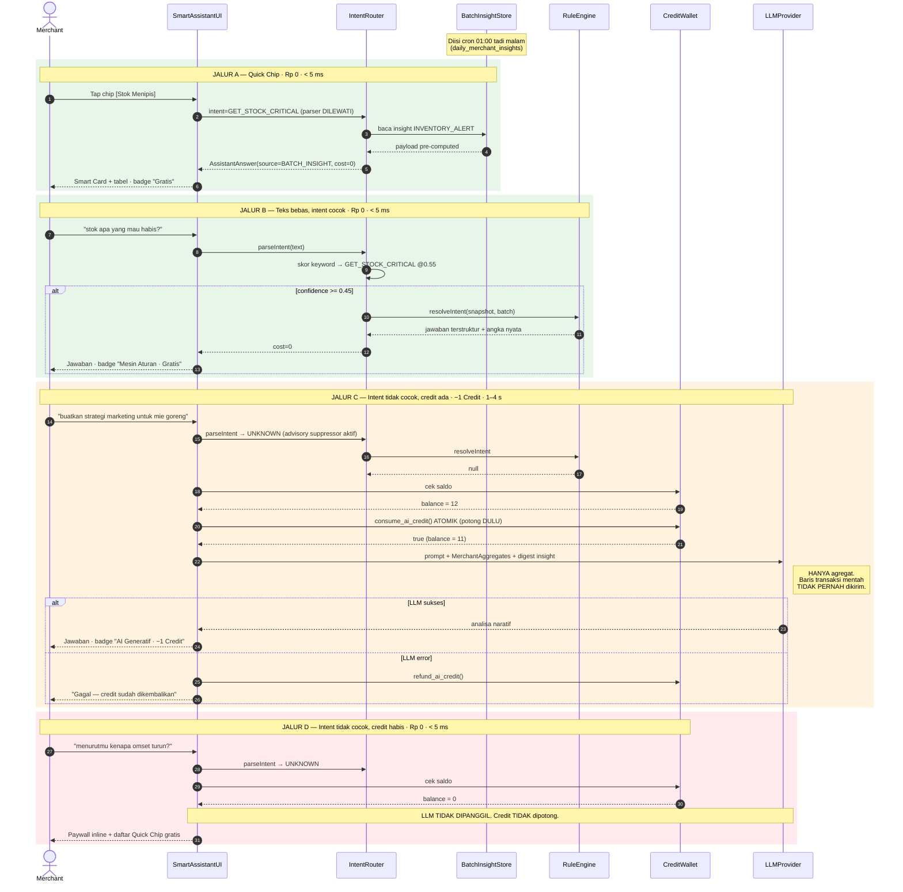
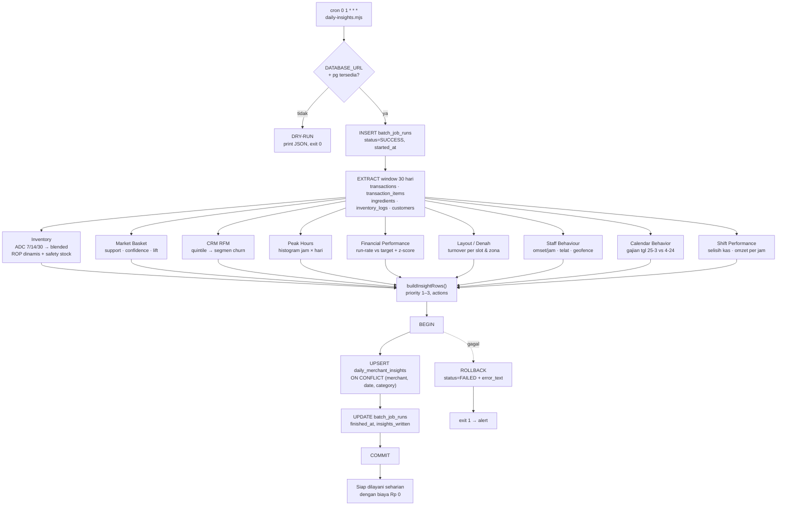

# Smart Assistant Engine — Arsitektur Hybrid

Dokumen ini menjelaskan implementasi fitur Smart Assistant di New Hope POS: bagaimana asisten benar-benar terhubung ke data toko, dan bagaimana mayoritas pertanyaan dijawab tanpa memanggil LLM sama sekali.

---

## 1. Ringkasan Eksekutif

**Masalah.** Paket langganan kami flat-rate, tapi biaya LLM API bersifat per-panggilan. Kalau setiap pertanyaan merchant ("stok apa yang mau habis?", "omset hari ini berapa?") diteruskan ke LLM, margin habis dimakan cost leakage — dan ironisnya pertanyaan-pertanyaan itu justru yang paling mudah dijawab dengan query biasa.

**Jawaban.** Tiga layer:

| Layer | Kapan jalan | Biaya | Latensi |
|---|---|---|---|
| **1. Batch Learning** | Sekali per hari (cron 01:00) | Rp 0 | ~50 ms untuk seluruh toko |
| **2. Intent Router + Rule Engine** | Setiap pertanyaan, real-time | **Rp 0** | < 5 ms, tanpa network |
| **3. LLM Fallback** | Hanya kalau Layer 2 menyerah | −1 AI Credit | 1–4 detik |

**Target: ≥ 90% pertanyaan dijawab di Layer 1–2.** Pengukuran aktual pada test suite (`scripts/dev/smoke-assistant.ts`, 53 pertanyaan realistis berbahasa Indonesia): **47 dijawab deterministik, 6 diteruskan ke LLM → 88,7% zero-cost** — angka ini dijalankan ulang oleh CI setiap push (`npm run smoke`), memakai fikstur milik suite itu sendiri di `scripts/dev/fixtures/`, dan keenam yang diteruskan memang pertanyaan strategis terbuka ("buatkan strategi marketing…", "menurutmu kenapa penjualan turun?") yang secara desain **memang** butuh LLM.

### Catatan jujur soal deployment saat ini

> **Diperbarui.** Paragraf di bawah sudah tidak berlaku. Jalur sinkronisasi ke
> PostgreSQL kini berjalan penuh: `POST /api/v1/sync/transactions` menulis ke
> skema `pos`, dan ai-service membaca angka uang dari `contract.merchant_revenue`
> — view yang sama dengan yang dipakai konsol back-office.
>
> `localStorage` tetap menjadi sistem pencatatan aplikasi kasir (itulah yang
> membuatnya bekerja saat internet mati), tapi Postgres bukan lagi blueprint.

~~Data merchant di build ini **masih tersimpan di `localStorage` browser**, bukan Postgres. `schema.sql` dan `schema_hybrid_pos.sql` adalah blueprint yang belum tersambung ke aplikasi.~~

Karena itu Layer 1 ditulis **source-agnostic**: `src/lib/assistant/insights.ts` menerima array biasa dan mengembalikan data biasa — tanpa React, tanpa `localStorage`, tanpa SQL.

- Di browser, `scheduler.ts` menyuapinya dari `localStorage` (jalan hari ini).
- Di server, `scripts/batch/daily-insights.mjs` menyuapinya dari Postgres (jalan begitu DB disambung).

**Logika analitiknya identik.** Lihat §8 untuk jalur migrasinya.

---

## 2. Sequence Diagram — Alur Query Layer 1 → 3



**Invariant yang dijaga kode:**

1. Quick Chip **tidak pernah** melewati NL parser → biaya nol dijamin secara struktural, bukan kebetulan.
2. Credit dicek **sebelum** model dipanggil, dan dipotong **sebelum** request dikirim (crash di tengah jalan tidak bisa dieksploitasi jadi panggilan gratis).
3. Model gagal → credit **dikembalikan**.
4. `DEEPSEEK_API_KEY` belum diisi → credit **tidak dipotong** (menagih panggilan yang tidak pernah terjadi adalah bug billing).
5. Intent yang butuh data mentah (pelanggan, produk, shift berjalan, promo, absensi) **tidak** dieskalasi ke LLM — model hanya menerima agregat, jadi ia pun tidak bisa menjawabnya. Server membalas deterministik dengan Rp 0 dan mengarahkan merchant membuka aplikasi.

> **Terverifikasi runtime.** 35 request bersamaan terhadap saldo 30 credit menghasilkan tepat 30 jawaban `LLM` dan 5 `PAYWALL`; saldo turun 30 → 0, `usedThisMonth` = 30, tidak ada double-spend dan tidak pernah negatif.

---

## 3. Flowchart — Nightly Batch Job



UPSERT pada `(merchant_id, insight_date, category)` membuat job ini **idempoten** — aman di-rerun kapan saja tanpa menduplikasi kartu.

---

## 4. Tabel Keputusan — Deterministik vs LLM

### Deterministik (Rp 0) — 22 intent

| Intent | Contoh yang dikenali | Sumber |
|---|---|---|
| `GET_STOCK_CRITICAL` | "stok apa yang mau habis?", "barang apa yg perlu restock", "cek stok dong" | Rule + Batch |
| `GET_STOCK_FORECAST` | "kapan biji kopi habis", "prediksi stok 3 hari ke depan" | Batch (ADC/ROP) |
| `GET_TOP_SELLING_ITEM` | "menu terlaris apa", "top 5 produk terlaris" | Rule |
| `GET_SLOW_MOVING` | "produk yang jarang terjual", "kurang laku" | Rule |
| `GET_REVENUE_SUMMARY` | "berapa omset hari ini", "omzet minggu ini brp" | Rule |
| `GET_PROFIT_MARGIN` | "untung bersih berapa bulan ini", "margin" | Rule (pakai `costPrice`) |
| `GET_PAYMENT_MIX` | "qris berapa persen", "metode bayar paling sering" | Rule |
| `GET_CROSS_SELL` | "produk apa yang sering dibeli bareng" | Batch (MBA) |
| `GET_CHURN_CUSTOMERS` | "pelanggan mana yang sudah lama tidak datang" | Batch (RFM) |
| `GET_LOYAL_CUSTOMERS` | "siapa pelanggan paling setia" | Rule + RFM |
| `GET_CUSTOMER_DETAIL` | "riwayat pelanggan Budi" | Rule |
| `GET_PEAK_HOURS` | "jam berapa toko paling ramai", "jam sepi kapan" | Batch |
| `GET_TARGET_PROGRESS` | "progres target bulan ini gimana", "run rate bulan ini" | Batch (#5) |
| `GET_CALENDAR_PATTERN` | "pola gajian pelanggan gimana", "tanggal muda lebih ramai ga" | Batch (#6) |
| `GET_SHIFT_PERFORMANCE` | "kinerja shift kasir gimana", "ada selisih kas ga" | Batch (#7) |
| `GET_TABLE_STATUS` | "berapa meja yang kosong sekarang", "okupansi" | Batch (denah) |
| `GET_STAFF_PERFORMANCE` | "gimana kinerja staf saya", "staf terbaik siapa" | Batch (perilaku) |
| `GET_ATTENDANCE` | "siapa yang belum clock in", "absensi hari ini" | Rule |
| `GET_SHIFT_STATUS` | "selisih kas shift kemarin", "tutup kasir berapa setoran" | Rule |
| `GET_PRODUCT_DETAIL` | "harga Nasi Goreng berapa" | Rule |
| `GET_PROMO_LIST` | "kode promo aktif" | Rule |
| `GET_INSIGHT_DIGEST` | "ringkasan kondisi toko", "briefing pagi dong" | Batch |

### Butuh LLM (−1 credit)

| Jenis | Contoh | Kenapa tidak bisa deterministik |
|---|---|---|
| Strategi terbuka | "buatkan strategi marketing untuk mie goreng" | Butuh penalaran & kreativitas, bukan lookup |
| Diagnosa sebab | "menurutmu kenapa penjualan bulan ini turun?" | Butuh hipotesis kausal lintas variabel |
| Copywriting | "bikinin caption instagram buat promo" | Output bahasa alami, bukan angka |
| Saran kompetitif | "gimana cara bersaing dengan sebelah" | Butuh pengetahuan di luar data toko |

Parser punya **advisory suppressor**: frasa seperti "menurutmu", "saran dong", "bagaimana cara", "buatkan strategi" secara aktif **menurunkan** confidence agar tidak salah dijawab template. Lebih baik bayar 1 credit untuk jawaban benar daripada gratis tapi ngawur.

---

## 4b. Tujuh Algoritma Batch (Layer 1)

Sembilan kategori insight dihasilkan tiap malam. Tujuh sesuai spec, dua tambahan karena spec tidak bisa mengekspresikannya.

| # | Kategori | Rumus inti | Threshold |
|---|---|---|---|
| 1 | `INVENTORY_ALERT` | ADC blended 7/14/30 hari; ROP = ADC × leadTime + safety stock; DOS = stok / ADC | DOS ≤ leadTime (default 3 hari) |
| 2 | `CROSS_SELL_OPPORTUNITY` | Support = P(A∩B); Confidence = P(B\|A); Lift = Confidence / P(B) | Support ≥ 0,05 · Confidence ≥ 0,30 · Lift > 1 |
| 3 | `CRM_CHURN` | RFM kuintil; Recency = hari sejak transaksi terakhir | Recency > 30 hari **DAN** Monetary di top 20% |
| 4 | `OPERATIONAL_PEAK` | Histogram jam × hari dari transaksi COMPLETED | Jam dengan omzet ≥ 1,2 × rata-rata jam aktif |
| 5 | `FINANCIAL_PERFORMANCE` | RunRate% = MTD / Target × 100 · Expected% = hariKe / totalHari × 100 | **HIGH** bila RunRate% < Expected% |
| 6 | `CALENDAR_BEHAVIOR` | PaydayAvgBasket (tgl 25–3) ÷ NormalAvgBasket (tgl 4–24) | Uplift > 1,20 · min 5 transaksi/periode |
| 7 | `SHIFT_PERFORMANCE` | CashVariance = actualCash − expectedCash · ShortageRate · SalesPerHour | \|variance\| > 2% kas **atau** ShortageRate ≥ 0,5 · min 3 shift |
| + | `LAYOUT_UTILISATION` | Turnover & omzet per slot denah, roll-up per zona | Slot tanpa order dalam window |
| + | `STAFF_BEHAVIOUR` | Omzet/jam per staf, telat clock-in, pelanggaran geofence | min 3 order sebelum dinilai |

**Catatan penting soal #5 — auto-target.** Target yang harus diisi manual adalah target yang mayoritas UMKM tidak akan pernah isi, sehingga kartunya kosong selamanya dan merchant menyimpulkan fiturnya rusak. Karena itu bila `settings.monthlyRevenueTarget` kosong, target diturunkan dari **rata-rata 3 bulan lengkap terakhir × 1,1**, ditandai `targetSource: 'AUTO'`, dan **setiap jawaban wajib menyebut bahwa itu target otomatis** — merchant tidak boleh dikira menyetujui angka yang tidak pernah ia tetapkan.

**Catatan penting soal #7 — rumus ini tidak ada di spec.** Spec menyebut `SHIFT_PERFORMANCE` di enum tapi daftar rumusnya berhenti di nomor 6. Rumus di atas didefinisikan di sini, berpusat pada dua hal yang benar-benar merugikan pemilik toko: selisih kas dan throughput. Nada bahasanya sengaja dijaga sebagai **temuan operasional yang perlu dicek**, bukan tuduhan pencurian — dan tidak ada kasir yang dinilai dari kurang dari 3 shift.

**`STAFF_BEHAVIOUR` vs `SHIFT_PERFORMANCE` bukan duplikat.** Yang pertama menilai orang yang melayani pelanggan (barista, kapster) dari atribusi order dan absensi. Yang kedua menilai laci kasir: selisih kas dan omzet per jam per sesi shift.

---

## 5. Skema Data & Batas Privasi

| Tabel | Isi |
|---|---|
| `daily_merchant_insights` | Output batch semalam. UNIQUE (merchant, date, category) → idempoten. `payload` JSONB mengikuti union `InsightPayload`. |
| `merchant_ai_credits` | Kuota Layer 3. `CHECK (balance >= 0)` sebagai benteng terakhir. |
| `ai_query_logs` | Satu baris per pertanyaan. Sumber kebenaran untuk metrik zero-cost rate. |
| `batch_job_runs` | Observability cron: sukses/gagal, durasi, jumlah insight. |

### Apa yang dikirim ke LLM

Hanya **`MerchantAggregates`** (roll-up angka) + ringkasan maksimal 6 insight:

```
revenueTotal · avgTicket · grossMarginPct · voidRatePct · discountRatePct
topProducts[] · slowMovers[] · paymentMix[] · categoryMix[] · revenueByDay[]
customerCounts · stockCritical · slotsOccupied/Total · staffOnShift
```

**Yang tidak pernah keluar dari perangkat merchant:** baris transaksi mentah, nomor telepon pelanggan, nama & PIN kasir, catatan item, koordinat GPS absensi. Ini bukan sekadar kebijakan — `server.ts` secara fisik hanya menyerialisasi `body.aggregates` dan `body.insights` ke dalam prompt.

---

## 6. Model Biaya (contoh perhitungan)

Asumsi: 1 merchant, **40 pertanyaan/hari**, 26 hari kerja/bulan.

| | Tanpa hybrid | Dengan hybrid |
|---|---|---|
| Pertanyaan/bulan | 1.040 | 1.040 |
| Panggilan LLM | 1.040 | **104** (10%) |
| Credit terpakai | 1.040 | 104 |
| Ditanggung grant 30 | — | 30 |
| Sisa harus dibeli | 1.010 | **74** |
| Add-on (Rp 49.000 / 50 credit) | 21 paket | **2 paket** |
| **Biaya/merchant/bulan** | **Rp 1.029.000** | **Rp 98.000** |

Penghematan ±**90%**. Pada 1.000 merchant: Rp 1,03 M → Rp 98 jt per bulan.

**Break-even:** grant 30 credit menutupi merchant yang butuh ≤ 30 pertanyaan strategis/bulan (≈ 1,2/hari). Di atas itu add-on menutup biaya marginal — Rp 980/credit terhadap biaya token `deepseek-chat` yang jauh di bawah itu, jadi setiap add-on tetap positif margin.

**Sensitivitas:** setiap 1% penurunan zero-cost rate menambah ±10 panggilan LLM/merchant/bulan. Karena itu §7 memperlakukan penurunan rate sebagai bug produk.

---

## 7. Runbook Operasional

**Jalankan batch manual**

```bash
npm run batch:insights          # live (butuh DATABASE_URL + pg)
npm run batch:insights:dry      # dry-run, dataset demo, tanpa tulis DB
node scripts/batch/daily-insights.mjs --merchant usr-1 --window 30 --lead-time 5
```

**Paksa hitung ulang hari ini**

```sql
DELETE FROM daily_merchant_insights
 WHERE merchant_id = 'usr-1' AND insight_date = CURRENT_DATE;
```
Di browser: `invalidateDailyInsights(merchantId)` dari `scheduler.ts`.

**Cek kesehatan cron**

```sql
SELECT job_name, status, insights_written, duration_ms, error_text, started_at
  FROM batch_job_runs
 WHERE started_at > CURRENT_DATE - INTERVAL '7 days'
 ORDER BY started_at DESC;
```

**Ukur zero-cost rate (metrik utama)**

```sql
SELECT date_trunc('day', asked_at) AS hari,
       COUNT(*)                                                  AS total,
       COUNT(*) FILTER (WHERE credits_charged = 0)               AS gratis,
       ROUND(100.0 * COUNT(*) FILTER (WHERE credits_charged = 0)
             / NULLIF(COUNT(*), 0), 1)                           AS zero_cost_pct
  FROM ai_query_logs
 WHERE asked_at > CURRENT_DATE - INTERVAL '30 days'
 GROUP BY 1 ORDER BY 1 DESC;
```

Endpoint setara: `GET /api/v1/assistant/audit?merchantId=…`

**Kalau zero-cost rate turun di bawah 90%**

Ini **bug parser, bukan alasan menaikkan kuota.** Prosedurnya:

```sql
-- Pertanyaan apa yang bocor ke LLM?
SELECT query_text, COUNT(*) AS n
  FROM ai_query_logs
 WHERE source = 'LLM' AND asked_at > CURRENT_DATE - INTERVAL '14 days'
 GROUP BY 1 ORDER BY n DESC LIMIT 50;
```

1. Kelompokkan hasilnya. Kalau ada frasa yang sebenarnya bisa dijawab data → tambahkan ke `RULES` di `intents.ts` (`strong` untuk frasa, `weak` untuk token tunggal), atau tambah entri `PATTERN_BOOSTS` untuk pola yang terpisah kata seperti "kapan … habis".
2. Tambahkan frasa itu sebagai probe di `scripts/dev/smoke-assistant.ts`.
3. `npx tsx scripts/dev/smoke-assistant.ts` — harus 0 problems.

> **Kalibrasi ambang.** `INTENT_CONFIDENCE_THRESHOLD = 0.45`. Dua keyword domain berbeda yang muncul bersama bernilai `0.55` (di atas ambang, gratis); satu token generik bernilai `0.25` (di bawah ambang, diteruskan). Angka ini pernah salah: dulu dua keyword hanya bernilai `0.40`, sehingga "stok apa yang mau habis?" bocor ke jalur berbayar. Perubahan skor apa pun **wajib** diverifikasi lewat smoke test.

---

## 7b. Keputusan Arsitektur

| # | Keputusan | Alasan |
|---|---|---|
| a | `category` & `status` = **VARCHAR + CHECK**, bukan Postgres ENUM | Payload JSONB dibenarkan atas nama *zero migration overhead*; ENUM justru mengkhianati itu — kategori ke-10 butuh `ALTER TYPE … ADD VALUE` yang tidak bisa di-rollback dan (PG < 12) tidak bisa jalan dalam transaction block. `batch_run_status_enum` tetap ENUM karena SUCCESS/FAILED/SKIPPED memang himpunan tertutup. |
| b | ID tetap **VARCHAR(64)**, bukan UUID | Seluruh tabel existing memakai id bermakna (`tenant-default`, `prod-fnb-1`). Kolom UUID tidak bisa FK ke VARCHAR(64). Migrasi ke UUID adalah epic tersendiri, bukan efek samping fitur ini. |
| c | Target bulanan **auto-derived** bila kosong | Lihat catatan #5 di atas. |
| d | `priority` tetap **SMALLINT 1–3**, bukan ENUM | Integer sort natural di `ORDER BY`; ENUM HIGH/MEDIUM/LOW tidak. Murni kosmetik, tidak sepadan dengan biaya migrasinya. |
| i | **`TenantContext` sebagai satu-satunya sumber partisi** | `businessId = ${userId}_${sector}` adalah partition key untuk semua storage, cache insight AI, dan konteks prompt. Dipilih persis begitu agar `newhope_data_${businessId}_${entity}` **identik byte-per-byte** dengan key lama — partisi jadi eksplisit tanpa migrasi data. Koleksi bersama (`staff_members`) dipartisi lewat field: baris di-stamp `businessId` saat ditulis dan disaring `belongsToBusiness()` saat dibaca, dengan fallback ke `sector` untuk baris lama. `buildSnapshot()` menyaring ulang koleksi bersama sebagai lapis terakhir sebelum data masuk prompt AI. |
| j | **Prompt AI menyebut `businessId` + peran, dan RBAC ditegakkan di rule engine** | Prompt sistem menyatakan unit bisnis dan peran penanya, lalu melarang model membandingkan atau menyebut unit bisnis lain — terverifikasi: model menolak dan menyebut `usr-1_FNB` secara eksplisit. Tapi menyuntik peran ke prompt saja tidak cukup: `resolveIntent`/`resolveIntentFromAggregates` sebelumnya menjawab margin & HPP untuk **CASHIER**, padahal tab Laporan terkunci untuk peran itu — asisten jadi jalan pintas RBAC. Sekarang `INTENT_PERMISSION` memetakan intent sensitif ke `PermissionFeature` dan ditolak sebelum data dibaca, di kedua jalur. Omset hari ini sengaja **tidak** digerbang: header sudah menampilkannya ke semua peran. |
| h | **Isolasi tenant: setiap entitas dagang di-scope per akun DAN per sektor** | `customers`, `promo_codes` dan `attendance_logs` semula hanya per akun, jadi merchant yang menjalankan kafe + laundry melihat satu daftar bersama — dan `Customer.totalSpent/points/tier` yang dimutasi transaksi per-sektor jadi tercampur. Sekarang ketiganya pakai `getScopedKey`. Cache insight AI juga ikut membawa sektor (`newhope_ai_insights_<user>_<sektor>_<tanggal>`); tanpa itu dua sektor berbagi satu slot cache dan pemeriksaan kesegaran berbasis jumlah order tidak menangkapnya. Hanya `settings` (memuat `businessSector` itu sendiri) dan `staff_members` (satu roster, difilter saat dibaca) yang tetap per-akun. Dijaga otomatis oleh `npm run hygiene`. **Trade-off:** loyalty program jadi terpisah per sektor. Kalau Anda ingin satu program lintas usaha, `customers` harus dikembalikan ke global — tapi perhitungan poin/tier perlu dirancang ulang lebih dulu. |
| f | **Staf di-scope ke sektor aktif di POSContext**, bukan di tiap layar | Roster staf disimpan global per user (`getGlobalUserKey`), beda dari produk/meja yang sudah scoped. Akibatnya kapster muncul di modal "Pilih Petugas" kafe, di lembar absensi kafe, dan di dalam insight `STAFF_BEHAVIOUR` kafe. Menyaring di satu sumber (`sectorStaffMembers`) berarti tidak ada layar yang bisa bocor karena lupa memfilter. `allStaffMembers` tetap tersedia untuk layar manajemen lintas-sektor. |
| g | Tab berat di-**lazy load** (`React.lazy`) | Kasir membuka Home/POS dan sering tidak ke mana-mana, tapi Reports (recharts), AI Assistant (engine), Inventory dan Settings ikut terbawa ke first paint. Bundle awal 1.123 kB → **484 kB**. |
| e | Provider LLM = **DeepSeek** (`deepseek-chat`) | API OpenAI-compatible, jadi **tanpa SDK tambahan** — cukup `fetch()` ke `/chat/completions`. Key hanya dari `process.env.DEEPSEEK_API_KEY`, file `.env` sudah masuk `.gitignore`, dan setiap pesan error di-scrub dari key sebelum di-log. Timeout 30 detik supaya provider yang menggantung tidak mengunci worker Express. |

---

## 8. Jalur Migrasi ke Postgres

| Berkas | Berubah? |
|---|---|
| `src/lib/assistant/insights.ts` | **Tidak.** Sudah source-agnostic — inti nilainya ada di sini. |
| `src/lib/assistant/intents.ts` | **Tidak.** |
| `src/lib/assistant/types.ts` | **Tidak.** |
| `src/lib/assistant/snapshot.ts` | Tambah adaptor SQL di samping adaptor localStorage. |
| `src/lib/assistant/scheduler.ts` | Diganti: baca `daily_merchant_insights` via HTTP, bukan hitung di browser. |
| `server.ts` | Wallet & audit in-memory → tabel; pakai `consume_ai_credit()`. |
| `scripts/batch/daily-insights.mjs` | Aktif penuh (mode LIVE). |

**Langkah:**

1. `psql < schema_hybrid_pos.sql`, lalu `psql < migrations/0003_smart_assistant.sql`.
2. `npm i pg`, set `DATABASE_URL`.
3. Jalankan `npm run batch:insights` manual, cek `batch_job_runs`.
4. Pasang crontab `0 1 * * *`.
5. Ganti Map in-memory di `server.ts` dengan query ke `merchant_ai_credits` / `ai_query_logs`.
6. Ubah `scheduler.ts` agar mengambil insight dari server.

Layer 2 dan seluruh matematika Layer 1 tidak tersentuh — itulah gunanya memisahkan engine dari sumber data sejak awal.

---

## 9. Peta Berkas

```
src/lib/assistant/
  types.ts        Kontrak bersama (dipakai browser + server + cron)
  snapshot.ts     Adaptor sumber data → MerchantSnapshot
  insights.ts     LAYER 1 — 7 modul analitik, murni & source-agnostic
  scheduler.ts    Driver Layer 1 di browser (sekali per hari, cache + prune)
  intents.ts      LAYER 2 — parser + 19 resolver deterministik
server.ts         LAYER 3 — /api/v1/assistant/*, wallet, audit, LLM fallback
migrations/0003_smart_assistant.sql
scripts/batch/daily-insights.mjs   Cron job Postgres
scripts/dev/smoke-assistant.ts     Regression harness (wajib hijau: npm run smoke)
scripts/dev/check-source-hygiene.mjs  Gate NUL byte / mojibake / kelas Tailwind invalid / key ter-commit
src/components/ai/AIAssistant.tsx  Smart Cards dashboard
```
